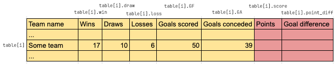

# Practice in Information Processing - Final Report
Maximilian Fernaldy - C2TB1702

<p class=disclaimer> Note: some links and other HTML-related objects may not work in pdf form. Consider reading the webpage format of the report <a href='https://agb5003.com/coursework/pip/final'>here</a>. </p>

<br>

The objective of the final assignment is to display a ranked results sheet of the 2023 J-league season. A csv (comma-separated values) file is provided, detailing the result of each team, and we are tasked to add two additional statistics, rank the teams based on their results, and display the ranked order along with the statistics in a .txt file. This is an exercise in database construction, manipulation and display, and a little glimpse into Data Structures and Algorithm, too, namely in the optional tasks.

Mostly, the flow of execution in both J_score1.c, J_score2.c and J_score3.c is the same:

1. Read data from the provided .csv file
2. Store the data in an array of structs
3. Assign points and calculate goal difference for each team
4. Rank the teams based on first points, then goal difference, and finally goals scored as the last tiebreaker
5. Write the ranked data to a .txt file and format it for readability

However, the methods that the programs use to execute two of these tasks are different. First of all, J_score1.c and J_score 2.c employ a simple selection sort to sort the teams in order, while J_score3.c uses a smarter heap sort algorithm. Secondly, J_score1.c works directly with the array, moving entire structs around each time a swap is performed for the sorting algorithm. On the contrary, J_score2.c and J_score3.c sort an array of pointers to the structs instead.

## 1. Common operations between J_score1.c, J_score2.c and J_score3.c

For tasks 1 to 3, all programs perform identically. First, we read the data from J_result2023.csv using `read_data()`. Originally, `read_data()` takes the file pointer from the main function and writes the data to a table also declared in the main function. At first I used this approach, but this makes modifying the csv file difficult. If an entry is added to the csv file, the program breaks because a macro definition is used to define the number of teams in the file (`#define TEAM_NUM 18`), and this macro definition is used to define the size of `table[]`. In my opinion, the number of teams should be determined by the reading function `read_data()`, then memory allocation is done dynamically according to how many teams there are. This means the program can be used with any csv file as long as the format is correct, regardless of the number of teams in the file.

### a). Counting the number of teams in the file

It is possible to count the number of teams in the file *and* read data from it in one pass through the file, but according to resources online, using two `while` loops; first to count the number of teams and second to read data, is a more common and maintainable approach. Since the time complexity is still O(n), we don't have to worry about performance issues. To implement this, I created a function `get_number_of_teams()` to count the number of teams in the file.

```C
int get_number_of_teams(FILE *fin) {
    // This function gets the selected file and returns how many lines are in the file.
    char buffer[DATA_LEN];
    int number_of_teams = 0;
    while (fgets(buffer, sizeof(buffer), fin) != NULL) {
        number_of_teams++;
    }
    fseek(fin, 0, SEEK_SET);  // return fgets to the first line
    return number_of_teams;
}
```

This function simply takes the file pointer to access the csv file, then loops and increments `number_of_teams`, reading lines with `fgets()` until it returns `NULL`, which means there are no more non-empty lines in the file. After counting the number of times, we need to move the "pointer" of `fgets()` so that when we use it again, we will return to the first line in the file, and not at the end, which will obviously get us nothing since there is no more lines to be read. This is done using `fseek()` by passing the file pointer `fin`, the line to go to `SEEK_SET`, which is a predefined macro corresponding to the beginning of the file, and then `0` is the number of bytes to offset, which should be zero since we want to start at the very beginning. For a complete documentation of `fseek()`, see <a href='https://www.ibm.com/docs/en/zos/2.2.0?topic=functions-fseek-change-file-position'>here</a>. At the end of the function, it returns `number_of_teams`, a self-explanatory integer variable.

### b). Reading and storing data

The `get_number_of_teams()` function is called inside `read_data()`, which allocates memory according to how many teams there are in the file, and executes another `while` loop to read the data and store it inside `table[]`:

```C
SC *read_data(const char *file_path, int *number_of_teams)
{
    // Read data from csv file and store in table[]
    // Declare table to store data
    SC *table;

    // Open file for reading
    FILE *fin;
    if((fin = fopen(file_path,"r"))==NULL){ // open input file
        printf("Can't open result file. Make sure the csv file is in the working directory and formatted as \"J_resultYYYY.csv\".\n");
        exit(1);
    } else {
        printf("Reading file \"%s\"...\n", file_path);
    }

    // Dynamically allocate memory for table
    int i = 0;
    *number_of_teams = get_number_of_teams(fin);
    table = malloc(sizeof(SC) * *number_of_teams);

    // Store data in array
    char buffer[DATA_LEN];
    while (fgets(buffer, sizeof(buffer), fin) != NULL) {
        sscanf(buffer, "%[^,],%d,%d,%d,%d,%d",
                table[i].name,
                &table[i].win,
                &table[i].draw,
                &table[i].loss,
                &table[i].GF,
                &table[i].GA);
        i++;
    }

    // Close file and return storage table
    fclose(fin);
    return table;
}
```

In `read_data()`, the while loop is almost the same as `get_number_of_teams()`, but this time, the buffer is scanned and stored with `sscanf()`. One thing to note, the arguments of `sscanf()` are:

1. The buffer to read from
2. The format of the string used to scan the buffer
3. The **memory addresses** to store the data in

Since it takes **memory addresses**, we need to use the ampersand (&) operator in front of the variable members. However, this does not apply to `table[i].name` (the team name), because recall that in C, strings are arrays of characters. This means `table[i].name` is actually a pointer to the first character of the string. We don't need to take the memory address of that again, because then it would become the memory address of the pointer instead.

It might feel bulky to move the entire table from the `read_data()` function to the main function, but in fact, we are only returning the *pointer* to the table. There is no copying of large data here, we are only building the data as we would normally and telling the main function where that data is stored.

### c). Assigning points and calculating goal difference for each team

If we imagine the array of structs as a table (conveniently, the array is literally named `table[]`), then the rows represent different teams, and the columns represent the members of the struct. Then we can visualize this operation as the function being passed a single row of the table and writing the results of the calculation into two columns of that row.

<p align='center'>  </p>

The fields colored in yellow are already given to us, but we still need to fill in the points and goal difference for each team in our imaginary table—the fields in red. This is done by passing the pointer to each team's data into a function that does the calculation and writes the result back into the correct fields. This pointer is declared as `SC *team`: a pointer to an SC-type variable. Since what we have is a pointer to a struct, we can use the arrow operator in the function to access and write to the members:

```C
void calc_score(SC *team)
{
    // Points = wins * 3 + draws * 1 + losses * 0
    team->score = team->win * 3 + team->draw;
    // Point difference = Goals For - Goals Against
    team->point_diff = team->GF - team->GA;
}
```

This is done for every team by iterating through all of them in the main function and passing the correct pointer for each one with `&table[i]`.

```C
/* （2）Calculating score */
for(i=0; i< number_of_teams; i++) {
    calc_score(&table[i]);
}
```

## 2. J_score1.c

With the points and goal difference calculations done, we can move on to ranking the teams. This is where the different programs start to diverge in their methodology. First we will look at how J_score1.c ranks the teams: using a simple selection sort and swapping structs.

### a). What is selection sort?

Selection sort is a simple sorting algorithm that works by going through the entire unsorted portion, finding the largest or smallest element, then "moving" it from the unsorted portion to the sorted portion by swapping it with the first element in the unsorted portion (effectively considering that element sorted after the swap). The first iteration compares the first element with all other elements $ (n-1) $, the second with $ (n-2) $ elements, and so on, until the second last element is compared only once with the last unsorted element. Each iteration, the unsorted portion decreases by 1, so the total number of required comparisons is:

$$ (n-1) + (n-2) + \ldots + 2 + 1 = \frac{n(n-1)}{2} $$

Since we drop constants and only take the largest order for big O notation, the time complexity is $O(n^2)$. Big O notation is usually taken for the worst case scenario, but for selection sort, this is actually true for **all cases.** This is because no matter what the sequence of numbers looks like, it will always look through the entire array for the smallest or largest element. A time complexity of $O(n^2)$ is definitely not the best for large databases, but it doesn't mean selection sort is useless. It's still plenty fast enough for small lists or small data types, and its tiny code size and simplicity are valid strengths over its more complicated counterparts.

### b). Implementing selection sort in J_score1.c

Selection sort is very simple to implement. We simply have two `for` loops, one to iterate from the first element to the second last as the **reference** elements, and the second nested inside the first one to iterate from the element *after* the reference element to the very last element in the array, as the **compared** elements.

```C
void rank_score(SC table[], int number_of_teams)
{
    // Use selection sort
    for (int i = 0; i < number_of_teams-1; i++) {
        int highest_rank_index = i;
        for (int j = i+1; j < number_of_teams; j++) {
            // SORTING CONDITIONS
        }
        if (highest_rank_index != i) {
            swap_SC(&table[i], &table[highest_rank_index]);
        }
    }
}
```

If we ignore the `if-else` ladder for our sorting conditions for a moment, the code is actually very small and easy to understand. It's just two nested loops and a swap at the end of the `i` loop if a new highest rank is found.

As for the `if-else` ladder itself,

```C
if (table[j].score > table[highest_rank_index].score) {
    highest_rank_index = j;
} else if (table[j].score == table[highest_rank_index].score) {
    // Case if a score tie is encountered
    if (table[j].point_diff > table[highest_rank_index].point_diff) {
        // If compared team has larger point difference
        highest_rank_index = j;
    } else if (table[j].point_diff == table[highest_rank_index].point_diff) {
        // If the point difference is still the same
        if (table[j].GF > table[highest_rank_index].GF) {
            // If the compared team has more goals scored.
            highest_rank_index = j;
        }
    }
}
```

If a team's score is simply higher than the previously highest score, the highest rank index is reassigned. Then if a score tie is encountered, the ladder checks if the compared team's *point difference* is larger. If it's still a tie, the ladder checks if the compared team has more goals scored than the previous highest. If even the goals scored are tied, the program leaves it alone, as it is not in the specifications of the assignment.

Once all the comparisons are done, if a new highest rank is found, we swap the positions of the two teams in the array with `swap_SC()`:

```C
void swap_SC(SC *team1, SC *team2)
{
    // Swap places of reference team and team with current highest score
    SC temp = *team1;
    *team1 = *team2;
    *team2 = temp;
}
```

We can already get a sense of how bulky this program *feels*: it takes the pointer to two teams, copies the **entire struct** to a temporary variable `temp`, copies the whole of `team2` to `team1`, then copies the whole of `temp` to `team2` again. Now, `team_score` is a relatively small struct of 1 `char[20]` and 7 `int`'s, so its size is probably around 32 bytes (because the string is stored through a pointer of 4 bytes). As such, this method is actually not that inefficient. In fact, since it's small enough, it might be the least cache-inefficient (more on this later) method when paired with certain sorting algorithms. But imagine using this method for moving structs that are much larger. We can see how efficient data structures and algorithms are so important when moving actual real world data.

### c). Displaying the ranked data to a .txt file for J_score1.c

If there is an upside to dealing with sorting the data directly, it is that displaying the sorted data is very easy. The array `table[]` is already in order, and we only need to iterate through them and print them line by line to a text file, like how we would with `printf()`.

```C
void write_data(FILE *fout, SC table[], int number_of_teams)
{
    fprintf(fout, "| Rank | Team Name            | Wins | Draws | Losses | Goals Scored | Goals Conceded | Points | Goal Difference |\n");
    fprintf(fout, "|------|----------------------|------|-------|--------|--------------|----------------|--------|-----------------|\n");
    for (int i = 0; i < number_of_teams; i++) {
        fprintf(fout, "| %-4d | %-20s | %4d | %5d | %6d | %12d | %14d | %6d | %15d |\n",
                i+1,
                table[i].name,
                table[i].win,
                table[i].draw,
                table[i].loss,
                table[i].GF,
                table[i].GA,
                table[i].score,
                table[i].point_diff);
    }
}
```

To make the .txt file more readable, we can try to mimic a spreadsheet format by using headers to indicate the meaning of the columns' values, a separator between the headers and data, and formatting the data so that it fits into our "spreadsheet" nicely.

This is done by carefully calculating how many characters each field would take, and using the appropriate format specifier accordingly. Each line is printed to `fout` with the following format:

```C
"| %-4d | %-20s | %4d | %5d | %6d | %12d | %14d | %6d | %15d |\n"
```

These format specifiers have specific lengths assigned to them to accommodate for the width of the headers. For example, to properly align the values, we use `%12d` for values under "Goals Scored" compared to `%4d` for values under "Wins". Then, for rank and team names, we add the minus sign in front of the length to tell `fprintf()`that we want those values to be **aligned left.**

Finally, we pass in the values of each member of the `i`-th team as the last argument for `fprintf()`. Running J_score1.c, we get the following output in J_score1.txt:

<p align='center'>  </p>

We can see that teams are sorted by their points, and teams with tied points are sorted by their goal difference.


[comment]: <> (Below is CSS code for the output HTML and pdf files. Don't touch them unless you know what you're doing.)
<style>
    figcaption{
        text-align:center;
        font-size:9pt
    }
    img{
        filter: drop-shadow(0px 0px 7px );
    }
    .noshade{
        filter: none
    }
    .disclaimer{
        font-size: 9pt
    }
    .linker{
        color: inherit !important
    }
</style>