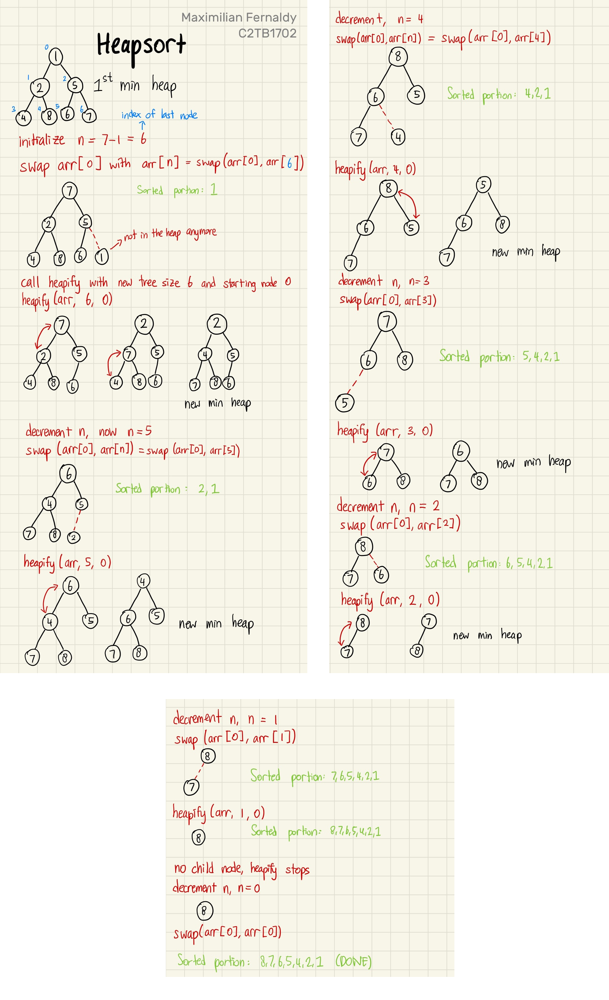
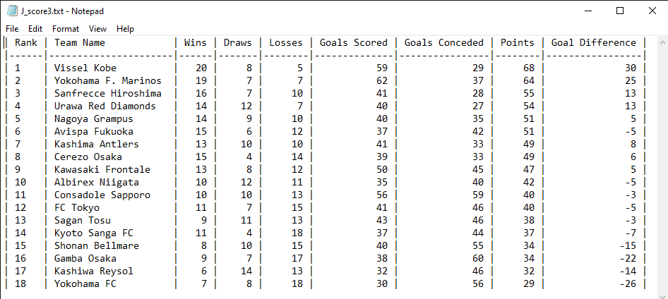
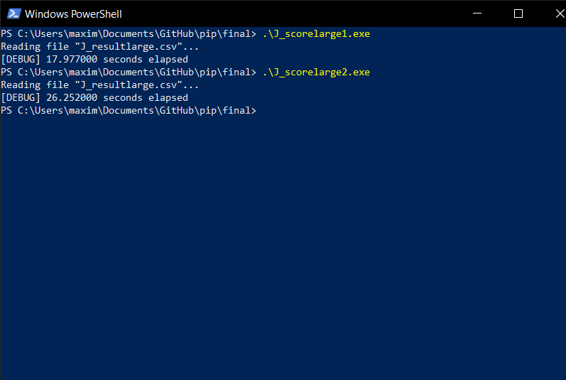

# Practice in Information Processing - Final Report
Maximilian Fernaldy - C2TB1702

<p class=disclaimer> Note: some links and other HTML-related objects may not work in pdf form. Consider reading the webpage format of the report <a href='https://agb5003.com/coursework/pip/final'>here</a>. </p>

## 4. J_score3.c

Now let's take a look at another sorting algorithm: **heapsort.** Despite being relatively simple in concept, heapsort is widely used in enterprise, production environments for its performance, efficiency and consistently low memory usage. We need to first understand what a *heap* is, before we can go into heapsort.

### a). What is a heap?

A heap is just a version of a binary tree. A binary tree is a visualization method that takes numbers and treats them as *nodes*. It is usually visualized with the *root* of the tree at the top. There is only one root node, and each node branches out into **two** *child nodes* (hence the name). At the bottom of the tree are the *leaf nodes*, which don't have child nodes, as they are at the lowest level of the tree. A binary tree is constructed by putting the first element as the root, then the second as the *left node* of the root, the third as the *right node* of the root. Then for the third level and so on, we fill the tree **from left to right.** We cannot create a new level before filling up the entire level. This rule conveniently gives us a mathematical representation for their indices as follows:

$$
    \mathrm{For\;an\;arbitrary\;node\;} i\mathrm{,\;}
    \mathrm{its\;left\;child\;node\;is\;} 2i+1
    \mathrm{\;and\;its\;right\;child\;node\;is\;} 2i+2
$$

<br>

<p align='center'>  </p>

When classified by rule, there are two kinds of heaps: the *max* heap and the *min* heap. As their name suggests, a max heap has the largest element at the top, and a min heap has the smallest element at the top. Additionally, a max heap respects the heap rule where no child can be *larger* than its parent, and a min heap respects the rule where no child can be *smaller* than its parent. In a way, *building* a min or max heap is already partly sorting the array. However, take a look at the example below, where we have a min heap but when we convert it into an array, it's not fully sorted yet:

<p align='center'>  </p>

### b). Building a heap

Building min and max heaps is done by repeatedly *heapify*ing the binary tree. For this explanation, let's say we want to make a min heap. To do this, we iterate from the last non-leaf node, and decrement the iterator by 1 until it reaches 0, inclusive. In each iteration, we pass the iterator as the index of the node that heapify should access. 

Say we have a tree of 7 elements. If we denote the size of the tree as $n = 7$, and the last non-leaf node as $i$, then

$$
    \mathrm{If\;n\;is\;odd,\;last\;node\;is\;a\;right\;child\;node.} \\
    \begin{align*}
        \implies n &= 2i+2 \\
                    n - 2 &= 2i \\
                    i &= \dfrac{n-2}{2} \\
                    i & = \dfrac{n}{2} - 1 \\
                    \mathrm{for\;the\;case\;} n = 7, \\
                     i &= \dfrac{7}{2} - 1 \\
                     i &= 2 
    \end{align*} \\
$$

Which means we start at $i = 2$ as the last non-leaf node, call heapify with $i=2$, decrement $i$ to $1$, call heapify with $i=1$, decrement again to $i=0$, call heapify with $i=0$, and by the end of this we should have a min heap.

#### heapify

Heapify is in principle, a recursive function. First, it takes the parent node of a subtree, compares it to both of its child nodes, and if one of the child nodes is smaller, heapify swaps that child node with the parent, making the parent now the smallest between the three nodes. Then, heapify recursively calls itself, but now passing the index of the child node that used to contain the smallest number (before the swap). We can then imagine this operation as heapify "moving" to a new subtree, one with the child node as the new parent node. This subtree would then be heapified too, with the smallest element in it as the new parent node.

<p align='center'>  </p>

<p align='center'> click <a href='https://imgur.com/a/GTZ2z2F'>here</a> to see full image. </p>

If we see what the array looks like after the min heap is built, we can see that it's *somewhat* sorted, but not completely. We have the smallest element as the first one, and there seems to be a trend of increasing numbers, but some elements are still out of order.

### c). heapsort

Finally, we can talk about heapsort. The following points outline the principle of heapsort:

1. Obtain min/max heap
2. Move root from the heap to the sorted portion by swapping it with the last element in the heap
3. Now the tree is not a heap, so heapify again to obtain min/max heap
4. Move new root from the heap to the sorted portion by swapping it with the last element in the heap
5. Repeat until the heap is gone and everything is sorted

Perhaps counterintuitively, sorting elements from smallest to largest is done by utilizing the *max* heap, and sorting from largest to smallest is done by building *min* heaps. This is because we put the sorted portion *after* the heap in the array, and when elements are added to the sorted portion, it's added in front of it, which means we're adding elements from the back to front. Take the following example of sorting from smallest to largest:

<p align='center'>  </p>

Instead of the heap being an entirely separate array, it's just a representation of the unsorted portion of our array. We sort the array by repeatedly making a max heap, taking the root out and putting it in front of the sorted portion, and repeat until there is no unsorted portion anymore; there is no heap anymore. Then we know that everything inside the array is sorted.

Let's take a look at another example, this time building min heaps to sort largest to smallest:

<p align='center'>  </p>

<p align='center'> click <a href='https://imgur.com/a/2L8orvX'>here</a> to see full images. </p>

### d). Applying heapsort to J_score3.c

So now we know how we could use heapsort for our case. Since we want to sort the teams from the highest ranking to the lowest, we will need to build **min heaps.** We take the lowest ranked team in the heap, put it at the bottom of our figurative table, and repeat until the table is sorted.

```C
void rank_score(SC table[], SC *rank_array[], int number_of_teams)
{
    // Create array of pointers
    for (int i = 0; i < number_of_teams; i++) {
        rank_array[i] = &table[i];
    }

    // Build min heap
    for (int i = number_of_teams/2 - 1; i >= 0; i--) {
        heapify(rank_array, number_of_teams, i);
    }
    /*
    At this point in the code, we have built a min heap, which means
    the smallest element is at the top of the heap, and no child node is
    smaller than the parent. However, it's not fully sorted yet.
    */

    // Heap sort
    for (int n = number_of_teams - 1; n >= 0; n--) {
        /*
        Remove root node from heap by swapping with last element
        Then, heapify at root to get the smallest element at the root again
        Repeat until the heap is gone.
        */
        swap_pointers(&rank_array[0], &rank_array[n]);

        heapify(rank_array, n, 0);
    }
}
```

Like in J_score2.c, we create an array of pointers `rank_array[]`. Then, our first min heap is created before the heap sort. The root of this min heap is the smallest element in the array—the lowest ranked team in the league. Once we have this initial min heap, that means we can take out the root, put it into the sorted portion, and run heapify again on the unsorted portion. This is why we start the second `for` loop in `rank_score()` at `n = number_of_teams - 1`, because by the point we need to run `heapify()` again, we have taken out the root of the first min heap, and the unsorted portion's size has decreased by 1. Once this new heapify is done, we will have another min heap, so we **decrement n** by 1 (implying the size of the heap should decrease by 1 again), take out the root and put it in the sorted portion, and repeat until there are no unsorted elements.

At a lower level, we construct our heapify function specifically for our case. This amounts to simply putting our `if-else` ladder in the comparison between child nodes and the parent node:

```C
void heapify(SC *rank_array[], int n, int i) {
    int lowest = i;  // Initialize lowest as parent node
    int left = 2*i+1;  // Index left child node
    int right = 2*i+2;  // Index right child node
    
    if (left < n) {
        // If left child node should rank lower
        if (rank_array[left]->score < rank_array[lowest]->score)
        {
            // If score is lower
            lowest = left;
        } else if (rank_array[left]->score == rank_array[lowest]->score)
        {
            // If score is tied
            if (rank_array[left]->point_diff < rank_array[lowest]->point_diff)
            {
                // If point difference is lower
                lowest = left;
            } else if (rank_array[left]->point_diff == rank_array[lowest]->point_diff)
            {
                // If point difference is tied
                if (rank_array[left]->GF < rank_array[lowest]->GF) {
                    // If less goals were scored
                    lowest = left;
                }
            }
        }
    }
    if (right < n) {
        // If right child node should rank lower
        if (rank_array[right]->score < rank_array[lowest]->score)
        {
            // If score is lower
            lowest = right;
        } else if (rank_array[right]->score == rank_array[lowest]->score)
        {
            // If score is tied
            if (rank_array[right]->point_diff < rank_array[lowest]->point_diff)
            {
                // If point difference is lower
                lowest = right;
            } else if (rank_array[right]->point_diff == rank_array[lowest]->point_diff)
            {
                // If point difference is tied
                if (rank_array[right]->GF < rank_array[lowest]->GF) {
                    // If less goals were scored
                    lowest = right;
                }
            }
        }
    }
    
    // Swap if root is not the largest element, then continue heapify
    if (lowest != i) {
        // Swapping pointers around
        swap_pointers(&rank_array[lowest], &rank_array[i]);
        heapify(rank_array, n, lowest);
    }
}
```

Naturally, this `if-else` ladder is identical to the one we used in J_score1.c and J_score2.c.

### e). Printing the output of J_score3.c

Since J_score3.c uses an identical method to J_score2.c to store the sorted data, we can reuse the code used in J_score2.c to display the results in J_score3.txt. Of course, adjustments are made in the main function to point the `fout` file pointer to `J_score3.txt` instead of `J_score2.txt`:

```C
/* Open writing file */
fout = fopen("J_score3.txt","w"); // open output file
```

Running the program after compiling, we confirm that all three .txt files are identical:

<p align='center'>  </p>


## 5. Testing large datasets

Let's now test just how much more efficient heapsort is compared to selection sort. The effect will not be very apparent if we only have 18 teams, but what about a thousand? No, a **hundred thousand teams?**

I made a rough python script that generates randomized result data of games won, games drawn, games lost, goals scored and goals conceded. I adjusted the ranges, but the data is probably still nonsensical when analyzed closely. However, it will give us a rough estimate of how scaling affects efficiency of sorting algorithms. The python script outputs a file containing the result of a 100,000 different teams:

```python
from numpy import random
import csv

def generate_wdl():
    wins = 0
    draws = 0
    losses = 0
    while wins < 4 or losses < 0:
        wins = int(random.normal(16.5,4))
        draws = int(random.normal(7, 5))
        losses = 33-(wins+draws)
    return wins,draws,losses

def generate_goals():
    goals_for = 0
    goals_against = 0
    while goals_for < 30 or goals_against < 20:
        goals_for = int(random.normal(40, 15))
        goals_against = int(random.normal(40, 15))
    return goals_for,goals_against

file_path = "J_resultlarge.csv"


result = [[0] * 6 for _ in range(100000)]
for i in range(0,100000):
    result[i][0] = "Team " + f"{i}"
    result[i][1:4] = generate_wdl()
    result[i][4:6] = generate_goals()

with open(file_path, mode="w", newline='') as csv_file:
    csv_writer = csv.writer(csv_file)
    csv_writer.writerows(result)
```

Then I created a copy of J_score2.c and J_score3.c, changed their input file to J_resultlarge.csv and output files to J_scorelarge2.txt and J_scorelarge3.txt respectively. Finally, I modified the files to include a simple stopwatch that tracks how long it takes each program to sort the teams.

```C
void rank_score(SC table[], SC *rank_array[], int number_of_teams)
{
    clock_t start, end;
    double elapsed;
    start = clock();
    // SORTING CODE
    end = clock();
    elapsed = ((double)(end - start)) / CLOCKS_PER_SEC;
    printf("[DEBUG] %lf seconds elapsed\n",elapsed);
}
```

Running the two one after another:

<p align='center'>  </p>

Yes, heapsort was more than two entire **order of magnitudes** faster than selection sort. And this is only for a dataset $32\mathrm{B} * 100000 = 3.2\mathrm{MB}$ in size. Real databases are much, much larger—for instance, a typical database containing user data of a medium-sized website would range between a few gigabytes to tens of gigabytes. Using an inefficient data structure or sorting algorithm that "just works" is **not** an option when we're working with files this large.

Performance is a very complicated subject in software engineering in general, and it stays true in this comparison as well. There are many factors that contribute to this result, but mainly, there was one cause that I found to be the biggest culprit: **low cache efficiency and high time complexity of selection sort.**

A processing unit does not only work with the main memory unit. In order to manipulate the data stored in the main memory, it needs to first move them over to the processor *cache*. This cache provides high speed memory to the main processing unit, but it's smaller than the main memory unit, and therefore, not all data can be stored on it. The term *missing a cache* means that the data required by the CPU is not on the cache, which means it needs to be accessed from the main memory instead. As a general rule, missing a cache is typically at least an order of magnitude slower than a cache *hit*.

The cache efficiency of a sorting algorithm refers to how well it utilizes the processor cache. Selection sort exhibits certain characteristics that make it very inefficient at this. Firstly, it always looks through the entire unsorted portion to find the smallest or largest element. It's uncertain where this largest or smallest element is, so the memory access pattern is scattered or utterly random, which results in more cache misses, especially with a large array size. It also doesn't take advantage of any preexisting order in the array, unlike heapsort. Even after going through the array many times, it still needs to go through the entire unsorted portion to find the next smallest/largest element. Of course, this means far more comparisons made than heap sort, and more comparisons will always result in more cache misses yet again. Selection sort will have very frequent cache misses, requiring much slower memory access to compare and swap values, which results in the slower total time for the sorting algorithm.

## 6. Pointer arrays are not always better

It is pretty intuitive to infer that sorting the much smaller struct pointers will be more memory-efficient and faster than moving entire structs around. However, this is in fact not always the case, and it really depends on the type and size of data.

For arrays containing structs with a large number of high precision members, the time and memory penalty incurred might be sufficiently large such that creating a separate array containing pointers to them is the obvious choice. In contrast, imagine an array of very small, 4-byte structs. If we create a separate array of pointers, in a 64-bit system, the size of a pointer would be 8 bytes, which makes the size of the pointer array twice as large as the original array. Obviously, it doesn't make sense to use this larger array to sort and access the elements.

Sometimes, it's not so obvious, though. Comparing J_score1.c and J_score2.c, we have a more nuanced case. They both use selection sort, but J_score1.c moves structs around, while J_score2.c uses pointer swapping. When we use them to sort a large amount of elements like we did earlier, J_score1.c is actually consistently *faster* than J_score2.c, and not by an insignificant amount, too.

<p align='center'>  </p>

The reason why this happens is actually related to the cache efficiency we talked about earlier. The poor cache efficiency of selection sort has differing effects on algorithm performance, depending on what method is used to access the data. Since J_score1.c accesses the structs directly, data is stored contiguously (next to each other) in memory, and this allows the CPU cache to be more effective since it's optimized to access consecutive/contiguous memory addresses. In contrast to this, J_score2.c creates an array of pointers somewhere entirely different from the memory used to store the original array, and this creates fragmentation. More precisely, using an array of pointers to read and manipulate data creates **pointer indirection**.

To understand pointer indirection intuitively, imagine a traveler needs to travel to Town B. With J_score1.c, the traveler meets with the adventurers' guild in their town, which takes some time out of their day, but they're pointed immediately in the right direction. With J_score2.c, the traveler meets with their amateur adventurer friend, who doesn't know where Town B is, but they know someone in another town who definitely does. Their friend takes them to meet this other person, who finally points them in the right direction to Town B. Even though it was faster for the traveler to meet their friend, having to go to someone else before setting off ultimately takes more time than if they had just gone to the adventurers' guild in the first place.

Jumping between different levels of memory hierarchy and non-contiguous memory blocks to access the struct members and swap teams around ultimately compounds on the cache inefficiency of selection sort, which slows down the pointer swapping method in our case, enough to make it slower than simply swapping the structs.

While the array of pointers method might not be the most effective method for this specific case, it is still integral to learn all the possible data structures, algorithms and memory access methods so that when faced with a task that *does* call for them, we can confidently apply these techniques with the correct rationale behind why we choose them over the others.

## 7. Conclusion and further reading

This assignment provided an exercise of data parsing, processing and storage, drawing from the skills learned from all previous classes. By comparing different sorting algorithms and memory access methods, it was determined that **for this specific use case**, the memory access method or sorting algorithm don't incur a significant difference in performance, as the size of the database is relatively small. However, increasing the number of teams in the input file revealed that the sorting algorithm and data structure used had a much larger impact on the sorting performance than the difference in memory access method.

Further reading and resources are listed below.

1. [Heap sort algorithm | Programiz](https://www.programiz.com/dsa/heap-sort)
2. [Big O notation | Wikipedia](https://www.wikiwand.com/en/Big_O_notation)
3. [Estimating database size requirements | IBM](https://www.ibm.com/docs/zh-tw/tsm/7.1.7?topic=requirements-hp-ux-maximum-number-files)
4. [Sorting with an array of pointers | University of Hawaii](https://ee.hawaii.edu/~tep/EE160/Book/chap9/section2.1.4.html#:~:text=The%20advantage%20of%20a%20pointer,without%20moving%20the%20data%20items.)


[comment]: <> (Below is CSS code for the output HTML and pdf files. Don't touch them unless you know what you're doing.)
<style>
    figcaption{
        text-align:center;
        font-size:9pt
    }
    img{
        filter: drop-shadow(0px 0px 7px );
    }
    .noshade{
        filter: none
    }
    .disclaimer{
        font-size: 9pt
    }
    .linker{
        color: inherit !important
    }
</style>