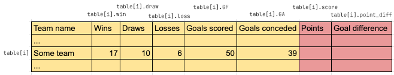
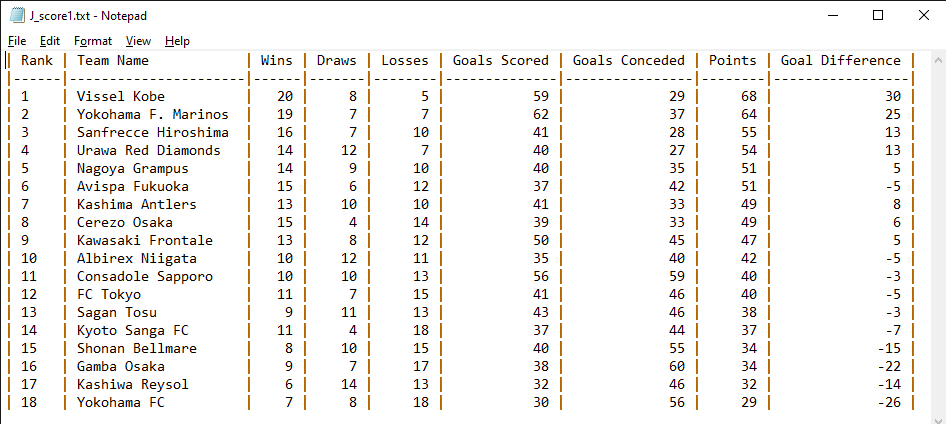
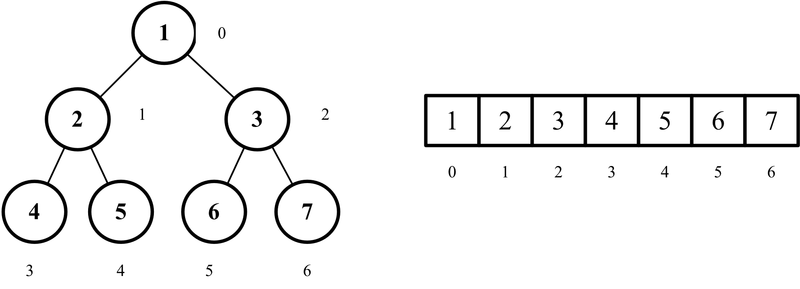
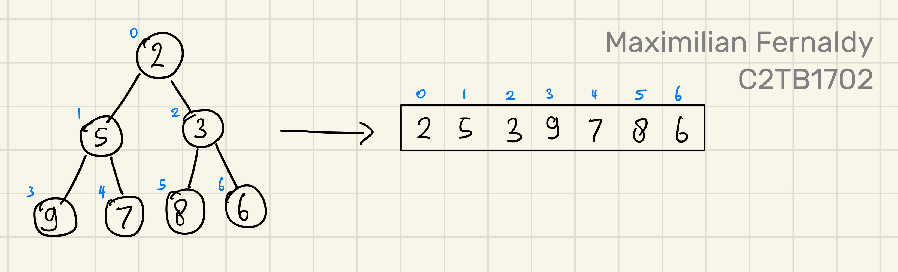
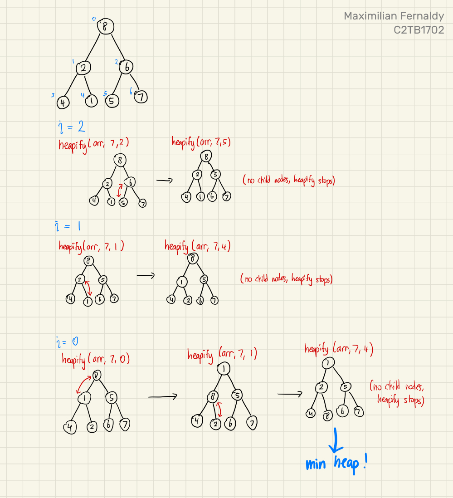
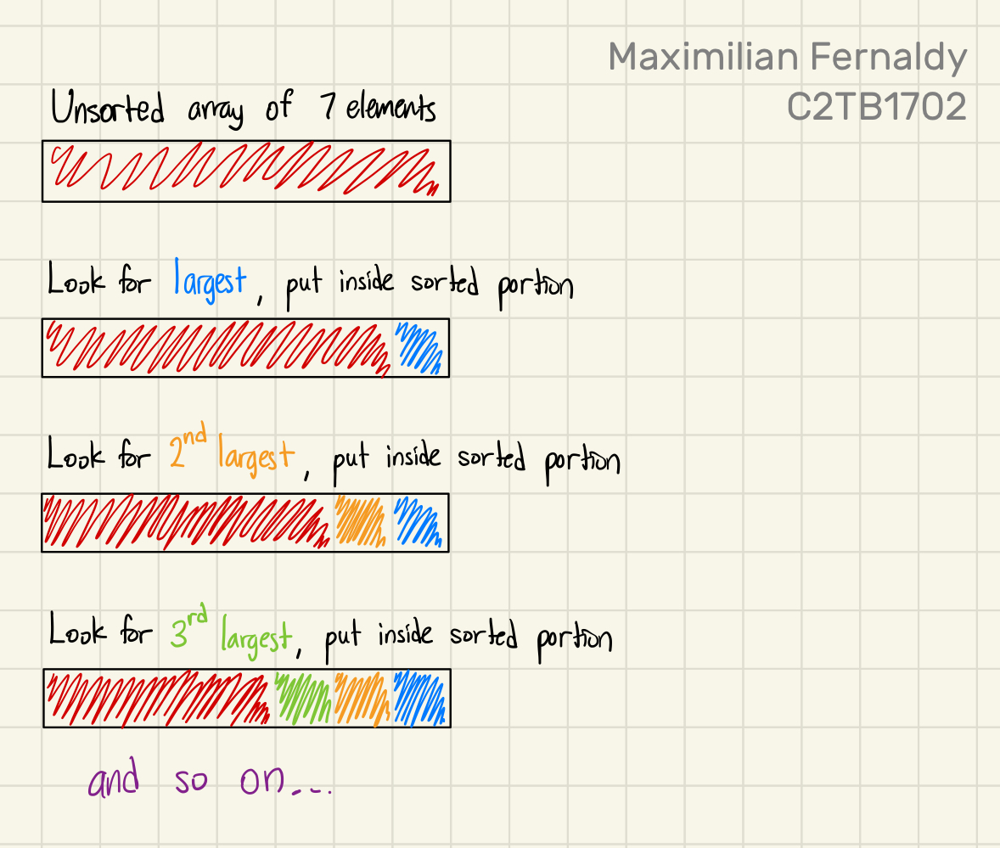
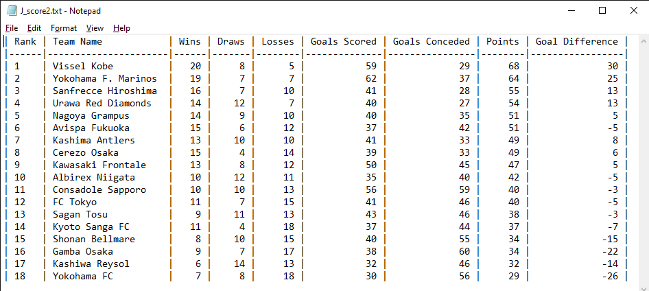
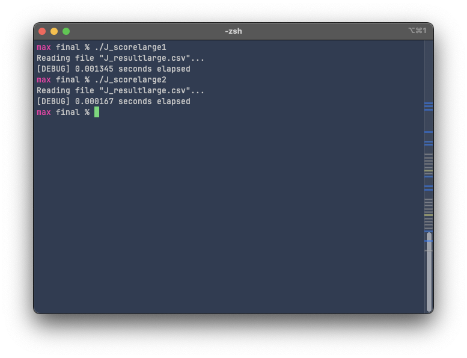

# Final report: J_score
Maximilian Fernaldy - C2TB1702

<br>

The objective of the final assignment is to display a ranked results sheet of the 2023 J-league season. We are provided with a csv (comma-separated values) file detailing the result of each team, and we are tasked to add two additional statistics, rank the teams based on their results, and display the ranked order along with the statistics in a .txt file. This is an exercise in database construction, manipulation and display, and a little glimpse into Data Structures and Algorithm, too, namely in the optional tasks.

Mostly, the flow of execution in both J_score1.c and J_score2.c is the same:

1. Read data from the provided .csv file
2. Store the data in an array of structs
3. Assign points and calculate goal difference for each team
4. Rank the teams based on points, goal difference and goals scored as the final tiebreaker
5. Write the ranked data to a .txt file and format it for readability

However, the methods that the two programs use to execute two of these tasks are different. First of all, J_score1.c employs a simple selection sort to sort the teams in order, while J_score2.c uses a smarter heap sort algorithm. Secondly, J_score1.c works directly with the array, moving entire structs around each time a swap is performed for the sorting algorithm. On the contrary, J_score2.c sorts an array of pointers to the structs instead, which are much smaller than the structs they point to, and as a consequence, are easier to move around. For a short list with 18 members like this case, the difference might not be very noticeable, but for large databases with thousands of entries, each of them structs containing a considerable amount of data, the difference will be very noticeable. I will demonstrate this difference later. 

## 1. Common operation between J_score1.c and J_score2.c

For tasks 1 to 3, J_score1.c and J_score2.c performs identically. First, we read the data from J_result2023.csv using read_data. Originally, `read_data()` takes the file pointer from the main function and writes the data to a table also declared in the main function. At first I used this approach, but this makes modifying the csv file difficult. If an entry is added to the csv file, the program breaks because a macro definition is used to define the number of teams in the file (`#define TEAM_NUM 18`), and this macro definition is used to define the size of `table[]`. In my opinion, the number of teams should be determined by the reading function `read_data()`, then memory allocation is done dynamically according to how many teams there are. This means the program can be used with any csv file as long as the format is correct, regardless of the number of teams in the file.

### a). Counting the number of teams in the file

It is possible to count the number of teams in the file *and* reading data from it in one pass through the file, but according to resources online, using two `while` loops; first to count the number of teams and second to read data, is a more common and maintainable approach. Since the time complexity is still O(n), we don't have to worry about performance issues. To implement this, I created a function `get_number_of_teams()` to count the number of teams in the file.

```C
int get_number_of_teams(FILE *fin) {
    // This function gets the selected file and returns how many lines are in the file.
    char buffer[DATA_LEN];
    int number_of_teams = 0;
    while (fgets(buffer, sizeof(buffer), fin) !=NULL) {
        number_of_teams++;
    }
    fseek(fin, 0, SEEK_SET);  // return fgets to the first line
    return number_of_teams;
}
```

This function simply loops and increments `number_of_teams` until `fgets()` returns `NULL`, which means there are no more non-empty lines in the file. Then at the end of the loop it returns `number_of_teams`.

### b). Reading and storing data

The `get_number_of_teams()` function is called inside `read_data()`, which allocates memory according to how many teams there are in the file, and executes another `while` loop to read the data and store it inside `table[]`:

```C
SC *read_data(const char *file_path, int *number_of_teams)
{
    // Read data from csv file and store in table[]
    // Declare table to store data
    SC *table;

    // Open file for reading
    FILE *fin;
    if((fin = fopen(file_path,"r"))==NULL){ // open input file
        printf("Can't open result file. Make sure the csv file is in the working directory and formatted as \"J_resultYYYY.csv\".\n");
        exit(1);
    } else {
        printf("Reading file \"%s\"...\n", file_path);
    }

    // Dynamically allocate memory for table
    int i = 0;
    *number_of_teams = get_number_of_teams(fin);
    table = malloc(sizeof(SC) * *number_of_teams);
    char buffer[DATA_LEN];
    while (fgets(buffer, sizeof(buffer), fin) != NULL) {
        sscanf(buffer, "%[^,],%d,%d,%d,%d,%d",
                table[i].name,
                &table[i].win,
                &table[i].draw,
                &table[i].loss,
                &table[i].GF,
                &table[i].GA);
        i++;
    }

    fclose(fin);

    return table;
}
```

In `read_data()`, the while loop is almost the same as `get_number_of_teams()`, but this time, the buffer is scanned and stored with `sscanf()`. One thing to note, the arguments of `sscanf()` are:

1. The buffer to read from
2. The format of the string used to scan the buffer
3. The **memory addresses** to store the data in

Since it takes **memory addresses**, we need to use the ampersand (&) operator in front of the variable members. However, this does not apply to `table[i].name` (the team name), because recall that in C, strings are arrays of characters. This means `table[i].name` is actually a pointer to the first character of the string. We don't need to take the memory address of that again, because then it would become the memory address of the pointer instead.

It might feel bulky to move the entire table from the `read_data()` function to the main function, but in fact, we are only returning the *pointer* to the table. There is no copying of large data here, we are only building the data as we would normally and telling the main function where that data is stored.

### c). Assigning points and calculating goal difference for each team

If we imagine the array of structs as a table (conveniently, the array is literally named `table[]`), then the rows represent different teams, and the columns represent the members of the struct. Then we can visualize this operation as the function being passed a single row of the table and writing the results of the calculation into two columns.

<p align='center'>  </p>

The fields colored in yellow are already given to us, but we still need to fill in the points and goal difference for each team in our imaginary table—the fields in red. This is done by passing the pointer to each team's data into a function that does the calculation and writes the result back into the correct fields. This pointer is declared as `SC *team`: a pointer to an SC-type variable. Since what we have is a pointer to a struct, we can use the arrow operator to access and write to the members:

```C
void calc_score(SC *team)
{
    // Points = wins * 3 + draws * 1 + losses * 0
    team->score = team->win * 3 + team->draw;
    // Point difference = Goals For - Goals Against
    team->point_diff = team->GF - team->GA;
}
```

This is done for every team by iterating through all of them in the main function and passing the correct pointer for each one.

```C
/* （2）Calculating score */
for(i=0; i< number_of_teams; i++) {
    calc_score(&table[i]);
}
```

## 2. J_score1.c

With the points and goal difference calculations done, we can move on to ranking the teams. This is where J_score1.c and J_score2.c starts to diverge in their methodology. First we will look at how J_score1.c ranks the teams: using a simple selection sort.

### a). What is selection sort?

Selection sort is a simple sorting algorithm that works by going through the entire unsorted portion, finding the largest or smallest element, then "moving" it from the unsorted portion to the sorted portion by swapping it with the first element in the unsorted portion. The first iteration compares the first element with all other elements $ (n-1) $, the second with $ (n-2) $ elements, and so on, until the second last element is compared only once with the last unsorted element. Each iteration, the unsorted portion decreases by 1, so the total number of required comparisons is:

$$ (n-1) + (n-2) + \ldots + 2 + 1 = \frac{n(n-1)}{2} $$

Since we drop constants and only take the largest order for big O notation, the time complexity is $O(n^2)$. Big O notation is usually taken for the worst case scenario, but for selection sort, this is actually true for **all cases.** This is because no matter what the sequence of numbers looks like, it will always look through the entire array for the smallest or largest element. A time complexity of $O(n^2)$ is definitely not the best for large databases, but it doesn't mean selection sort is useless. It's still plenty fast enough for small lists or small data types, and its tiny code size and simplicity are valid strengths over its more complicated counterparts.

### b). Implementing selection sort in J_score1.c

Selection sort is very simple to implement. We simply have two `for` loops, one to iterate from the first element to the second last as the reference elements, and the second nested inside the first one to iterate from the element *after* the reference element to the very last element in the array, as the compared elements. This is where the time complexity $ O(n^2) $ comes from: there are two loops each iterating through (basically) the entire array.

```C
void rank_score(SC table[], int number_of_teams)
{
    // Use selection sort
    for (int i = 0; i < number_of_teams-1; i++) {
        int highest_rank_index = i;
        for (int j = i+1; j < number_of_teams; j++) {
            // SORTING CONDITIONS
        }
        if (highest_rank_index != i) {
            swap_SC(&table[i], &table[highest_rank_index]);
        }
    }
}
```

If we ignore the `if-else` ladder for our sorting conditions for a moment, the code is actually very small and easy to understand. It's just two nested loops and a swap at the end of the `i` loop if a new highest rank is found.

As for the `if-else` ladder itself,

```C
if (table[j].score > table[highest_rank_index].score) {
    highest_rank_index = j;
} else if (table[j].score == table[highest_rank_index].score) {
    // Case if a score tie is encountered
    if (table[j].point_diff > table[highest_rank_index].point_diff) {
        // If compared team has larger point difference
        highest_rank_index = j;
    } else if (table[j].point_diff == table[highest_rank_index].point_diff) {
        // If the point difference is still the same
        if (table[j].GF > table[highest_rank_index].GF) {
            // If the compared team has more goals scored.
            highest_rank_index = j;
        }
    }
}
```

If a team's score is simply higher than the previously highest score, the highest rank index is reassigned. Then if a tie is encountered, the ladder checks if the compared team's *point difference* is larger. If it's still a tie, the ladder checks if the compared team has more goals scored than the previous highest. If even the goals scored is a tie, the program leaves it alone, as it is not in the specifications of the assignment.

Once all the comparisons are done, if a new highest rank is found, we swap the positions of the two teams in the array with `swap_SC()`:

```C
void swap_SC(SC *team1, SC *team2)
{
    // Swap places of reference team and team with current highest score
    SC temp = *team1;
    *team1 = *team2;
    *team2 = temp;
}
```

We can already get a sense of how bulky this program feels: it takes the pointer to two teams, copies the **entire struct** to a temporary variable `temp`, copies the whole of `team2` to `team1`, then copies the whole of `temp` to `team2` again. Now, `team_score` is a relatively small struct of 1 `char[20]` and 7 `int`'s, so its size is probably around 32 bytes with padding. But imagine using this method for moving structs that are much larger. We can see how efficient data structures and algorithms are so important when moving actual real world data.

### c). Displaying the ranked data to a .txt file for J_score1.c

If there is an upside to dealing with sorting the data directly, it is that displaying the sorted data is very easy. The array `table[]` is already in order, and we only need to iterate through them and print them line by line to a text file, like how we would with `printf()`.

```C
void write_data(FILE *fout, SC table[], int number_of_teams)
{
    fprintf(fout, "| Rank | Team Name            | Wins | Draws | Losses | Goals Scored | Goals Conceded | Points | Goal Difference |\n");
    fprintf(fout, "|------|----------------------|------|-------|--------|--------------|----------------|--------|-----------------|\n");
    for (int i = 0; i < number_of_teams; i++) {
        fprintf(fout, "| %-4d | %-20s | %4d | %5d | %6d | %12d | %14d | %6d | %15d |\n",
                i+1,
                table[i].name,
                table[i].win,
                table[i].draw,
                table[i].loss,
                table[i].GF,
                table[i].GA,
                table[i].score,
                table[i].point_diff);
    }
}
```

To make the .txt file more readable, we can try to mimic a spreadsheet format by using headers to indicate the meaning of the columns' values, a separator between the headers and data, and formatting the data so that it fits into our "spreadsheet" nicely.

This is done by carefully calculating how many characters each field would take, and using the appropriate format specifier accordingly. Each line is printed to `fout` with the following format:

```C
"| %-4d | %-20s | %4d | %5d | %6d | %12d | %14d | %6d | %15d |\n"
```

These format specifiers have specific lengths assigned to them to accommodate for the width of the headers. For example, to properly align the values, we use `%12d` for values under "Goals Scored" compared to `%4d` for values under "Wins". Then, for rank and team names, we add the minus sign in front of the length to tell `fprintf()`that we want those values to be **aligned left.**

Finally, we pass in the values of each member of the `i`-th team as the last argument for `fprintf()`. Running J_score1.c, we get the following output in J_score.txt:

<p align='center'>  </p>

We can see that teams are sorted by their points, and teams with tied points are sorted by their goal difference.


## 3. J_score2.c

Now let's take a look at another approach: **heapsort.** Despite being relatively simple in concept, heapsort is widely used in enterprise, production environments for its performance, efficiency and consistently low memory usage. We need to first understand what a *heap* is, before we can go into heapsort.

### a). What is a heap?

A heap is just a version of a binary tree. A binary tree is a visualization method that takes numbers and treats them as *nodes*. It is usually visualized with the *root* of the tree at the top. There is only one root node, and each node branches out into **two** *child nodes* (hence the name). At the bottom of the tree are the *leaf nodes*, which don't have child nodes, as they are at the lowest level of the tree. A binary tree is constructed by putting the first element as the root, then the second as the *left node* of the root, the third as the *right node* of the root. Then for the third level and so on, we fill the tree **from left to right.** We cannot create a new level before filling up the entire level. This rule conveniently gives us a mathematical representation for their indices as follows:

$$
    \mathrm{For\;an\;arbitrary\;node\;} i\mathrm{,\;}
    \mathrm{its\;left\;child\;node\;is\;} 2i+1
    \mathrm{\;and\;its\;right\;child\;node\;is\;} 2i+2
$$

<br>

<p align='center'>  </p>

When classified by rule, there are two kinds of heaps: the *max* heap and the *min* heap. As their name suggests, a max heap has the largest element at the top, and a min heap has the smallest element at the top. Additionally, a max heap respects the heap rule where no child can be *larger* than its parent, and a min heap respects the rule where no child can be *smaller* than its parent. In a way, *building* a min or max heap is already partly sorting the array. However, take a look at the example below, where we have a min heap but when we convert it into an array, it's not fully sorted yet:

<p align='center'>  </p>

### b). Building a heap

Building min and max heaps is done by repeatedly *heapify*ing the binary tree. Heapify is in principle, a recursive function. For this explanation, let's say we want to make a min heap. To do this, we iterate from the last non-leaf node (index $\frac{n}{2}-1$), and decrement the iterator by 1 until it reaches 0, inclusive. We pass the iterator as the index of the node that heapify should access. Say we have a tree of 7 elements, then we start from $i = \frac{7}{2} -1 = 2$, call heapify on that node, then heapify $i=1$, heapify $0$, and by the end we should have a min heap.

First, it takes the root of a tree, compares it to both of its child nodes, and if one of the child nodes is smaller, heapify swaps that child node with the root, making the root now the smallest between the three nodes. Then, heapify recursively calls itself, but now passing the index of the node that used to contain the smallest number. The subtree would then be heapified too, with the smallest element as the parent.

<p align='center'>  </p>

<p align='center'> click <a href='https://imgur.com/a/GTZ2z2F'>here</a> to see full image. </p>

If we see what the array looks like after the min heap is built, we can see that it's *somewhat* sorted, but not completely. We have the smallest element as the first one, and there seems to be a trend of increasing numbers, but some elements are still out of order.

|1|2|5|4|8|6|7|
|-|-|-|-|-|-|-|

### c). heapsort

Finally, we can talk about heapsort. The following points outline the principle of heapsort:

1. Obtain min/max heap
2. Move root from the heap to the sorted portion by swapping it with the last element in the heap
3. Now the tree is not a heap, so heapify again to obtain min/max heap
4. Move new root from the heap to the sorted portion by swapping it with the last element in the heap
5. Repeat until the heap is gone and everything is sorted

Perhaps counterintuitively, sorting elements from smallest to largest is done by utilizing the *max* heap, and sorting from largest to smallest is done by utilizing the *min* heap. This is because we put the sorted portion *after* the heap in the array, and when elements are added to the sorted portion, it's added in front of it, which means we're adding elements from the back to front. Take the following example of sorting from smallest to largest:

<p align='center'>  </p>

Instead of the heap being an entirely separate array, it's just a representation of the unsorted portion of our array. We sort the array by repeatedly making a max heap, taking the root out and putting it in front of the sorted portion, and repeat until there is no unsorted portion anymore; there is no heap anymore. Then we know that everything inside the array is sorted.

### d). Applying heapsort to J_score2.c

So now we know how we could use heapsort for our case. Since we want to sort the teams from the highest ranking to the lowest, we will need to build **min heaps.** We take the lowest ranked team in the heap, put it at the bottom of our figurative table, and repeat until the table is sorted.

```C
void rank_score(SC table[], SC *rank_array[], int number_of_teams)
{
    // Create array of pointers
    for (int i = 0; i < number_of_teams; i++) {
        rank_array[i] = &table[i];
    }

    // Build min heap
    for (int i = number_of_teams/2 - 1; i >= 0; i--) {
        heapify(rank_array, number_of_teams, i);
    }
    /*
    At this point in the code, we have built a min heap, which means
    the smallest element is at the top of the heap, and no child node is
    smaller than the parent. However, it's not fully sorted yet.
    */

    // Heap sort
    for (int n = number_of_teams - 1; n >= 0; n--) {
        /*
        Remove root node from heap by swapping with last element
        Then, heapify at root to get the smallest element at the root again
        Repeat until the heap is gone.
        */
        swap_pointers(&rank_array[0], &rank_array[n]);

        heapify(rank_array, n, 0);
    }
}
```

To make our algorithm even more efficient, we will use an array of pointers instead of moving entire structs around. This array of pointers is created simply by iterating through the table's length, storing the pointer to each team's data inside an array aptly named `rank_array[]`. Then, our first min heap is created before the heap sort. The root of this min heap is the smallest element in the array—the lowest ranked team in the league. Once we have this initial min heap, that means we can take out the root, put it into the sorted portion, and run heapify again on the unsorted portion. This is why we start the second `for` loop in `rank_score()` at `n = number_of_teams - 1`, because by the point we need to run `heapify()` again, we have taken out the root of the first min heap, and the unsorted portion's size has decreased by 1. Once this heapify is done, we will have another min heap, so we **decrement n** by 1 (implying the size of the heap should decrease), take out the root and put it in the sorted portion, and repeat the entire process again.

At a lower level, we construct our heapify function specifically for out case. This amounts to simply putting our `if-else` ladder in the comparison between child nodes and the parent node:

```C
void heapify(SC *rank_array[], int n, int i) {
    int lowest = i;  // Initialize lowest as parent node
    int left = 2*i+1;  // Index left child node
    int right = 2*i+2;  // Index right child node
    
    if (left < n) {
        // If left child node should rank lower
        if (rank_array[left]->score < rank_array[lowest]->score)
        {
            lowest = left;
        } else if (rank_array[left]->score == rank_array[lowest]->score)
        {
            if (rank_array[left]->point_diff < rank_array[lowest]->point_diff)
            {
                lowest = left;
            } else if (rank_array[left]->point_diff == rank_array[lowest]->point_diff)
            {
                if (rank_array[left]->GF < rank_array[lowest]->GF) {
                    lowest = left;
                }
            }
        }
    }
    if (right < n) {
        // If right child node should rank lower
        if (rank_array[right]->score < rank_array[lowest]->score)
        {
            lowest = right;
        } else if (rank_array[right]->score == rank_array[lowest]->score)
        {
            if (rank_array[right]->point_diff < rank_array[lowest]->point_diff)
            {
                lowest = right;
            } else if (rank_array[right]->point_diff == rank_array[lowest]->point_diff)
            {
                if (rank_array[right]->GF < rank_array[lowest]->GF) {
                    lowest = right;
                }
            }
        }
    }
    
    // Swap if root is not the largest element, then continue heapify
    if (lowest != i) {
        // Swapping pointers around
        swap_pointers(&rank_array[lowest], &rank_array[i]);
        heapify(rank_array, n, lowest);
    }
}
```


### e). Pointers of pointers

Remember that to swap things in an array, we need their memory address. That's exactly what we're doing with `swap_pointers()`. We pass the memory address of `rank_array[0]` and `rank_array[n]`, which are pointers. This means we're passing *pointers to pointers*. Although it may seem confusing, we don't actually have to worry since pointers are just plain variables, and exchanging their values are as simple as exchanging the values of any other variable: using the dereference operator (*).

```C
void swap_pointers(SC **pointerA, SC **pointerB) {
    // this function swaps pointers. To do that, we pass in the pointer to the pointer.
    SC *temp = *pointerA;
    *pointerA = *pointerB;
    *pointerB = temp;
}
```

For data types that are not numbers, we have no choice but to use a temp variable to store temporary data for swapping. Since a pointer is typically only 4 bytes, we don't really have to worry about performance here.

### f). Output of J_score2.c

Compiling and running the program, we get an identical result as the one we get from J_score1.c:

<p align='center'>  </p>


## 4. Testing large datasets

Let's now test just how much more efficient heapsort is compared to selection sort. The effect will not show if we only have 18 teams, but what about a thousand?

I made a rough python script that generates randomized result data of games won, games drawn, games lost, goals scored and goals conceded. I adjusted the ranges, but the data is probably still nonsensical when analyzed closely. However, it will give us a rough estimate of how scaling affects efficiency of sorting algorithms. The python script outputs a file containing the result of a thousand different teams:

```python
from numpy import random
import csv

def generate_wdl():
    wins = 0
    draws = 0
    losses = 0
    while wins < 4 or losses < 0:
        wins = int(random.normal(16.5,4))
        draws = int(random.normal(7, 5))
        losses = 33-(wins+draws)
    return wins,draws,losses

def generate_goals():
    goals_for = 0
    goals_against = 0
    while goals_for < 30 or goals_against < 20:
        goals_for = int(random.normal(40, 15))
        goals_against = int(random.normal(40, 15))
    return goals_for,goals_against

file_path = "J_resultlarge.csv"


result = [[0] * 6 for _ in range(1000)]
for i in range(0,1000):
    result[i][0] = "Team " + f"{i}"
    result[i][1:4] = generate_wdl()
    result[i][4:6] = generate_goals()

with open(file_path, mode="w", newline='') as csv_file:
    csv_writer = csv.writer(csv_file)
    csv_writer.writerows(result)
```

Then I created a copy of J_score1.c and J_score2.c, changed their input file to J_resultlarge.csv and output files to J_scorelarge1.txt and J_scorelarge2.txt respectively. Finally, I modified the files to include a stopwatch that tracks how long it takes each program to sort the teams.

In J_scorelarge1.c:

```C
void rank_score(SC table[], int number_of_teams)
{
    clock_t start, end;
    double elapsed;
    start = clock();
    // SORTING CODE
    end = clock();
    elapsed = ((double)(end - start)) / CLOCKS_PER_SEC;
    printf("[DEBUG] %lf seconds elapsed\n",elapsed);
}
```

and in J_scorelarge2.c:

```C
void rank_score(SC table[], SC *rank_array[], int number_of_teams)
{
    clock_t start, end;
    double elapsed;
    start = clock();
    // SORTING CODE
    end = clock();
    elapsed = ((double)(end - start)) / CLOCKS_PER_SEC;
    printf("[DEBUG] %lf seconds elapsed\n",elapsed);
}
```

Running the two one after another:

<p align='center'>  </p>

Yes, heapsort was almost an entire **order of magnitude** faster than selection sort. And this is only for a dataset $32\mathrm{B} * 1000 = 32\mathrm{KB}$ large. Real databases are much, much larger—a typical database containing user data of a medium-sized website would range between a few gigabytes to tens of gigabytes. Using an inefficient data structure that "just works" is **not** an option when we're working with files this large.


[comment]: <> (Below is CSS code for the output HTML and pdf files. Don't touch them unless you know what you're doing.)
<style>
    figcaption{
        text-align:center;
        font-size:9pt
    }
    img{
        filter: drop-shadow(0px 0px 7px );
    }
    .noshade{
        filter: none
    }
    .disclaimer{
        font-size: 9pt
    }
    .linker{
        color: inherit !important
    }
</style>