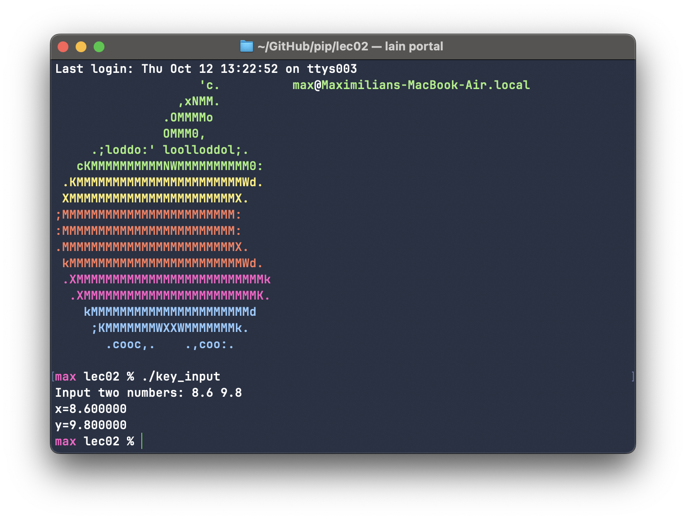

# Exercise 2.1: scanf
Maximilian Fernaldy - C2TB1702

<p align='center'>  </p>

key_input.c receives 2 integers and prints them out. In order to support decimal numbers, we cannot use the type `int` because it will truncate the decimals off of the numbers we input. In order to retain the decimals, we need to change the type to `float` or `double`. We also need to change the format specifiers from `%d` to `%f` when printing the numbers so that it fits the type of our variable, which is `float`. 

Putting all this together, we rewrite the program as such:

```C
#include <stdio.h>

int main(){
    
    /**** variable declaration ****/
    float x, y;           /* integer type */
    
    /**** processing contents ****/
    printf("Input two numbers: ");
    
    /* Get keyboard input */
    scanf("%f %f", &x, &y);

    /* display getting value */
    printf("x=%f\n", x);
    printf("y=%f\n", y);
    
    return 0;
}
```

Running the compiled program in the terminal produces this output:

<p align='center'>  </p>


[comment]: <> (Below is CSS code for the output HTML and pdf files. Don't touch them unless you know what you're doing.)

<style>
  figcaption{
    text-align:center;
    font-size:9pt
  }
  img{
    filter: drop-shadow(0px 0px 7px );
  }
</style>