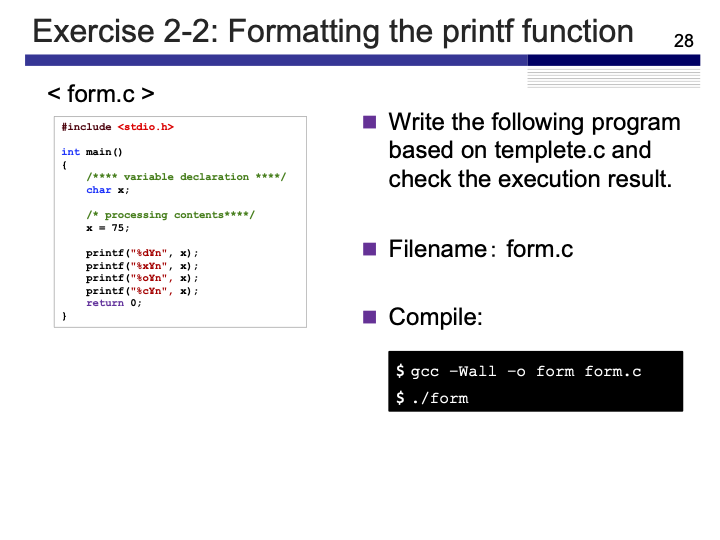
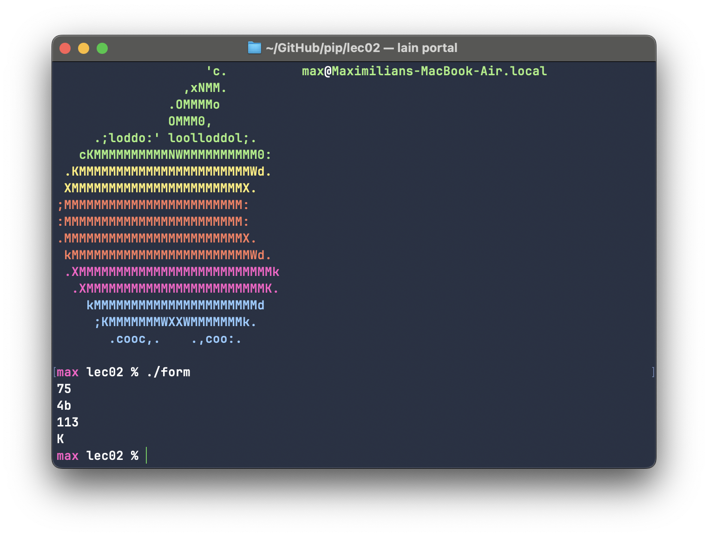
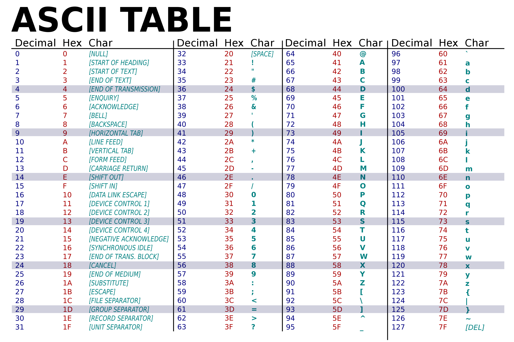

# Exercise 2-2: form.c
Maximilian Fernaldy - C2TB1702

  

form.c highlights an important concept in C, where a `char` type can be converted into other types by using the `printf()` function. This program defines the `char x` as `75` and prints out 4 lines of output that at first glance seems random and unrelated to the original value. However, there is logic behind these values and there are practical uses for this technique later on.

Compiling and running the program yields the following output in the terminal:

  

The first line prints out `x` formatted as an integer. As expected, the program prints out 75, but this is different from the 75 that's stored in `x`. Even though we did assign the value `75` to `x`, this is not exactly what is stored in the memory, as we will see later. Here, `printf()` formats what is stored in `x` to an integer and then prints out the formatted value to the terminal as output.

The second line is more interesting. Unexpectedly, it prints out `4b`, which doesn't seem to make sense at first. However, if we know what type it was formatted as, we can begin to understand it. Taking a look at `form.c`, we know that the second line prints out `x` after formatting it as a hexadecimal (base-16) number, instead of the usual decimal (base-10). This means we have an extra 6 set of values before moving on to the next digit, as such:

Hexadecimal|0|1|2|...|9|a|b|c|d|e|f|
|-|-|-|-|-|-|-|-|-|-|-|-|
Decimal|0|1|2|...|9|10|11|12|13|14|15|

To get numbers larger than 16, we just insert a new digit. For example, 28 is 1c in hexadecimal, because c carries the value 12 and $1\times16 + 12 = 28$. Now we can intuitively understand why 75 was printed as 4b, because b carries the value 12 and $4\times16 + 11 = 75$. Each digit's value is multiplied by a power of 16, and this carries over to the alphabetical digits too. For example, the hex of 228 is e4, because e carries the value of 14 and $ 14\times16 + 4 = 228 $.

We can imagine this being very useful when trying to make a program that involves hexadecimal color codes, because it means we can convert between decimal values (from 0 to 255) and hexadecimal values (from 0 to ff).

The third line is similar in that it's using a different numerical system than base-10, but it's in octal. As the name suggests, it is base-8, which means it converts `75` stored in `x` into 113, because $1\times8^2 + 1\times8^1 + 3\times8^0 = 75$. Again, each digit is multiplied by 8 and added to the sum to represent the final value.

The fourth and final line is also quite interesting, because it reveals what happened when we created the variable `x` and assigned `75` to it. By using the format specifier `%c`, we format the value stored in `x` as a single character, and then print it out. `75` is then converted to `K`, because it is the equivalent value for type `char` in the ASCII (American Standard Code for Information Interchange) standard. Other equivalent values can be seen below:

  

[comment]: <> (Below is CSS code for the output HTML and pdf files. Don't touch them unless you know what you're doing.)

