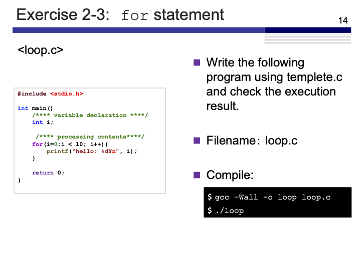

# Exercise 2-3: `for` statement
Maximilian Fernaldy - C2TB1702

<p align='center'>  </p>

This exercise introduces the `for` loop. A `for` loop iterates through a section of code for a certain amount of times, or until a condition is achieved. Taking a look at loop.c:

```C
#include <stdio.h>

int main()
{
    /**** variable declaration ****/
    int i;
    
    /**** processing contents ****/
    for(i=0;i<10;i++) {
        printf("hello: %d\n", i);
    }
    
    
    return 0;
    
}
```

This `for` loop initiates at `i=0` and loops as long as `i<10`, adding 1 to `i` every time an iteration is completed (this is what `i++` does). Logically, we can assume that this loop will print 10 times, which is when `i` is equal to 0, 1, 2, 3, 4, 5, 6, 7, 8, and finally 9. At the last iteration (when `i` = 9), the `for` loop adds 1 to `i`, which makes it equal 10, and therefore the statement `i<10` is not true anymore. This will end the for loop and continue with the program. Since we don't have anything after the `for` loop, it will just end.

Running the program after compiling it confirms our assumption:

<p align='center'>  </p>


[comment]: <> (Below is CSS code for the output HTML and pdf files. Don't touch them unless you know what you're doing.)

<style>
  figcaption{
    text-align:center;
    font-size:9pt
  }
  img{
    filter: drop-shadow(0px 0px 7px );
  }
  .noshade{
    filter: none
  }
</style>