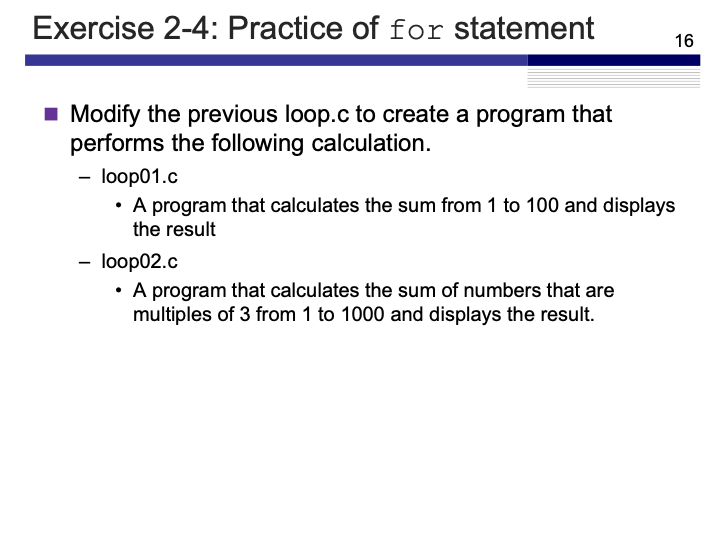
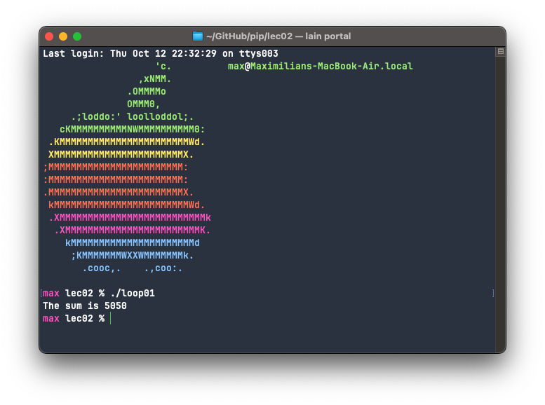
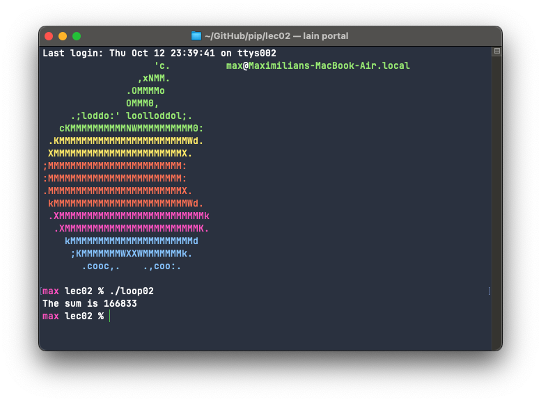

# Exercise 2-4: Practice of `for` statement
Maximilian Fernaldy - C2TB1702

<p align='center'>  </p>

## loop01.c

Exercise 2-4 demonstrates the simple applications of the `for` statement. First, we are tasked to calculate the sum of whole numbers from 1 to 100 and display the result. Although this seems easy enough at first glance, the logic might be a little harder.

```C
#include <stdio.h>

int main()
{
    /**** variable declaration ****/
    int i,sum = 0;
    
    /**** processing contents ****/
    for(i=0;i<100;i++) {
        sum += i+1;
    }
    
    printf("The sum is %d\n", sum);
    
    return 0;   
}
```

If we only do `sum += i`, the program will start adding from the initial value of `i`, which is 0. Since we want to do $1+2+\ldots+100$, we need to start from 1. To do this, we offset the addition into `sum` by doing `sum += 1`, so that it starts by adding 1 into `sum` when `i=0`, adding 2 into `sum` when `i=1`, and so on until it adds 100 into `sum` when `i=99`. Compiling and running the program yields:

<p align='center'>  </p>

## loop02.c

Next we are tasked to calculate the sum of numbers that are multiples of 3 from 1 to 1000 and display the result. There are many ways to do this, for example, the most intuitive way after reading the problem statement is probably by iterating through all the numbers from 1 to 1000, check if it's divisible by 3, and if it is, add it to the sum. However, this method requires us to run the `if` condition a thousand times. While C is incredibly fast, it is bad programming practice to rely on many logical processing when avoidable.

Another way to do this is actually simpler. We can use the `for` loop to work for us.

```C
#include <stdio.h>

int main()
{
    /**** variable declaration ****/
    int i,sum = 0;
    
    /**** processing contents ****/
    for(i=3;i<=1000;i+=3) {
        sum += i;
    }
    
    printf("The sum is %d\n", sum);
    
    return 0;
}
```

Instead of starting at 1 intuitively, since we know that 1 is not a multiple of 3, we can start at 3 and add 3 to `i` after each iteration. Compiling and running the code yields:

<p align='center'>  </p>

[comment]: <> (Below is CSS code for the output HTML and pdf files. Don't touch them unless you know what you're doing.)

<style>
  figcaption{
    text-align:center;
    font-size:9pt
  }
  img{
    filter: drop-shadow(0px 0px 7px );
  }
  .noshade{
    filter: none
  }
</style>