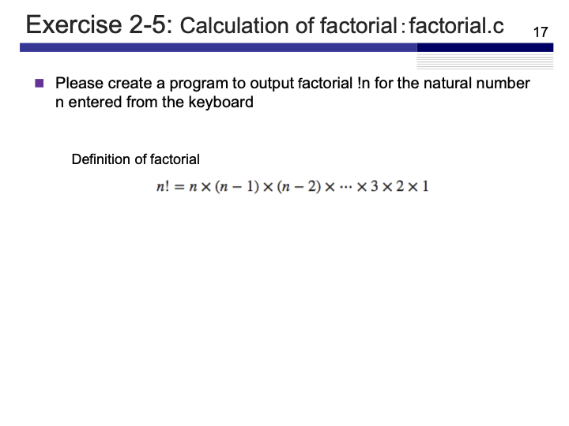
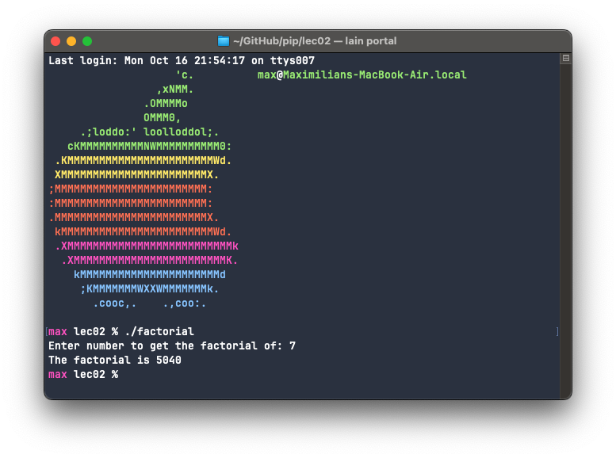
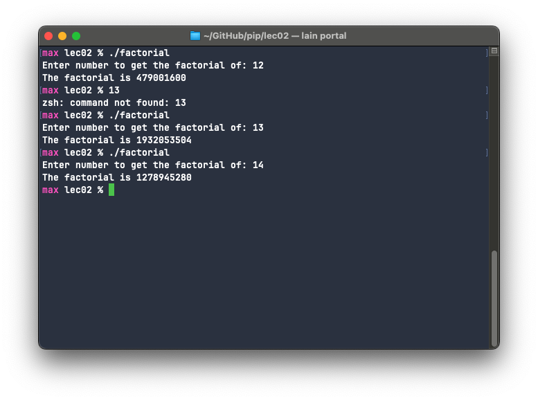
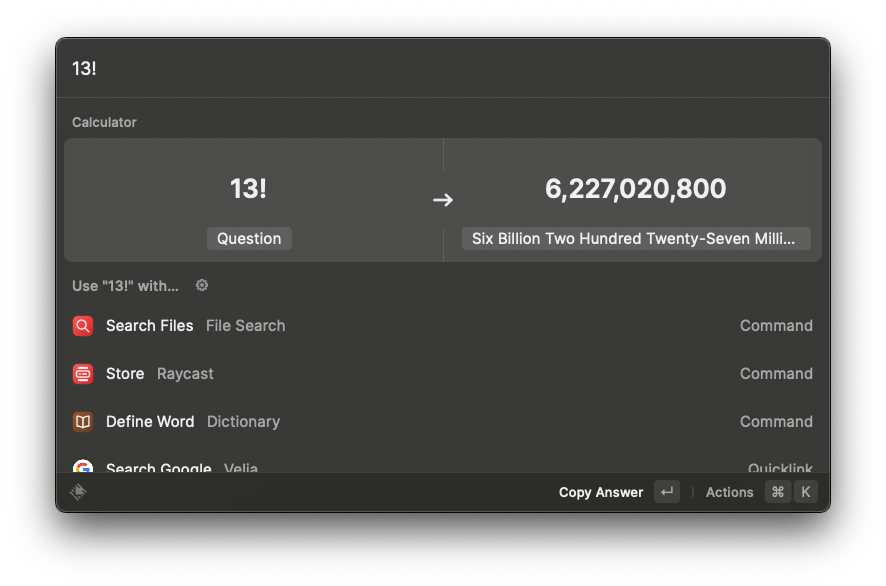
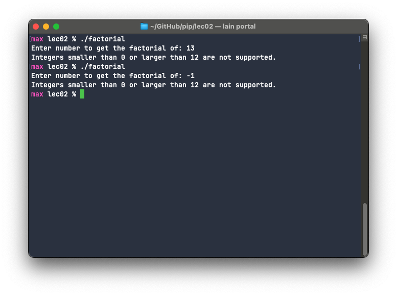

# Exercise 2-5: factorial.c
Maximilian Fernaldy - C2TB1702

<p align='center'>  </p>

Exercise 2-5 is another implementation of the for loop. Again there are multiple ways to go about this. A factorial can be defined as such:

$$n! = n \times (n-1) \times (n-2) \times \ldots \times 1$$

However, since we know that multiplication is commutative, we can also define it like this:

$$n! = 1 \times \ldots \times (n-2) \times (n-1) \times n$$

Which means our for loop can go both ways: going up from $1$ and ending with $n$ or going down starting with $n$ and ending with $1$. Ultimately both ways have their different use cases for specialized use, but since we only need the final result of the factorial for this exercise, either way is fine. I chose to go with the descending route.

```C
#include <stdio.h>

int main()
{
    /**** variable declaration ****/
    int n,factorial = 1; // Initialize factorial as 1 so that it defaults to 1 when 0 or 1 is entered

    printf("Enter number to get the factorial of: ");
    scanf("%d", &n); // get user input for the desired factorial
    
    /**** processing contents ****/
    for(;n>1;n--) {
        factorial *= n;
    }
    
    printf("The factorial is %d\n", factorial);
    
    return 0;
}
```

We omit the first field in the `for` loop because we have defined `n` using `scanf()`. Then we select `n>1` for the iteration condition, because we want to keep multiplying until `n` is equal to 1. Then we print the final result with `printf`.

Compiling and running the code yields the following:

<p align='center'>  </p>

But factorials can get large very quick. Since an `int` type can only hold a value up to 2147483647, if we get values higher than that with a factorial, the output will be wrong. Trying to get higher and higher numbers, we see that at `n=13`, the program breaks. It outputs a value that is not equal to $12! \times 13$. A quick check with a calculator confirms this. 

<p align='center'>  </p>

<p align='center'>  </p>

We don't want to give out false information, so to simply error handle this for now, we can just tell the user that factorials higher than 12 are not supported. Additionally we also add the condition for when `n` is smaller than 0.

```C
#include <stdio.h>

int main()
{
    /**** variable declaration ****/
    int n,factorial = 1; // Initialize factorial as 1 so that it defaults to 1 when 0 or 1 is entered

    printf("Enter number to get the factorial of: ");
    scanf("%d", &n); // get user input for the desired factorial
    if (n < 0 || n > 12) {
        printf("Integers smaller than 0 or larger than 12 are not supported.\n");
    }
    else {
        /**** processing contents ****/
        for(;n>1;n--) {
            factorial *= n;
        }
        
        printf("The factorial is %d\n", factorial);
    }
    return 0;
}
```

Now if we input numbers that don't satisfy the condition the program will alert the user that it is not supported.

<p align='center'>  </p>

Another route we can go is to use another type, namely long integers, to do the factorials with. However since this is not in the scope of the assignment I will leave it be.


[comment]: <> (Below is CSS code for the output HTML and pdf files. Don't touch them unless you know what you're doing.)
<style>
    figcaption{
    text-align:center;
        font-size:9pt
    }
    img{
        filter: drop-shadow(0px 0px 7px );
    }
    .noshade{
        filter: none
    }
</style>