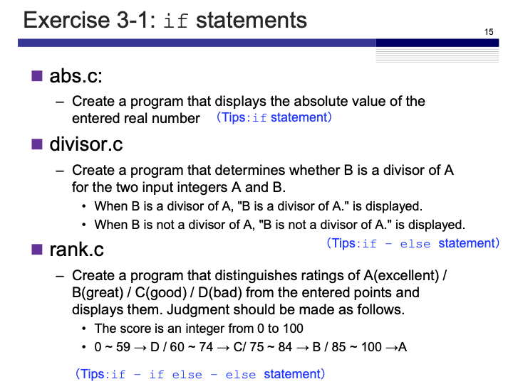
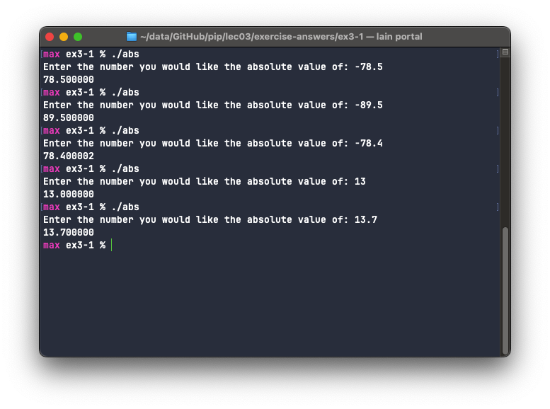
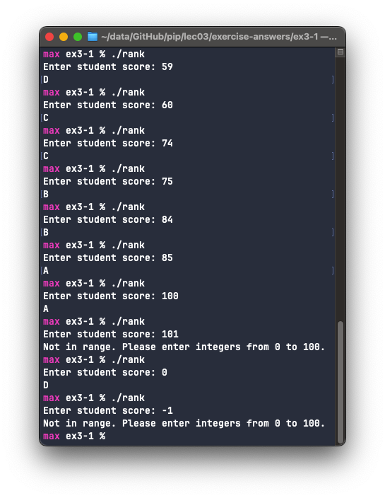

# Exercise 3-1: `if` statements
Maximilian Fernaldy - C2TB1702

## abs.c

<p align='center'>  </p>

The absolute value of a real number can be defined as such:
$$ |n| = \begin{cases} n \mathrm{,\;for\;positive\;}n\\
-n\mathrm{,\;for\;negative\;}n\end{cases} $$

which means we can use the conditional operator `if` and `else` to get the final result.

```C
#include <stdio.h>

int main() {
    float n = 0;
    printf("Enter the number you would like the absolute value of: ");
    scanf("%f", &n);
    if (n < 0) { // if n is negative, reverse the sign
        printf("%f\n", -n);
    } else { // if n is positive, leave it be
        printf("%f\n", n);
    }
}
```

another, perhaps simpler way to do this is to just use a single `if` operator, reversing the sign if it's negative:
```C
#include <stdio.h>

int main() {
    float n = 0;
    printf("Enter the number you would like the absolute value of: ");
    scanf("%f", &n);
    if (n < 0) { // if n is negative, reverse the sign
        n = -n;
    }
    printf("%f", n);
}
```

The program runs as expected:

<p align='center'>  </p>

## divisor.c

In divisor.c we are faced with a binary problem—either B is a divisor of A or it is not. In situations like this we can apply the `if` and `else` conditional operators to return the correct result.

```C
#include <stdio.h>

int main() {
    int a = 0, b = 0;
    printf("Input 2 integers A and B separated by a space: ");
    scanf("%d %d", &a, &b);
    if (a % b == 0) {
        printf("B is a divisor of A\n");
    } else {
        printf("B is not a divisor of A\n");
    }
}
```

To check whether or not B is a divisor of A we can use the modulo operator. It returns the remainder of a division. If it returns zero, then there is no remainder, which means B is a divisor of A, and if it returns anything else, then B is not a divisor of A.

## rank.c

For rank.c, we have multiple possibilities to account for. There are 4 possible ratings that can be assigned to a score. To do this we can make use of `if`, `else if` and `else` operators. In this use case, the usage of `else if` is not mandatory, but it is good practice to use it when the possibilities are disjoint (in this case, we cannot get 2 different ratings simultaneously).

```C
#include <stdio.h>

int main() {
    int score = 0;
    printf("Enter student score: ");

    scanf("%d", &score);

    if (score >= 0 && score <= 59) {
        printf("D");
    } else if (score >= 60 && score <= 74) {
        printf("C");
    } else if (score >= 75 && score <= 84) {
        printf("B");
    } else if (score >= 85 && score <= 100) {
        printf("A");
    } else {
        printf("Not in range. Please enter integers from 0 to 100.");
    }
    return 0;
}
```

The program is fairly straightforward. It takes the score input by the user and categorizes it into 5 different cases. First, if the score is between 0 and 59 inclusive, the program prints a D rating and ends. If it's between 60 and 74 inclusive it prints a C rating and ends. This also applies similarly to B and A, exiting after assigning a rating, because once the program knows where the score is on the scale, it doesn't need to check again if it belongs to another score range. For example, if the score input is 78, the program will first check if it is between 0 and 59, and return false. Then it will check if it is between 60 and 74 and return false again. It will finally check if it is between 75 and 84, and return true. The program doesn't need to check if it's between 85 and 100 anymore, because it's impossible to be true—we already know that it's between 75 and 84. This is why we should use `else if` instead of another `if` statement. Even though we know for sure that the last `if` statement won't return true, it is a waste of time and resources to check needlessly. In a program with a large amount of conditional operators, we should minimize the amount of checks as much as possible, and only use the correct ones where necessary.

The compiled program works as follows:

<p align='center'>  </p>


[comment]: <> (Below is CSS code for the output HTML and pdf files. Don't touch them unless you know what you're doing.)

<style>
  figcaption{
    text-align:center;
    font-size:9pt
  }
  img{
    filter: drop-shadow(0px 0px 7px );
  }
</style>