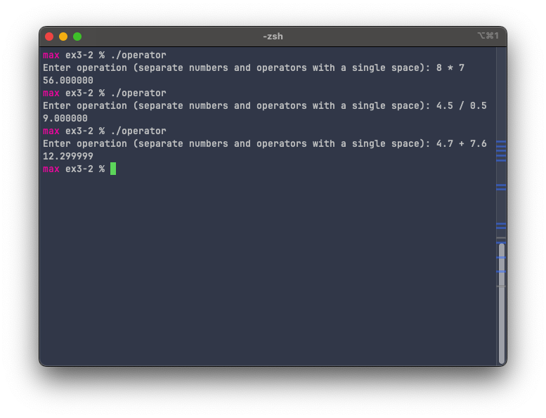

# Exercise 3-2: `switch` statement
Maximilian Fernaldy - C2TB1702

<p align='center'>  </p>

Exercise 3-2 introduces another way to deal with multiple possibilities: the `switch` statement. A switch statement is [much faster](https://medium.com/@michellekwong2/switch-vs-if-else-1d458e7b0711#:~:text=A%20switch%20statement%20works%20much,case%20has%20to%20be%20executed.) than an if-else ladder and is more readable when there are many possibilities to the value of something.

To implement this in operator.c, we first need to identify which variable has multiple possible values. Since we are tasked to create a simple arithmetic calculator, it is obvious that the operator here is that variable. We need to create a **switch** for the operator, which has multiple **cases**: plus sign for addition, minus sign for subtraction, asterisk for multiplication and slash for division.

```C
#include <stdio.h>

int main() {
    float a = 0, b = 0;
    char opr;
    printf("Enter operation (separate numbers and operators with a single space): ");
    scanf("%f %c %f", &a, &opr, &b);

    switch (opr) {
        case '+':
            printf("%f\n", a + b);
            break;
        case '-':
            printf("%f\n", a - b);
            break;
        case '*':
            printf("%f\n", a * b);
            break;
        case '/':
            printf("%f\n", a / b);
    }

    return 0;
}
```

We first initialize the variables a and b as `float` types (because the inputs are real numbers), and initialize the operator variable `opr` as a `char` type. Then, we scan the user input for the numbers and the operator. After that, we can return the result according to the operator from the user.

The compiled program works as follows:


<p align='center'>  </p>


[comment]: <> (Below is CSS code for the output HTML and pdf files. Don't touch them unless you know what you're doing.)

<style>
  figcaption{
    text-align:center;
    font-size:9pt
  }
  img{
    filter: drop-shadow(0px 0px 7px );
  }
</style>