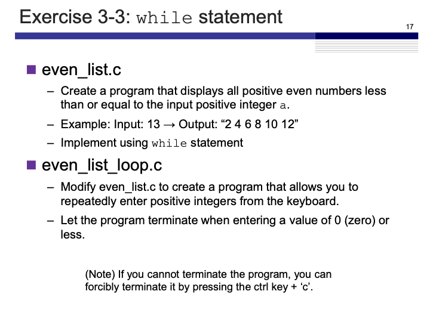

# Exercise 3-3: `while` statement
Maximilian Fernaldy - C2TB1702

<p align='center'>  </p>

## even_list.c

After asking for input into `a`, we initialize the while loop starting from `n = 0` (because 0 is even), then print the numbers and keep adding 2 as long as it is smaller than or equal to `a`. Once it is larger than `a`, the `while` loop stops and the program ends.

```C
#include <stdio.h>

int main() {
    int a = 0, n = 0;
    printf("Display even numbers up to: ");
    scanf("%d", &a);

    while (n <= a) {
        printf("%d\n", n);
        n+=2;
    }
  return 0;
}
```

## even_list_loop.c

For even_list_loop.c we initialize `i = 1` because it needs to be a positive integer. We then start the while loop and tell it to keep running as long as `i>0`. Inside the loop we ask for user input and assign it into `i`. As the iteration ends, the loop will first check if the condition is still fulfilled. If `i>0` is true, it will continue with the next iteration. If it is false, the program ends.

```C
#include <stdio.h>

int main () {
    int i = 1;

    while (i>0) {
        printf("Enter a positive integer: ");
        scanf("%d", &i);
    }
    return 0;
}
```

[comment]: <> (Below is CSS code for the output HTML and pdf files. Don't touch them unless you know what you're doing.)

<style>
  figcaption{
    text-align:center;
    font-size:9pt
  }
  img{
    filter: drop-shadow(0px 0px 7px );
  }
</style>