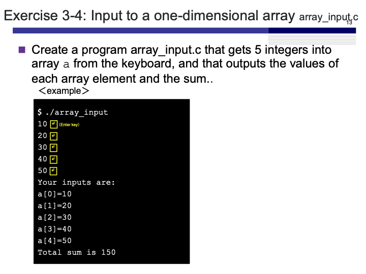
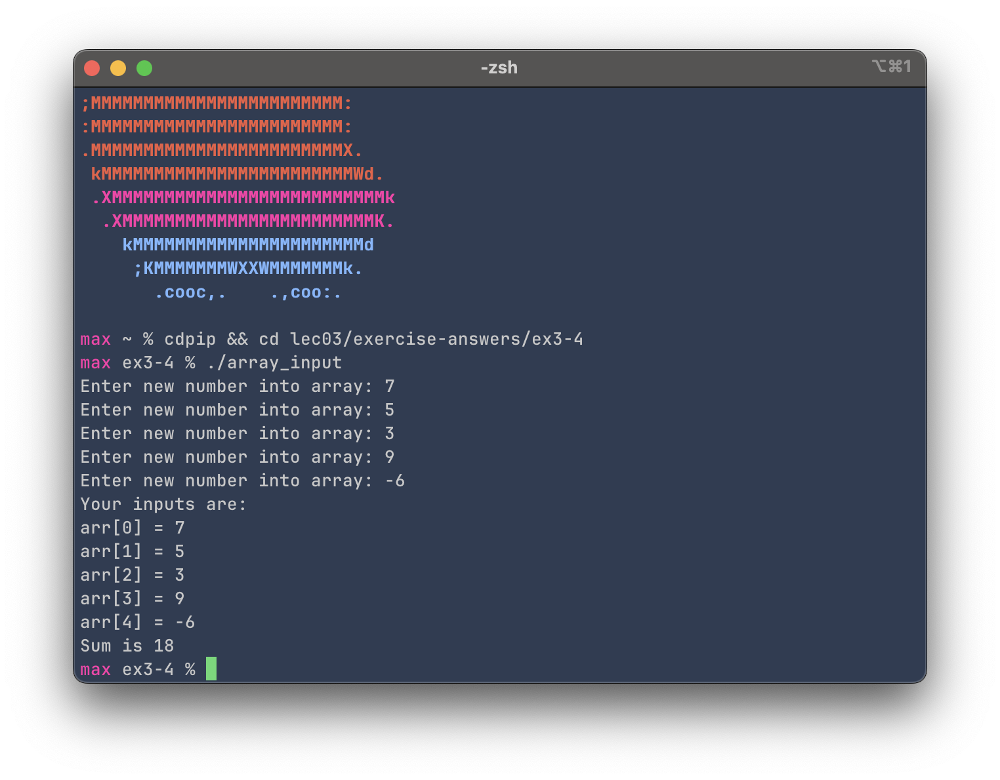

# Exercise 3-4: Input to one-dimensional array (array_input.c)
Maximilian Fernaldy - C2TB1702

<p align='center'>  </p>

To repeat an action a certain number of times, we can use the `for` loop. First we initialize the iterator variable `i` and set it as 0, then set it to stop before the array length (because the highest index is equal to the array length minus one, due to the array being zero-indexed). Finally in the loop we ask for input from the user, and insert the input into the array with `arr[i] = new_entry;`.

```C
#include <stdio.h>

#define ARRAY_LENGTH 5

int main() {
    int arr[ARRAY_LENGTH], sum = 0, new_entry;
    for (int i = 0; i < ARRAY_LENGTH; i++) {
        printf("Enter new number into array: ");
        scanf("%d", &new_entry);
        arr[i] = new_entry;
        sum += arr[i];
    }
    
    printf("Your inputs are:\n");
    for (int i = 0; i < ARRAY_LENGTH; i++) {
        printf("arr[%d] = %d\n", i, arr[i]);
    }
    printf("Sum is %d\n", sum);

    return 0;
}
```

still inside the `for` brackets, we add the new entry to an accumulating variable `sum`. After the iterator variable `i` reaches 5, the condition for the `for` loop returns `False` and the loop stops after the fifth iteration. It then continues to execute the code block after the loop, printing the inputs with another for loop and finally printing out the sum of the input numbers. We can see that it also works with negative integers.

<p align='center'>  </p>


[comment]: <> (Below is CSS code for the output HTML and pdf files. Don't touch them unless you know what you're doing.)

<style>
  figcaption{
    text-align:center;
    font-size:9pt
  }
  img{
    filter: drop-shadow(0px 0px 7px );
  }
</style>