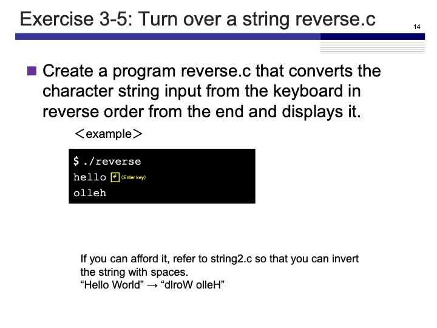
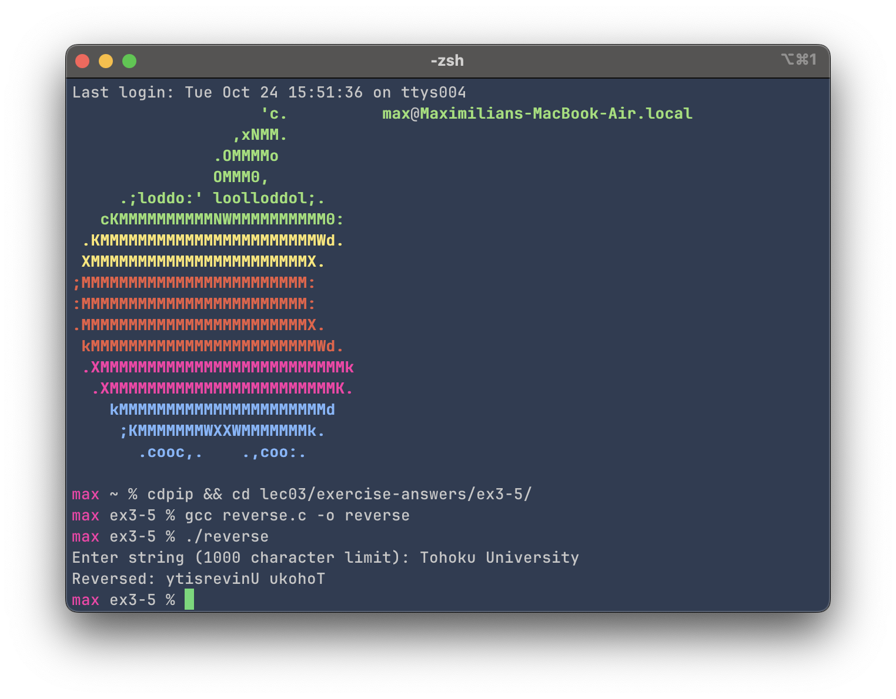

# Exercise 3-5: reverse.c
Maximilian Fernaldy - C2TB1702

<p align='center'>  </p>

We are tasked to make a program that takes user input and reverses the string.

```C
#include <stdio.h>
#include <string.h>

void reverse(char *string);

int main() {
    char string[1001];

    // Get string from user
    printf("Enter string (1000 character limit): ");
    fgets(string, sizeof(string), stdin);
    // NOTE: this fgets also gets newline character from pressing enter.
    // To remove this trailing newline, we use strcspn() function to
    // index the string and remove the newline.
    string[strcspn(string, "\n")] = 0;

    reverse(string);
}

void reverse(char *string) {
    // get string length and midpoint
    int length = strlen(string);
    int midpoint = length / 2;

    for(int i = 0; i < midpoint; i ++) {
        char temporary = string[i];
        string[i] = string[length -i -1];
        string[length - i - 1] = temporary;
    }

    printf("Reversed: %s\n", string);
}
```

as the programs we write are getting longer, I chose to define a function for better organization. So far we've only written code inside the main function `main()`, which runs the code inside it when the compiled binary is ran. Outside the main function, we can define other functions, for example, to reverse a string, like what we will do in this exercise.

To be able to use a function inside the main function, we need to either define it before the main function, or declare it and define it later (if it is declared before the main function, we can define it wherever we want inside the file). Declaring a function is similar to calling it, but we need to use the type specifier (`void` in this case) and pass in the parameter(s) into the brackets. All in all, this is what a declarator for a function that doesn't return anything looks like:

```C
void reverse(char *string);
```

The asterisk in front of `string` indicates that we are [passing the *pointer*](https://www.ibm.com/docs/en/i/7.3?topic=calls-pass-by-reference) into the `reverse()` function, instead of passing by value. Since strings are arrays of characters in C, they are passed into functions by the pointer to their first elements. Passing `string` without the asterisk would pass only the first character into the `reverse()` function, which we obviously don't want to do.

Then to define the function itself, we can do it after the main function because we have already declared it before the main function. The declarator tells the compiler to look for our function definition first before moving on with the main function, which makes the function available to use within the main function. This way of defining functions enables us to better organize the body of the file, enhancing readability.

To define a function, the grammar is exactly the same as with a declaration, but we then use curly brackets to **define** what the function does.

```C
void reverse(char *string) {
    // get string length and midpoint
    int length = strlen(string);
    int midpoint = length / 2;

    for(int i = 0; i < midpoint; i ++) {
        char temporary = string[i];
        string[i] = string[length -i -1];
        string[length - i - 1] = temporary;
    }

    printf("Reversed: %s\n", string);
}
```

There are many approaches that we can take for this problem, but a simple way to do this is to just to swap the characters in the string until we reach the middle point. This way we don't have to allocate memory for another string, we just need to allocate memory for 1 `char` to temporarily store the character that we're changing, so that we can still use the value later to put on the opposite side. For example, if we take out the first character, we first store it in `temp`, change the value of the first character to the value of the last character, then change the value of the last character to the value of `temp`. We keep doing this until we reach the midpoint, where we stop the replacement (because everything is already reversed).

```C
int main() {
    char string[1001];

    // Get string from user
    printf("Enter string (1000 character limit): ");
    fgets(string, sizeof(string), stdin);
    // NOTE: this fgets also gets newline character from pressing enter.
    // To remove this trailing newline, we use strcspn() function to index the string and remove the newline.
    string[strcspn(string, "\n")] = 0;

    reverse(string);
}
```

As for the main function itself, we first declare the string with `char string[1001]` so that we have enough room for a maximum of 1000 characters and the NULL terminator at the end. Then we get string input from the user with `fgets`. The choice of `fgets` over `scanf` is intentional. While `scanf` might work for single-word strings, it will only recognize the string as specified. For example, the following snippet will only take a single word:

```C
scanf("%s", foo);
```

While the following string can only take two words separated by a space, but store them in different variables:

```C
scanf("%s %s", foo, bar);
```

If we are taking input and we don't know how many whitespaces will be in the string, we need to use `fgets`. `fgets` is part of the standard file handling library of C defined in the standard header file `stdio.c`, and it works by getting data of a specified size and storing it into a string (hence the name `fgets`—file get string).

A documentation of `fgets` can be found [here](https://www.ibm.com/docs/en/i/7.3?topic=functions-fgets-read-string) by IBM. To use `fgets`, we must pass 3 arguments. The first one is the string we want to write to. The second argument is the size of the data we want to read, and the third argument is where we read the data from. It is also important to note that for the second argument, we must specify the actual physical size of the data, not how many elements/characters we want to read from the source. Since a character has a size of 1 byte, a string of $n$ characters will have a size of $n+1$ bytes, accounting for the additional byte needed to store the NULL terminator. Therefore as we defined our string as `char string[1001]`, `sizeof(string)` will return `1001`. This value is then used by `fgets` to read 1001 bytes of data. Finally, we specify `stdin` for the last argument, to instruct `fgets` to read from the `stdin` stream. `stdin` is a standard file stream in C that takes input from the keyboard when opened.

Finally, for our usage the syntax for `fgets` is
```C
fgets(string, sizeof(string), stdin);
```

Translated into English, this reads "into `string`, read data with size equal to the size of `string` from file stream `stdin`."

Before we reverse the string, we need to be aware of the fact that when we use `fgets`, it will record the newline character we enter after typing our desired string. This means at the end of the string there will be a newline character, and if we don't remove it, our `reverse()` function from earlier will regard it as a valid character and place it in front of the reversed string.

To remove this trailing newline, we can use the `strcspn()` function. The documentation for this function can be found [here](https://www.ibm.com/docs/en/i/7.1?topic=ssw_ibm_i_71/rtref/strcspn.html). `strcspn` stands for "string complementary span"—it takes two strings as arguments, and finds the first character in the first string that also exists in the second string. In our use case, we want to find how many characters are in front of our newline, so that we know its index in the string and remove it. For example, if we input "hello" and press return, a newline character will be inserted, and the final string will look like `"hello\n"` to our C program, with the newline character indexed at 5. With `strcspn(string, "\n")`, it will return `5`, because there are 5 characters in front of the newline character. Coincidentally, since arrays are zero indexed in C, this number also corresponds to the index number of the newline character, so removing it is easy—we assign a NULL terminator as a new value to that index.

```C
string[strcspn(string, "\n")] = 0;
```

It's important to note that this does not assign the *character* 0 to that index. It assigns the NULL terminator, a marker for nonexistence. This will allow our `reverse()` function to work properly. We can finally pass our string into `reverse`, which will print out the reversed string.

Compiling and running the program yields this result:

<p align='center'>  </p>


[comment]: <> (Below is CSS code for the output HTML and pdf files. Don't touch them unless you know what you're doing.)
<style>
    figcaption{
    text-align:center;
        font-size:9pt
    }
    img{
        filter: drop-shadow(0px 0px 7px );
    }
    .noshade{
        filter: none
    }
</style>