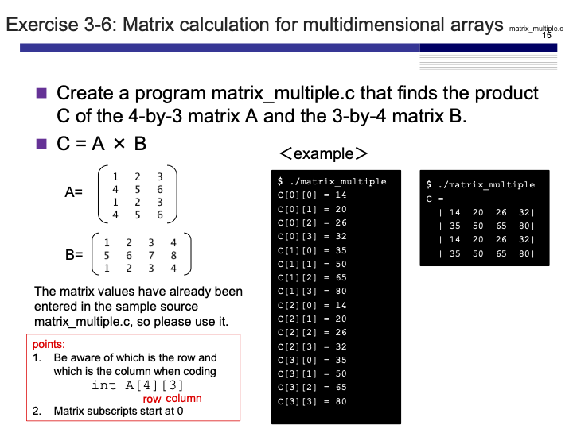
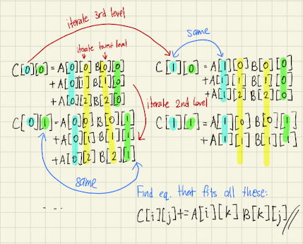
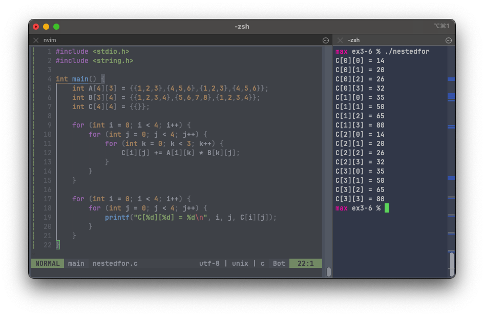
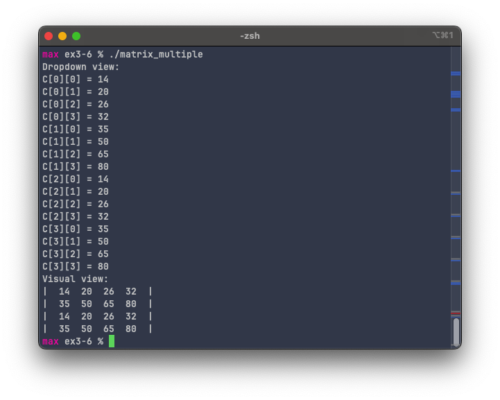

# Exercise 3-6: Matrix calculation for multidimensional arrays (matrix_multiple.c)
Maximilian Fernaldy - C2TB1702

<p align='center'>  </p>

Even though it might seem complicated at first, matrix multiplication is fairly simple with `for` loops, especially when we know the dimensions of the matrices and we don't need to implement adaptivity.

Since we know that the program will encounter a $4\times3$ matrix $A$ and $3\times4$ matrix $B$, it is mathematically deducible that the resulting matrix $C$ will be a $4\times4$ matrix. To derive the mathematical representation of the multiplication, I wrote down the first few iterations of the multiplication, found the pattern, and translated it into code.

<p align='center'>  </p>

From the different additive multiplications, we can see a pattern form. For any given entry $c_{ij}$, it is equal to the sum of the product of $a_{ik}$ and $b_{kj}$. We can represent this mathematically as:

$$ c_{ij} = \displaystyle\sum_{k=1}^{3} a_{ik} \times b_{kj} $$

Note that this formula is obviously only valid for this case. A more general formula would be

$$ c_{ij} = \displaystyle\sum_{k=1}^{n} a_{ik} \times b_{kj} $$

for the multiplication of matrices with size $m\times n$ and $n \times p$.

If we translate this into code, the sum of $a_{ik} \times b_{kj}$ can be obtained by iterating $k$ from 0 to 2. We can start with 1 to 3 just as well, but I decided to stay with the general formula used to define `for` loops in C, which is to start with 0 for the iterator variable. This is the lowest level of the iteration, used to define a single element $c_{ij}$. Next, we need to fill up the matrix, so we need two more levels of iteration, one to go right and fill a single row, then go down and fill the whole matrix. We use the $j$ iterator and the $i$ iterator respectively to do these things. After these nested `for` loops we should end up with all the entries for matrix C.

```C
for (int i = 0; i < 4; i++) {
    for (int j = 0; j < 4; j++) {
        for (int k = 0; k < 3; k++) {
            C[i][j] += A[i][k] * B[k][j];
        }
    }
}
```

To print the output we must use more nested `for` loops, this time only 2 levels deep because we just need 2 iterators.

```C
/* Display results */
// Dropdown
printf("Dropdown view:\n");
for (int i = 0; i < 4; i++) {
    for (int j = 0; j < 4; j++) {
        printf("C[%d][%d] = %d\n", i, j, C[i][j]);
    }
}
```

<p align='center'>  </p>

To print the output in a more easily read, graphical style we can do

```C
// Visual
printf("Visual view:\n");
for (int i = 0; i < 4; i++) {
    printf("| "); // Left boundary
    for (int j = 0; j < 4; j++) {
        printf(" %d ", C[i][j]); // print entry
    }
    printf(" |\n"); // Right boundary, then insert newline for new row
}
```

<p align='center'>  </p>


[comment]: <> (Below is CSS code for the output HTML and pdf files. Don't touch them unless you know what you're doing.)
<style>
    figcaption{
    text-align:center;
        font-size:9pt
    }
    img{
        filter: drop-shadow(0px 0px 7px );
    }
    .noshade{
        filter: none
    }
</style>