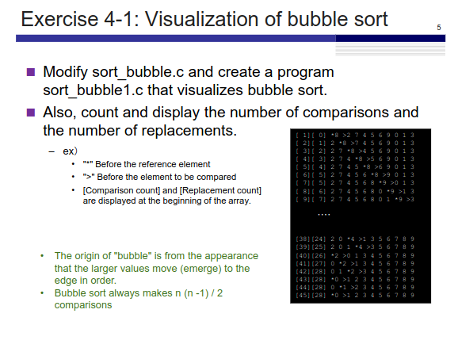
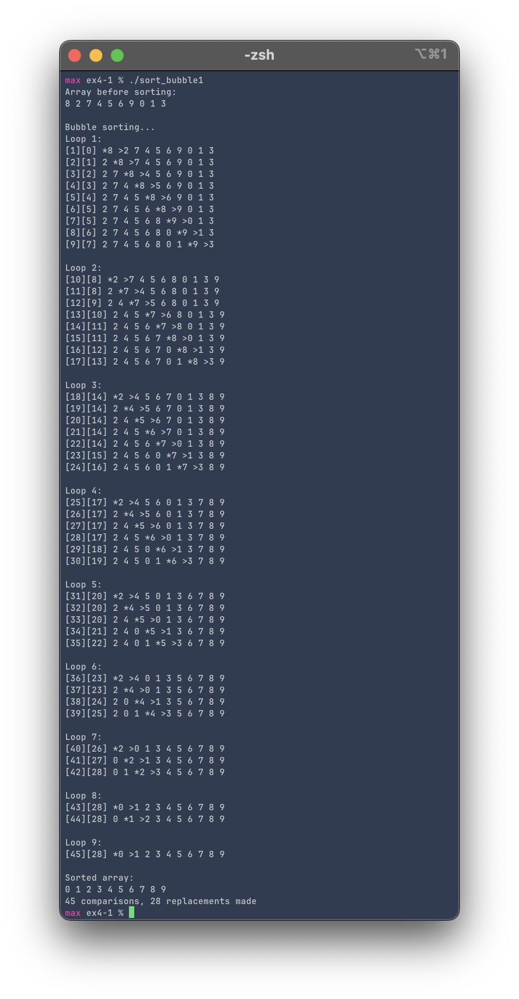

# Exercise 4-1: sort_bubble.c
Maximilian Fernaldy - C2TB1702

<p align='center'>  </p>

To visualize the comparisons, we need to modify the `j` level `for` loop of the program to print the current condition of the array for each comparison ran. An asterisk should be printed whenever our `for` loop encounters the element which is currently being referenced. Since the reference element is always compared to the element right next to it, we can just use `j+1` for its index. Then, if the `for` loop encounters the `j+1`-th element, it should print a ">" before printing the value of the element.

```C
for (j = 0; j < NUM-i-1; j++) {
    comparisons++;
    printf("[%d][%d] ", comparisons, swaps); // Display the number of comparisons and swaps done
    for (int k = 0; k < NUM; k++) {
        if (k == j) {
            printf("*%d ", A[k]);
        } else if (k == j + 1) {
            printf(">%d ", A[k]);
        } else {
            printf("%d ", A[k]);
        }
        
        // Insert new line if k reaches the end of the array
        if (k == NUM - 1) {
            printf("\n");
        }
    }
    
    // If compared number is smaller than reference number, swap them
    if (A[j] > A[j+1]) {
        temp = A[j];
        A[j] = A[j+1];
        A[j+1] = temp;

        swaps++;
    }
}
```

To print the array, we add a lower level `for` loop with iterator `k`, which goes from 0 to `NUM-1` to print the elements one by one, terminating before it reaches `NUM`. When `k` is equal to `j`, that means the program is trying to print the element on the array that is being referenced, so it should print an asterisk before the integer. When `k` is equal to `j+1`, the program is trying to print the element it is being compared to, so it should print an exclamation mark before the integer.

Here, it's not critical to use `else if` instead of `if`, because an element cannot be indexed by `j` and `j+1` at the same time. However, it is still good practice to use `else if` so that the program can skip over this condition if it has already executed the block above it (which is `if (k == j)`)

To count the number of comparisons and replacements made by the program, integers `comparisons` and `swaps` are initialized as 0, and every time a new comparison is made (the beginning of the `j` level `for` loop), `comparisons` is increased by 1:
```C
for (j = 0; j < NUM-i-1; j++) {
    comparisons++;
    ...
}
```
similarly, we modify the code that swaps the numbers to increment `swaps` by 1 to keep track of how many swaps has been made:
```C
if (A[j] > A[j+1]) {
    temp = A[j];
    A[j] = A[j+1];
    A[j+1] = temp;

    swaps++;
}
```

Compiling and running the program gives the following output:

<p align='center'>  </p>


[comment]: <> (Below is CSS code for the output HTML and pdf files. Don't touch them unless you know what you're doing.)
<style>
    figcaption{
    text-align:center;
        font-size:9pt
    }
    img{
        filter: drop-shadow(0px 0px 7px );
    }
    .noshade{
        filter: none
    }
</style>