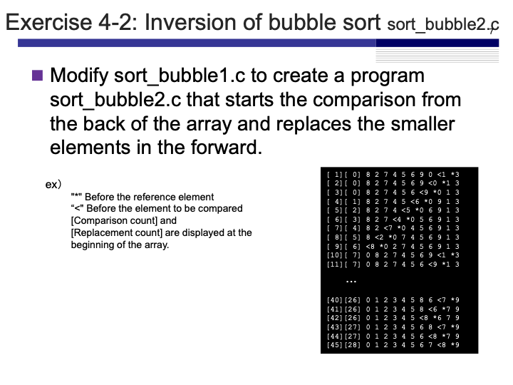
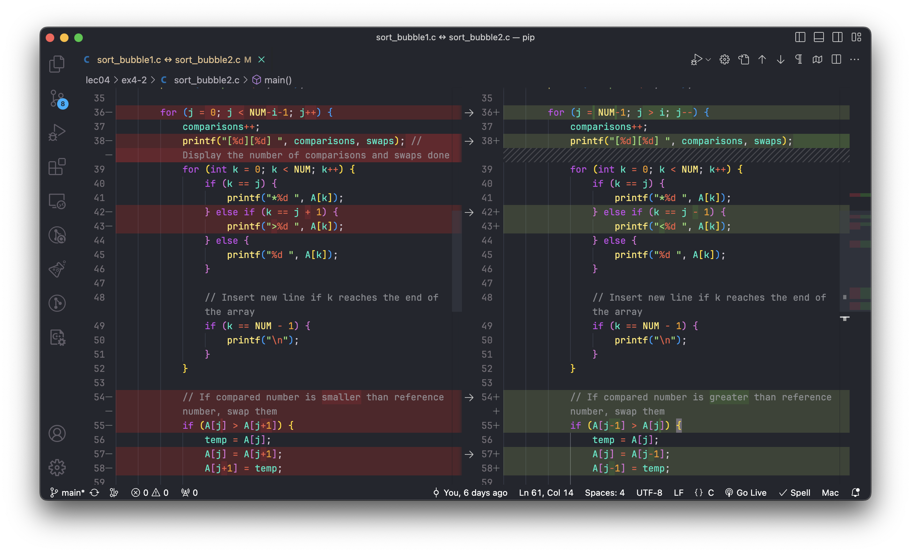
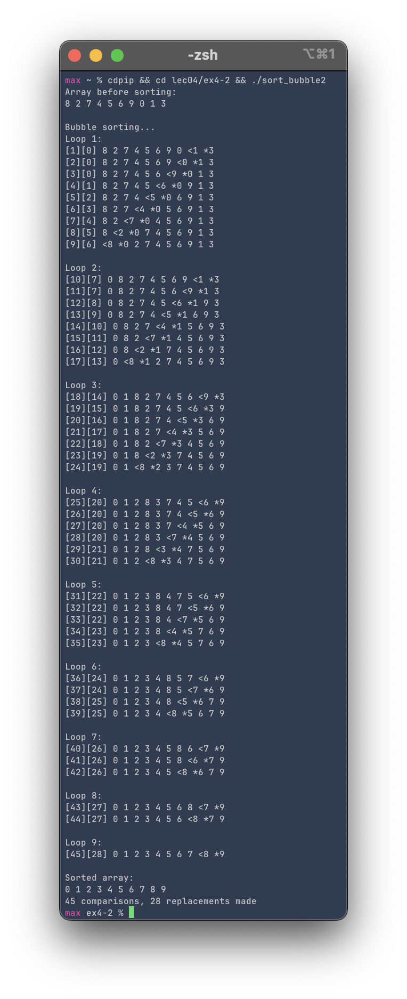

# Exercise 4-2: Inverted Bubble Sort (sort_bubble2.c)
Maximilian Fernaldy - C2TB1702

<p align='center'>  </p>

To start the sort from the end of the array, we only need to replace the values used in the loops, and reuse almost all the code from exercise 4-1. We need to modify these lines in particular:

<p align='center'>  </p>

First, we modify the j-th level `for` loop to start from the last element on the list with index `NUM-1`. Then, we use `j > i` for the looping condition, which means it will first go through the last element to the second element, then from the last to the third, and so on until it reaches the last comparison, which compares the last element with the second element. Finally we *decrement* `j` after every iteration instead of incrementing it so that we move backwards in the array.

```C 
for (j = NUM-1; j > i; j--) {
    ...
}
```

Next, we need to modify the `for` loop that prints the array. The element that is being referenced is still the `j`-th element, so we don't need to change that part. However, the element it is being compared to is now the `j-1`-th element, as opposed to `j+1` from earlier. Therefore, we should change the condition of the `else if` operator to execute the block is `k` matches `j-1` instead. We also change the symbol shown beside the number to "<" instead of ">".

```C
} else if (k == j - 1) {
    printf("<%d ", A[k]);
}
```

Finally, we of course need to change the code that swaps the numbers around. If the compared number is larger than the referenced one, they should be swapped around.

```C
if (A[j-1] > A[j]) {
    temp = A[j];
    A[j] = A[j-1];
    A[j-1] = temp;

    swaps++;
}
```

Running the compiled program gives:

<p align='center'>  </p>


[comment]: <> (Below is CSS code for the output HTML and pdf files. Don't touch them unless you know what you're doing.)
<style>
    figcaption{
    text-align:center;
        font-size:9pt
    }
    img{
        filter: drop-shadow(0px 0px 7px );
    }
    .noshade{
        filter: none
    }
</style>