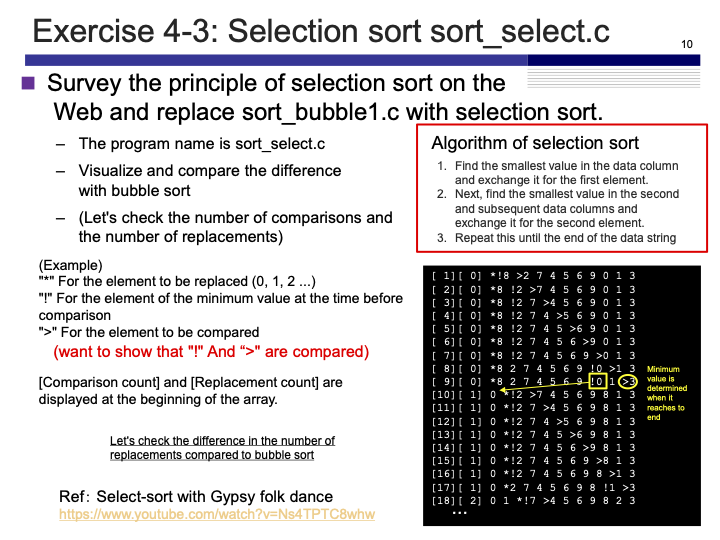

# Exercise 4-3: Selection Sort (sort_select.c)
Maximilian Fernaldy - C2TB1702

<p align='center'>  </p>

The principle of selection sort is to find the `i`-th smallest element and swap it with the `i`-th element in the array. For example, the first "selection" will look for the smallest element in the whole array, and place it in index `0`. The second selection will look for the second smallest element and place it in index `1`. This goes on until it reaches the last 2 numbers and swaps them if they're not already in the right order.

To program the selection sort, we initialize `i` to start from 0 and `j` to start at `i+1` (because we don't need to compare the `i`-th element with itself).

```C
for (i = 0; i < NUM-1; i++) {
    int smallest_index = i;
    printf("Search %d:\n", i+1);

    for (j = i+1; j < NUM; j++) {
        ...
    }
    ...
}
```

we also need to initialize `smallest_index` so that the program can remember the smallest number in each selection process. This can start at `i` for each selection, and we will change it later accordingly within the `j` level `for` loop.

```C
for (j = i+1; j < NUM; j++) {
    comparisons++;
    printf("[%d][%d] ", comparisons, swaps);
    for (int k = 0; k < NUM; k++) {
        if (k == i) { // Element to replace
            printf("*");
        } else if (k == j) { // Compared element
            printf(">");
        }
        if (k == smallest_index ) {
            printf("!");
        }
        printf("%d ", A[k]);
        // Insert new line if k reaches the end of the array
        if (k == NUM - 1) {
            printf("\n");
        }
    }
    // If compared number is smaller than current smallest number,
    // make it the new smallest
    if (A[j] < A[smallest_index]) {
        smallest_index = j;
    }
}
```

As for the `j` level `for` loop itself, we first increment `searches` by 1 at the start of each iteration, so that we can track how many searches are made in total. Then we display the current amount of searches and replacements with `printf`, and then display the current condition of the array inside the `k` level `for` loop. Similarly to sort_bubble, we use conditional operators with comparators to print the indicators. If `k == i`, that means the program is trying to print the referenced element, so we should print an asterisk before it. If `k == j`, it is trying to print the compared element, so we should print the ">" sign before it. Finally, if the loop encounters the element that is the current smallest one, it should also print an exclamation mark before the number. Since an element can be the referenced element and the current smallest at once, it should use an `if` instead of an `else if` conditional operator.

After displaying the current condition of the array, we compare the current smallest element with the element that is being compared by the program. If the compared element is smaller, we assign `j` to be the new value of `smallest_index` so that at the next iteration, the value of the smallest element is updated. At the end of all iterations of `j`, the program will have completed scanning through the unsorted portion of the array, so it can now swap the places of the referenced element (which is the `i`-th element) with the `i`+1-th smallest element. For example, on the first search, `i=0`, so it will swap the referenced element `A[0]` with the first smallest element. On the second search, `i=1`, `A[1]` is the referenced element and it will be swapped with the second smallest element. This continues until the nested loops reach the last 2 elements, compare them, and if they are in the wrong order, swap the `A[n-1]` element (which is the largest element) with the second *largest* element of the array. This will put the second largest and largest elements in their right places, completing the sort.

```C
// At the end of the search, swap smallest with element to replace
if (i != smallest_index) {
    temp = A[i];
    A[i] = A[smallest_index];
    A[smallest_index] = temp;
    swaps++;
}
printf("\n");
```

After sorting the array, we display the final results as such:
```C
/* display array after sorting */
printf("Sorted array: \n");
for (i=0;i<NUM;i++){
    printf("%d ",A[i]);
}
printf("\n");
printf("%d comparisons and %d replacements made\n", comparisons, swaps);
```

Compiling and running the program gives us the following output:


[comment]: <> (Below is CSS code for the output HTML and pdf files. Don't touch them unless you know what you're doing.)
<style>
    figcaption{
    text-align:center;
        font-size:9pt
    }
    img{
        filter: drop-shadow(0px 0px 7px );
    }
    .noshade{
        filter: none
    }
</style>