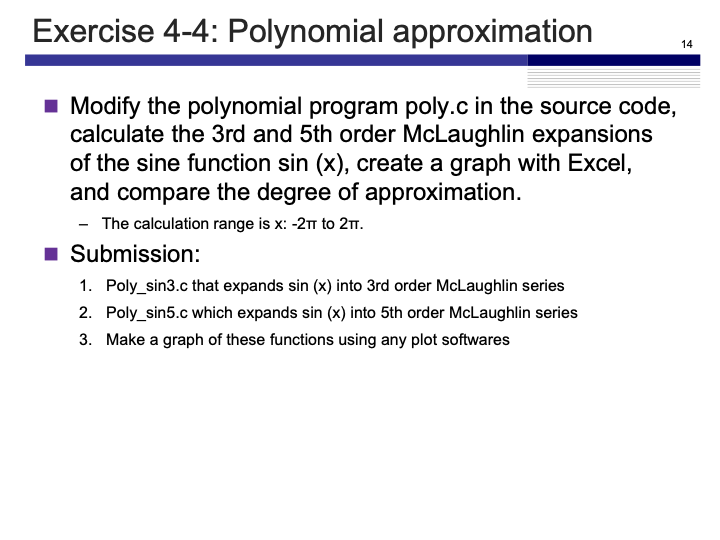

# Exercise 4-4
Maximilian Fernaldy - C2B1702

<p align='center'>  </p>

To evaluate the Maclaurin expansions, we first need to define it. The Maclaurin series is an approximation of a function that can be defined as follows:
$$ \begin{align*} f(x) &= \frac{f(0)}{0!} + \frac{f'(0)}{1!} x + \frac{f''(0)}{2!} x^2 + ... \\ \therefore\; f(x)&= \displaystyle\sum_{n = 0}^{\infty}\frac{f^{(n)}(0)}{n!} x^n \end{align*} $$

Since we're going to use factorials, we should also define the factorial as a function, as it's not included in the `<math.h>` header file:

```C
int factorial(int number) {
    if (number < 1) { // if zero is passed, return 1 as the factorial 
        return 1;
    }
    for (int i = number-1; i > 1; i--) {
        number *= i; // multiplies number by i and assigns that new value to number
    }
    return number;
}
```

Note that this function does not error handle factorials of integers less than 0 (it still returns 1 as the factorial, even though factorials of negative integers are undefined), but since we are going to use it four our own purposes, it's not a problem.

Using the newly-defined function `factorial`, we can define the coefficients to use in the Maclaurin series.

In poly_sin3.c:
```C
double	c[N] = {sin(0)/factorial(0), cos(0)/factorial(1), -sin(0)/factorial(2), -cos(0)/factorial(3)};
```

and in poly_sin5.c:
```C
double	c[N] = {sin(0)/factorial(0), // evaluates to 0
                cos(0)/factorial(1), // evaluates to 1
                -sin(0)/factorial(2), // evaluates to 0
                -cos(0)/factorial(3), // evaluates to 1/6
                sin(0)/factorial(4), // evaluates to 1/24
                cos(0)/factorial(5)}; // evaluates to 1/120
```

Even though it is possible to just use the evaluated values of the coefficients, it is good practice to define where the coefficients come from, for better code readability and comprehension.

After setting the coefficients, we use the following formula for the Maclaurin series of degree $n$:

$$ f(x) = (((c_{n-1}x + c_{n-2})x + c_{n-3})x + ... + c_1)x + c_0 $$

translating this formula to code, we have

```C
/**** (2) processing contents ****/
for(x = -M_PI; x <= M_PI; x += M_PI/100){
    for(y = c[N-1], i = N-2; i >= 0; --i) {
        y = y * x + c[i];
    }
    printf("%f %f\n", x, y);
}
```

the `x` level `for` loop iterates through the linear space of the $x$-axis, giving the function an $x$-value to work with. The `y` level `for` loop is being used to sum the terms of the formula. We can see that at the first iteration, `y = c[N-1]` which corresponds to $c_{n-1}$ gets multiplied by `x` and added by `c[i]`, which corresponds to $c_{n-2}$. Then the whole of this corresponds to $c_{n-1} x + c_{n-2}$, and it all gets multiplied by $x$ and added by `c[i]` again in the next iteration, but now `c[i]` corresponds to $c_{n-3}$. The operation will repeat itself, changing `c[i]` until it is `c[0]`, before printing the result for the specific value of $x$, and continuing with the next value of $x$. This will happen until the `x` level `for` loop also ends, ending the whole program.

Since we want to plot the values using matplotlib later, we should modify the program to print out the x and y values separated by a comma and space.

```C
/**** (2) processing contents ****/
printf("x values:\n");
for(x = -M_PI; x <= M_PI; x += M_PI/100){
    printf("%f, ", x);
}
printf("\ny values:\n");
for(x = -M_PI; x <= M_PI; x += M_PI/100){
    for(y = c[N-1], i = N-2; i >= 0; --i) {
        y = y * x + c[i];
    }
    printf("%f, ", y);
}
```

The first `for` loop iterates from $-\pi$ to $\pi$ in $\dfrac{\pi}{100}$ increments and prints out the $x$-values. The second calculates the $y$-values and prints them out. This part of the code stays the same for whichever degree of polynomial we are using.

Compiling and running poly_sin3.c gives:

<p align='center'>  </p>

and poly_sin5.c gives:

<p align='center'>  </p>

We can use the data from the output and plug it into an array in python (see last page for python code) to plot it and see how close they are to the actual sin function.

<p align='center'>  </p>

Clearly, the 5th degree Maclaurin series approximates $sin(x)$ better than the 3rd degree series, as it stays close to the real function further from $x = 0$. It's still not a viable option for $x$-values higher than $\pi$ or lower than $-\pi$ though, as we can see that it deviates quite severely after that point.

## Python code for plotting

```python
import matplotlib.pyplot as plt 
import numpy as np
from scipy.stats import binom

# Actual sin function
lowerlimit = -np.pi; upperlimit = np.pi

x_values = list(np.arange(lowerlimit, upperlimit, np.pi/100))

print(x_values)

y_values = [np.sin(x) for x in x_values]

# Data obtained from poly_sin3
c_program_x_range=[-3.141593, -3.110177, -3.078761, -3.047345, -3.015929, -2.984513, ...]

sin3data=[2.026120, 1.904050, 1.785049, 1.669087, 1.556133, 1.446155, ...]

# Data obtained from poly_sin5
sin5data=[-0.524044, -0.521131, -0.520097, -0.520826, -0.523202, -0.527114, ...]


plt.plot(x_values, y_values, label = "sin(x)")
plt.plot(c_program_x_range, sin3data, label = "Maclaurin degree 3")
plt.plot(c_program_x_range, sin5data, label = "Maclaurin degree 5")
plt.title("Maclaurin Approximations of sin(x)")
plt.legend()
plt.show()
```


[comment]: <> (Below is CSS code for the output HTML and pdf files. Don't touch them unless you know what you're doing.)
<style>
    figcaption{
    text-align:center;
        font-size:9pt
    }
    img{
        filter: drop-shadow(0px 0px 7px );
    }
    .noshade{
        filter: none
    }
</style>