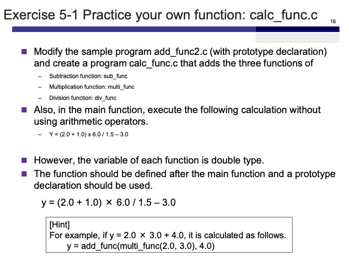
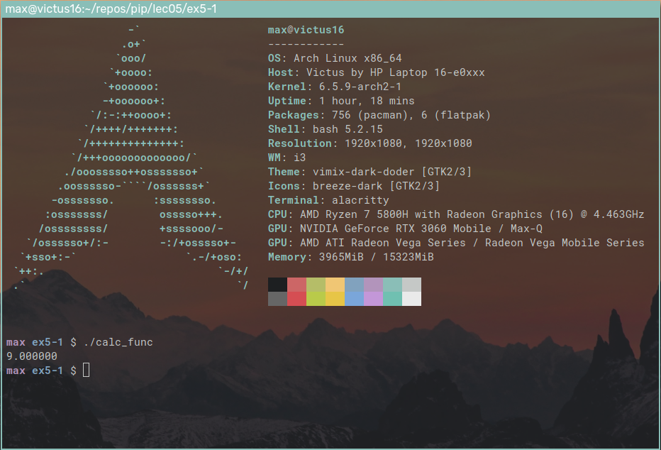

# Exercise 5-1: calc_func.c
Maximilian Fernaldy - C2TB1702

<p align='center'>  </p>

Since we are going to work with divisions, we should change the variables to type `float` in order to avoid unwanted truncation. Then, we should create prototype declarations for all the functions we're going to use after the includes:

```C
#include <stdio.h>

// Function declarations
float add_func(float x, float y);
float sub_func(float a, float b);
float multi_func(float a, float b);
float div_func(float a, float b);
```

Then, we can proceed with the main function. We simply initialize a `float result` and use the functions accordingly. Since functions work from inside to the outside, it is useful to think about arithmetic operations from the last operation first. For example, the last operation that we want to do in this exercise is subtracting 3 from everything else that has been calculated before. So, the outermost function should be `sub_func(..., 3.0)`. Then, the second to last operation is dividing everything that has been calculated before by `1.5`. We should then use `div_func()` inside the brackets of `sub_func()` like so `sub_func(div_func(..., 1.5), 3.0)`. We repeat this with the operation that should be performed before it, and the operation before it, and so on, until we reach the first operation that should be performed. Doing so, we will get this line:

```C
float result = sub_func(div_func(multi_func(add_func(2.0, 1.0), 6.0), 1.5), 3.0);
```

Now to define the functions. They are very simple arithmetic operations, so each of them simply takes two floats and does whatever operation is needed. The general form of the functions should look like this:

```C
float operation_func(float a, float b) {
    return a <operator> b;
}
```

Compiling and running the program gives us the following output:

<p align='center'>  </p>


[comment]: <> (Below is CSS code for the output HTML and pdf files. Don't touch them unless you know what you're doing.)
<style>
    figcaption{
    text-align:center;
        font-size:9pt
    }
    img{
        filter: drop-shadow(0px 0px 7px );
    }
    .noshade{
        filter: none
    }
</style>