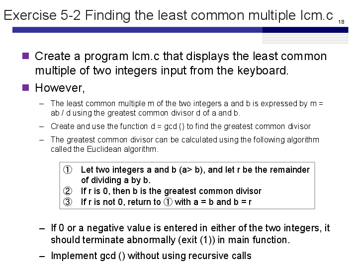
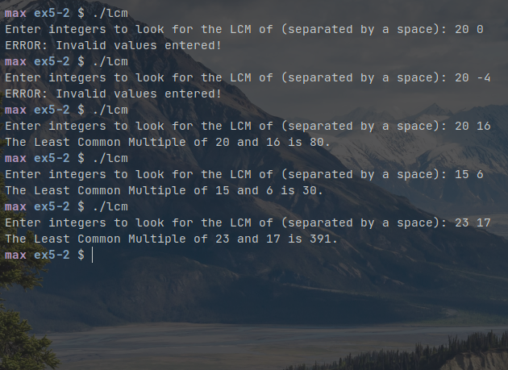

# Exercise 5-2
Maximilian Fernaldy - C2TB1702

<p align='center'>  </p>

To find the least common multiple of two integers, we first need to find the greatest common divisor. The greatest common divisor is the greatest integer that can divide both integers wholly (meaning it returns 0 as a remainder). When we have obtained this greatest common divisor, the least common divisor can then be found by multiplying the two integers, divided by their greatest common divisor.

## Handling invalid input

In the case that the user inputs a value equal or smaller than 0 for `a` or `b`, we need to stop the program, because it will not work with the `gcd()` function. To do that, we can use the `exit()` function defined in the `<stdlib.h` header file. To do that, we add `#include <stdlib.h>` to the top of the file and add an `if` condition to check if `a` or `b` has value equal to or smaller than 0. 
```C
if (a <= 0 || b <= 0) {
    printf("ERROR: Invalid values entered!\n");
    // Terminate the program and return status 1 to the OS
    // if invalid values are entered for a or b.
    exit(1);
}
```

## The Euclidean algorithm

The [Euclidean algorithm](https://www.wikiwand.com/en/Euclidean_algorithm) is an algorithm that searches for greatest common divisor of two numbers.

To better visualize how the algorithm work, suppose we want to find the greatest common divisor of 20 and 16. The algorithm works as follows:

$$ \mathrm{gcd}(20, 16)\\20 = 16 \times 1 + \; \mathclap{\underset{\substack{\uparrow \\ remainder}}{4}} \\ \mathrm{gcd}(16,4) \\ 16 = 4 \times 4 + \;\mathclap{\underset{\substack{\uparrow \\ remainder}}{0}} \\ \mathrm{gcd}(16,4) = 4 \\\therefore \; \mathrm{gcd}(20,16) = \mathrm{gcd}(16,4) = 4$$


It is recursive by nature, but its implementation in code doesn't necessarily have to be "recursive" in the strictly programming sense of the word. We can implement it by reassignment *inside* the function, instead of calling the function again with altered parameters.

```C
int gcd(int a, int b) {
    if (a < b) { // Swap a and b to make sure b is smaller than a
	a += b;
	b = a - b;
	a -= b;
    }

    while (a % b != 0) {
	// Euclidean algorithm
	// Swap a and b if the remainder is not 0
	a += b; // adds b to a and assigns to a
	b = a - b; // assigns the original value of a to b
	a -= b; // subtracts the original value of a from a and reassigns into a,
        // essentially making it equal to the original value of b
	b %= a; // assigns the remainder of b%a to b (because at this point b
        // contains original value of a and a contains the original value of b)
    }

    return b;
}
```

## Rearranging arguments

First, if a is smaller than b, we need to rearrange them, since the function `gcd()` should be able to take input arranged either way, but needs them in order to calculate the greatest common divisor. Therefore we use an `if` condition to check if `a` is smaller than `b`, and if so, we use a commonly known method to swap the values of integers without assigning extra memory. We do this by first adding the value of $b$ to $a$ (let's call this $a'$), then subtract the value of $b$ from $a'$ and assigning it to $b'$. Lastly, we subtract $b'$ from $a'$ and assign it to $a''$. After these operations, we have $a'' = b$ and $b' = a$, achieving our intended goal. In mathematical notation, these are the operations performed:

$$ \begin{align*} a' &= a + b \\ b' &= a' - b = a \\ a'' &= a' - b' = a + b - a = b\end{align*}$$

since arithmetic operations look different from mathematical notation, this might look confusing at first, but after taking time to understand what the method does, we can start to appreciate the ingenuity of programmers, finding ways to work around additional memory allocation. Although this might not seem like much in the small scale, when we're programming a massive codebase, these memory saving techniques can add up to a non-insignificant performance improvement.

## Performing the Euclidean algorithm

Now that the arguments are in the correct order, we can start to code the Euclidean algorithm itself. To make the algorithm repeat itself, we use the `while` statement. The condition should be while the remainder of dividing `a` by `b` is not equal to 0. This will make sure the block repeats as long as the remainder is not zero. Then, the code that should be executed repeatedly will perform the [integer-swapping method](#rearranging-arguments) explained earlier, but this time, at the end of the swapping, we assign `b % a` to `b`. Remember, this is equivalent to setting **the remainder of $b' \div a''$, or $a \div b$** to `b`. This way we don't have to initialize another variable like `r` into the program, and we can just use two variables `a` and `b` inside the function. After reassigning the variables, the `while` loop runs the code block inside it again, this time with different values inside the variables `a` and `b`. It will keep running until the remainder becomes 0, which will stop the `while` loop and return the greatest common divisor, which is inside the variable `b`.

## Getting the Least Common Multiple

Since we've done the hardest part, which is getting the greatest common divisor, getting the LCM of two integers is just a matter of plugging in the GCD into a formula:

$$ \mathrm{LCM} = \frac{a \times b}{\mathrm{GCD}} $$

```C
int lcm = a * b / gcd(a, b);
```

which will call the `gcd()` function, performs the appropriate operations and assign the result to `lcm`. Finally, we print the result as usual with `printf*()`.

```C
printf("The Least Common Multiple of %d and %d is %d.\n", a, b, lcm);
```

Compiling and running the program gives us the following output:

<p align='center'>  </p>


[comment]: <> (Below is CSS code for the output HTML and pdf files. Don't touch them unless you know what you're doing.)
<style>
    figcaption{
    text-align:center;
        font-size:9pt
    }
    img{
        filter: drop-shadow(0px 0px 7px );
    }
    .noshade{
        filter: none
    }
</style>
