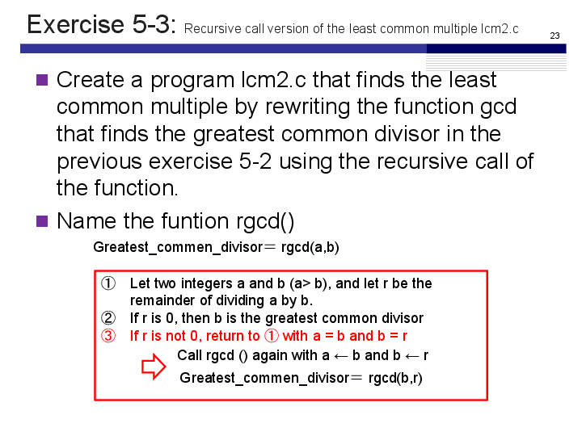
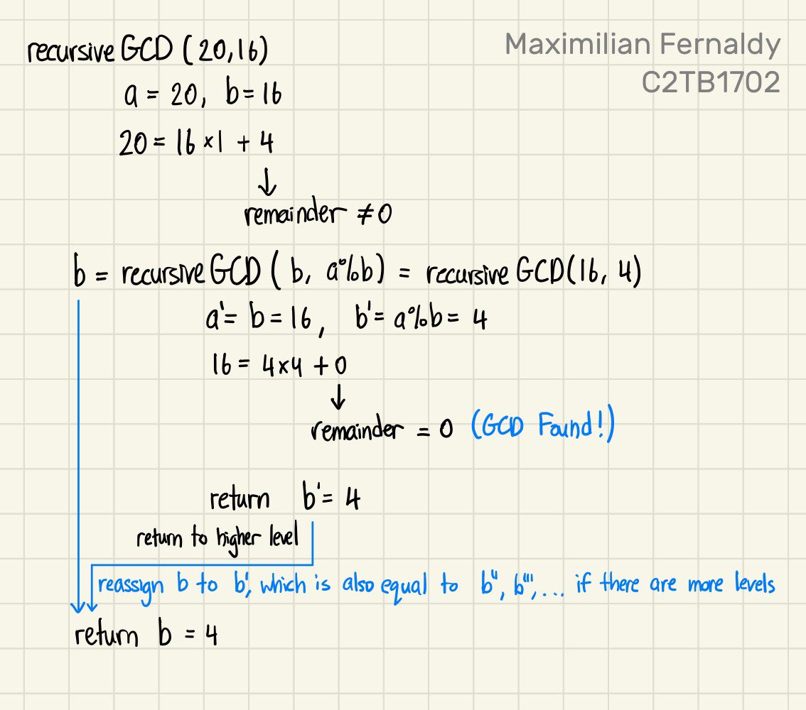
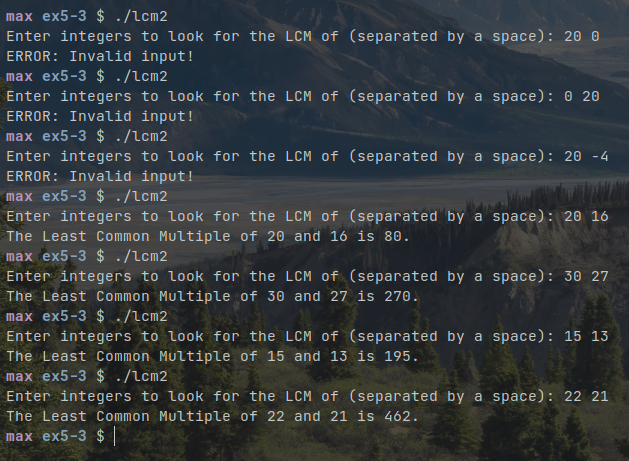

# Exercise 5-3: lcm2.c
Maximilian Fernaldy - C2TB1702



## Using recursive function calls to find greatest common divisor

We can copy most of the code from lcm.c except for the `gcd()` function. For this exercise, we should use recursive function calls to get the greater common divisor. Since the Euclidean algorithm is intuitively recursive, it's relatively simple to program the recursion.

```C
int recursiveGCD(int a, int b) {
    if (a < b) { // Swap a and b to make sure b is smaller than a
	a += b;
	b = a - b;
	a -= b;
    }
    
    // Euclidean algorithm
    if (a % b != 0) { // If a % b != 0, recursively call the function
    // with b as a and a%b as b
	b = recursiveGCD(b, a % b);
    }

    return b;
}
```

Similarly to lcm.c, if `a` is smaller than `b`, we need to swap their values. Then, to implement the argument itself, if the remainder of $a \div b$ is 0, the code inside the `if` statement will not execute, and the function will proceed to return `b` as the greatest common divisor. If the remainder is *not* 0, the function recursively calls another `recursiveGCD()` instance, but the value of `b` is used for argument `a` and the value of `a % b` is used for the argument `b`. That instance will call another instance if the remainder is not zero, and so on until the remainder is zero. When that happens, the function will have found the greatest common divisor, which is the value of `b` in that function's instance. This is why we have to reassign the return value of recursively-called functions to the variable `b` of the higher-level functions (i.e., the function that called the lower level functions). We can try to visualize what happens when $a = 20, \; b = 16$ is passed into the function `recursiveGCD()` like so:



Compiling and running the code gives the following output:

<p align=center></img></p>


[comment]: <> (Below is CSS code for the output HTML and pdf files. Don't touch them unless you know what you're doing.)
<style>
    figcaption{
        text-align:center;
        font-size:9pt
    }
    img{
        filter: drop-shadow(0px 0px 7px );
        width: 400px;
    }
    .noshade{
        filter: none
    }
</style>
