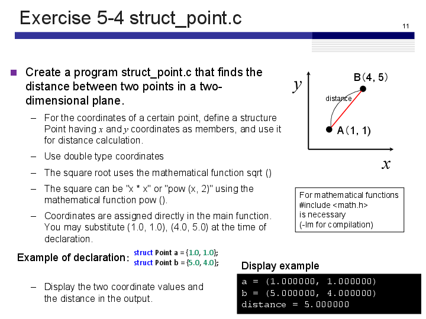
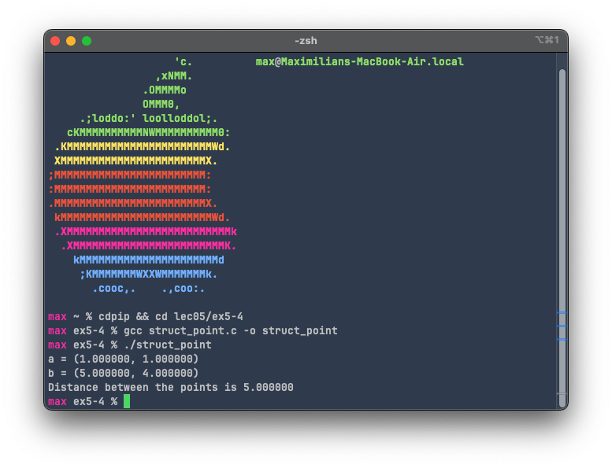
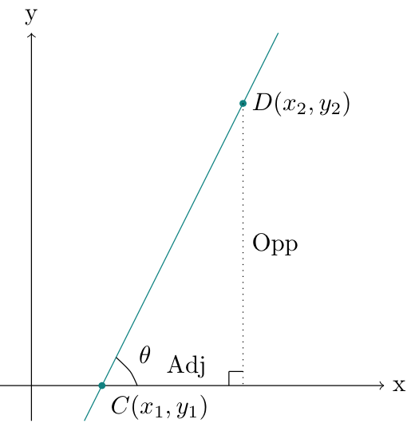
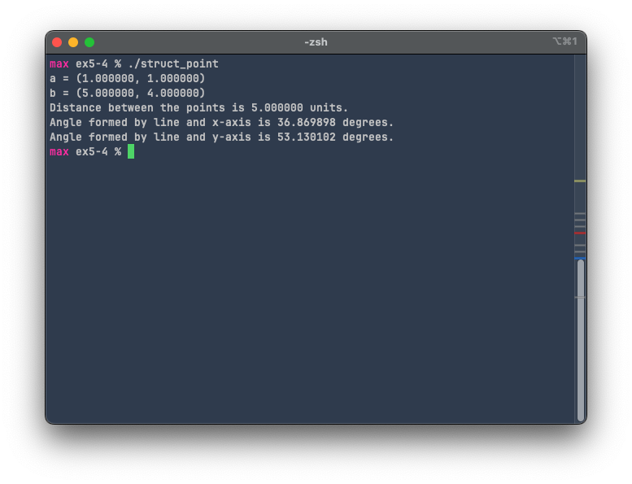

# Exercise 5-4: struct_point.c
Maximilian Fernaldy - C2TB1702

<p align='center'>  </p>

## Structs

In C, structs allow us to define a new "type" of variable, which may contain many different types of variables itself. This way, we can define many instances of a certain struct, with variables belonging to them (also called "members" in C, or "attributes" in object-oriented programming languages), without resorting to defining and organizing many variables that seem disjointed from each other.

### An analogy

We can try to better visualize structs by an analogy. Let's say that we have several kinds of fruits, and we want to take note of their characteristics. If we define each and every characteristic manually like so,
```C
char apple_color = "red";
char apple_size = "medium";
char apple_taste = "sweet";

char orange_color = "orange";
char orange_size = "medium";
char orange_taste = "sour";

char watermelon_color = "green";
char watermelon_size = "large";
char watermelon_taste = "sweet";
```

we can see that it starts becoming somewhat redundant and unwieldy. Not to mention the fact that we have to manually assign names to the variables inside the source code. Now let's try to achieve the same goal but with structs:

```C
#include <stdio.h>

struct Fruits {
    char name[20];
    char size[30];
    char taste[50];
};

int main() {
    int n = 0;
    printf("How many fruits are there? ");
    scanf("%d", &n);
    // Clear input buffer before proceeding with variable input
    while(getchar() != '\n');

    struct Fruits fruits_collection[n];
    // Data intake
    for (int i = 0; i < n; i++) {
        printf("Name of fruit %d: ", i+1);
        scanf("%s", fruits_collection[i].name);
        printf("Size of fruit %d: ", i+1);
        scanf("%s", fruits_collection[i].size);
        printf("Taste of fruit %d: ", i+1);
        scanf("%s", fruits_collection[i].taste);
    }

    // Print collected information
    printf("\nFruits collection: \n");
    for (int i = 0; i < n; i++) {
        printf("%s is %s-sized and tastes %s.\n", fruits_collection[i].name,
                                                fruits_collection[i].size,
                                                fruits_collection[i].taste);
    }
}
```

Even though there are a lot more lines (30 compared to 9), that is because the above snippet is basically an entire full-fledged program that asks how many fruits there are, then asks for the properties for each fruit, stores the data and prints them back out after entering all the information. This can all be achieved in *30 lines* with structs. Imagine if we have ten, or even a hundred fruits. It would be a nightmare to assign variables one by one, specifying the type every time as well. With structs and dynamic programming, we are essentially not limited as to how many fruits we can analyze. This is the power of object-oriented programming, and part of the reason why C++ was created. Although C is incredibly fast and powerful for procedural uses, it lacks some of the modernity and readability that object-oriented programming (OOP) languages like C++ and Python have. Even with the simple capability of single-level structs in C, we can achieve this level of simplicity. Imagine what can be done with more advanced object-oriented features like class inheritance, attributes and methods in Python.

## Applying structs in struct_point.c

In struct_point.c, we are asked to define a struct `Point` with members that correspond to the x-coordinate and y-coordinate of the points. We can define a struct like earlier with `Fruits`, but that might confuse us when trying to define a new point, because the declaration of the new point will look like a struct definition:

```C
struct Point a = {1.0, 1.0}; // This resembles a struct declaration/definition
```

In order to avoid that confusion, we can use another way of defining a struct, which is with `typedef`

```C
typedef struct {
    double x_coord;
    double y_coord;
} point;
```

This way of defining a struct will reserve the word `point` to be considered as a **type** by the compiler. This means every time we want to define a new point, we can just do this:

```C
point a = {1.0, 1.0};
```

which looks like the usual definition of a new variable.

### Getting the distance between two points

To get the distance between two points, we can use the general formula:

$$ d = \sqrt{\Delta x^2 + \Delta y^2} $$

where $d$ is the distance between two points, $\Delta x$ is the difference of x-coordinates between the two points and $\Delta y$ is the difference of y-coordinates between the two points.

In code form, we can write the following:

```C
double get_dist(point a, point b) { // Distance between point a and b
    return sqrt(pow(a.x_coord - b.x_coord, 2) + pow(a.y_coord - b.y_coord, 2));
}
```

Notice how instead of passing variables `a.x_coord, a.y_coord, b.x_coord, b.y_coord` to the function, we can simply pass the *points* a and b: `point a, point b`, and the function still works as it should. Now imagine if we are working with tens or hundreds of different points. Instead of passing the values for the coordinates one by one, which will result in an incredibly large argument list, we can just pass an array of *points* instead. This is why structs are so useful.

### Output

Compiling and running the code results in the following output:

<p align='center'>  </p>

## Self-challenge: calculating the angle formed by the line and the axes

To determine the angle formed by the line and the x-axis, we can use the following property:

<p align='center'>  </p>

$$ \begin{align*} \tan(\theta) &= \frac{\Delta y}{\Delta x} \\ \theta &= \arctan\left(\frac{\Delta y}{\Delta x}\right) \end{align*} $$

which means we can use the `atan()` function defined in `math.h` to get the angle:

```C
double get_angle(point pointA, point pointB) {
    double deltaY = pointA.y_coord - pointB.y_coord;
    double deltaX = pointA.x_coord - pointB.x_coord;
    double radians = (atan(deltaY / deltaX)); // Get angle in radians
    return radians * 180 / M_PI; // Convert radian to degrees
}
```

Since `atan()` returns the angle in [radians](https://www.programiz.com/c-programming/library-function/math.h/atan#:~:text=returns%20the%20value-,in%20radians,-.), we need to first convert it into degrees before returning the value. To do this, since we know that $180\degree = \pi \;\mathrm{rad}$, it follows that $ 1 \; \mathrm{rad} = \left(\frac{180}{\pi}\right) \degree$. This is why we multiply the result of $ \arctan\left(\frac{\Delta y}{\Delta x}\right) $ by $\frac{180}{\pi}$.

For the angle formed between the line and the y-axis, since we know that the x-axis and y-axis form a right angle, we can just subtract the angle formed by the line and the x-axis from 90 degrees to get the angle to the y-axis.

Adding this code to the file, compiling and running it results in the following output:

<p align='center'>  </p>


[comment]: <> (Below is CSS code for the output HTML and pdf files. Don't touch them unless you know what you're doing.)
<style>
    figcaption{
    text-align:center;
        font-size:9pt
    }
    img{
        filter: drop-shadow(0px 0px 7px );
    }
    .noshade{
        filter: none
    }
</style>