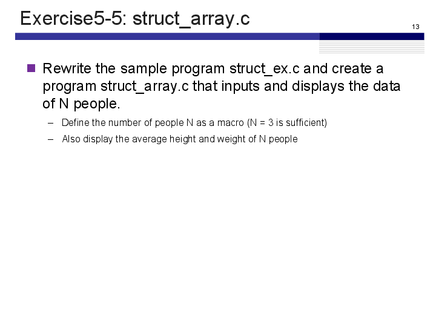
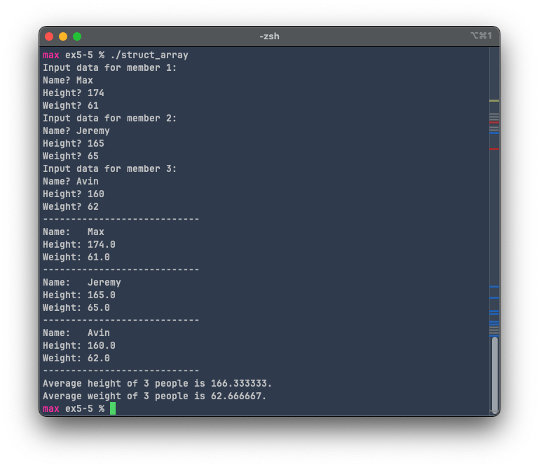
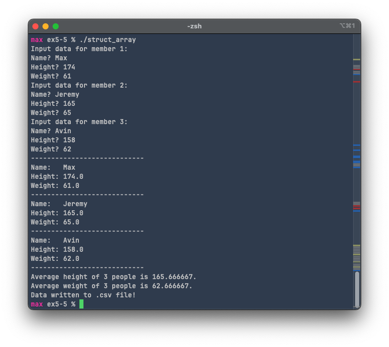
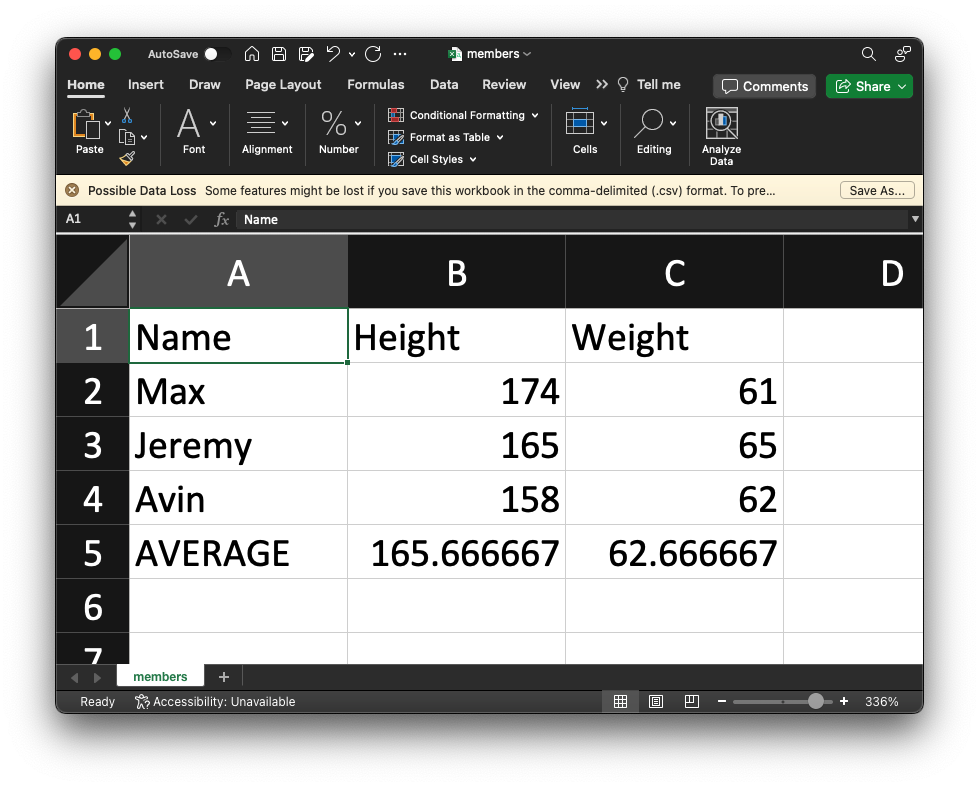

# Exercise 5-5: struct_array.c
Maximilian Fernaldy - C2TB1702

<p align='center'>  </p>

Since structs are essentially just new types of variables, that means we can also create arrays of struct instances. Once we've defined the struct like such:

```C
/* Definition of structure person */
typedef struct {
    char name[NAME_LEN];
    double height;
    double weight;
} person;
```

we can define an array of type `person` with name `members` like so:

```C
person member[N_PEOPLE];
```

where `N_PEOPLE` is a macro definition for specifying how many people we should take the data of. As per the exercise instructions, it is set to 3. Then, we can do data input and processing in one `for` loop:

```C
double avg_height = 0.0, avg_weight = 0.0;
for (int i = 0; i < N_PEOPLE; i++) {
    /* (2) processing contents */
    /* data input */
    printf("Input data for member %d:\n", i+1);
    printf("Name? ");
    fgets(member[i].name, sizeof(member[i].name),stdin);
    // Delete newline character at the end of name
    member[i].name[strcspn(member[i].name, "\n")] = 0;

    printf("Height? ");
    scanf("%lf", &member[i].height);
    avg_height += member[i].height / N_PEOPLE;

    printf("Weight? ");
    scanf("%lf", &member[i].weight);
    avg_weight += member[i].weight / N_PEOPLE;

    // Clear input buffer
    while(getchar() != '\n');
}
```

Since we want the names to be able to have spaces in them, we should use `fgets()` instead of `scanf()`. However, since `fgets()` also stores the newline character that gets input when we press the enter/return key, we should remove it by changing it to a NULL terminator. We have discussed this in a previous report before, namely [exercise 3-5](https://www.agb5003.com/coursework/pip/lec03/ex3-5/ex3-5.html#:~:text=Before%20we%20reverse,to%20that%20index.). Then, for height and weight, since we don't need to have spaces in the input, we can just use `scanf()` as usual. Additionally, we can immediately add the member's height and weight divided by the total number of people to the average. This way, by the time the for loop finishes taking all data, it will have the correct average for the heights and weights of all members. At the end of the `for` iteration, we clear the input buffer so that it is ready to take in the next member's name in the next iteration.

## Displaying the data

```C
/* data display */
for (int i = 0; i < N_PEOPLE; i++) {
    printf("----------------------------\n");
    printf("Name:   %s\n",member[i].name);
    printf("Height: %.1f\n",member[i].height);
    printf("Weight: %.1f\n",member[i].weight);
}

printf("----------------------------\n");
printf("Average height of %d people is %f.\n", N_PEOPLE, avg_height);
printf("Average weight of %d people is %f.\n", N_PEOPLE, avg_weight);
```

To display the data, we can use a `for` loop going through the entries and printing the data one by one. Then we print out the average height and weight we've obtained earlier at the end.

## Output

Compiling and running the program gives the following output:

<p align='center'>  </p>

## Self-challenge: store entries in a .csv file

But taking all these data and only being able to view it once is not very useful. After we close the terminal, we won't be able to view it again unless we enter the data again. As an alternative, we can also write the data to a .csv file. This way we can always view the data again inside Excel, for example, or any other spreadsheet processing software.

To interact with files in C, we can use the file interaction functions already defined for us in the `<stdio.h>` header file. These functions are namely `fopen()`, `fprintf()` and `fclose()`. They allow us to open files, write to them and close them when we're done, respectively.

```C
int write_to_file(person member[N_PEOPLE], double avg_height, double avg_weight) {
    FILE *file; // declare file pointer

    file = fopen("./members.csv", "w"); // file is a file POINTER, not the file itself.
    // It points to the file for reading or writing purposes, but it doesn't store
    // the data inside the file as its value.

    if (file == NULL) { // fopen returns NULL if it can't open the file.
        printf("Error opening the file for writing data.");
        return 1;
    }

    // Print headers
    fprintf(file, "Name,Height,Weight\n");

    for (int i = 0; i < N_PEOPLE; i++) {
        fprintf(file, "%s,%lf,%lf\n", member[i].name, member[i].height, member[i].weight);
    }

    // Print averages
    fprintf(file, "AVERAGE,%lf,%lf",avg_height,avg_weight);

    if (ferror(file)) {
        printf("Error writing to csv file.\n");
        return 1;
    } else {
        printf("Data written to .csv file!\n");
    }

    fclose(file);

    return 0;
}
```

To access a file, we need to use what's called a file *pointer*. As the name suggests, these pointers allow access to a file without having to load the entire document's data into a single variable. We can then use this pointer inside the other file interaction functions to modify the file. We first declare it with

```C
FILE *file;
```

and then assign its value using `fopen()`:

```C
file = fopen("./members.csv", "w");
```

where `"./members.csv"` is the directory path of the file we want to write to, and `"w"` is the *opening mode* (also called *file access flags* by the IBM documentation) of the file. Since we want to write to the file, we should use `"w"`, which opens a file for writing, or if the file doesn't exist, creates a file with the specified name in the previous argument. Other modes include `"r"` which opens a file for reading only, and the file must exist; and `"a"` for appending (which means adding to the file), and if the file doesn't exist, it will create a new file. There are also other modes that can be used to *both* read and write to the file, the specifications of which can be found in the [documentation](https://devdocs.io/c/io/fopen).

For some basic error handling, we can create an `if` statement to check if the file opened correctly. If it didn't, we should print an error message to the terminal and return with status code `1`.

```C
if (file == NULL) { // fopen returns NULL if it can't open the file.
    printf("Error opening the file for writing data.");
    return 1;
}
```

After we have the pointer for the file, we can then proceed to write data into it. The .csv file extension stands for comma-separated values, which suggests the fact that it separates the values stored in it by commas (and newlines). New elements to the right (new columns) are created by commas, and new elements to the bottom (new rows) are created by newline characters. To use the `fprintf()` function, we pass 2 or 3 arguments into it. If we are passing a [string literal](https://devdocs.io/c/language/string_literal), we can simply pass the file pointer where we want to write the string to (`file` in our case), then the string that we want to write, like so:

```C
// Print headers
fprintf(file, "Name,Height,Weight\n");
```

These are the headers that help us identify what the values mean in the .csv file.

To print formatted strings, we need to pass 3 arguments. First is the file pointer, then the string containing format specifiers, then the actual variables that we want to format in the string, then write to the file.

```C
for (int i = 0; i < N_PEOPLE; i++) {
    fprintf(file, "%s,%lf,%lf\n", member[i].name, member[i].height, member[i].weight);
}
```

We also want to print the average height and average weight of the members, so to do that, we add a new `fprintf()` at the end of the `for` loop.

```C
// Print averages
fprintf(file, "AVERAGE,%lf,%lf",avg_height,avg_weight);
```

We can also add some basic error handling for the case if `fprintf()` fails to write to the file.

```C
if (ferror(file)) {
    printf("Error writing to csv file.\n");
    return 1;
} else {
    printf("Data written to .csv file!\n");
}
```

Finally, after we're done writing to the file, we need to close it to prevent memory leakage and manage our resources properly. This is needed because in C, things like resource management and memory allocation are left to be the responsibility of the programmer, not the language runtime (as it is with more high-level languages like Java with JVM or C# with the CLR (Common Language Runtime) inside the .NET framework). These runtimes manage the garbage collection, which means they close files when they're not in use anymore, deallocate memory for some unused variables, and many more things. For C, though, we will need to manage those by ourselves. To close a file, we use the `fclose()` function and pass the pointer to the file that we want to close, like so:

```C
fclose(file);
```

## Self-challenge output

<p align='center'>  </p>

a .csv file called "members.csv" then pops up in the same directory as the executable binary, which contains these values:

<p align='center'>  </p>


[comment]: <> (Below is CSS code for the output HTML and pdf files. Don't touch them unless you know what you're doing.)
<style>
    figcaption{
    text-align:center;
        font-size:9pt
    }
    img{
        filter: drop-shadow(0px 0px 7px );
    }
    .noshade{
        filter: none
    }
</style>