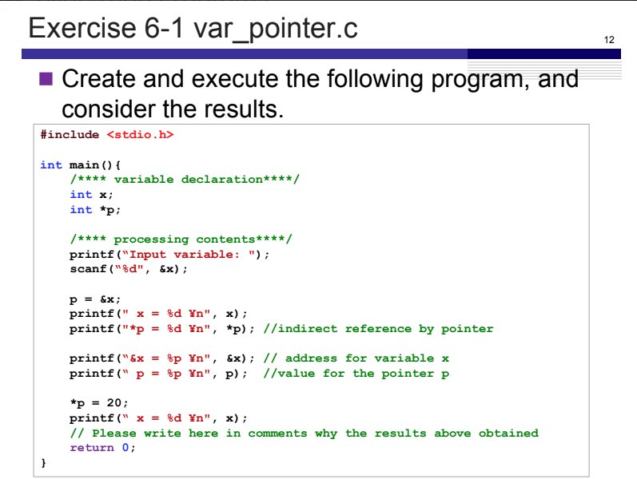
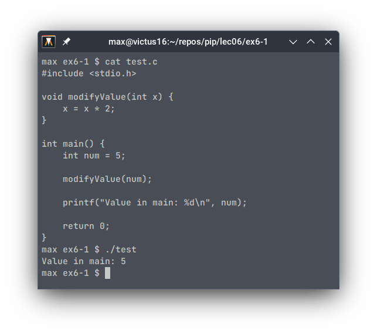
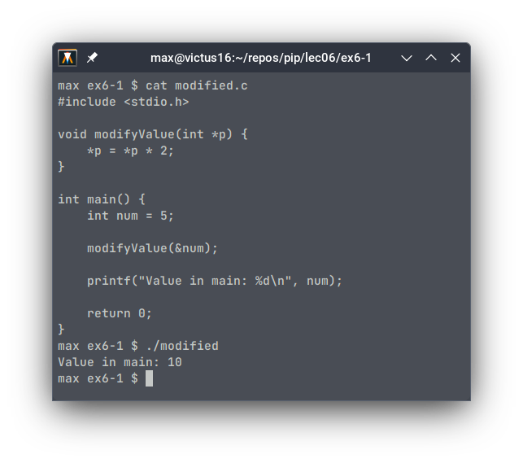

# Exercise 6-1: var_pointer.c
Maximilian Fernaldy - C2TB1702

<p align='center'>  </p>

## Introduction to pointers and memory addresses

In C, memory and resource management are integral factors in writing efficient and effective code. To that end, pointers and memory addresses play an important role in doing these tasks.

A pointer is essentially a variable that contains the memory address of another variable, hence the name. It *points* to the location in the computer's memory where said variable is stored. Although the concept of pointers and memory addresses seem foreign to other, more high level languages, they are in fact not exclusive to C. For instance, the close derivative of C, C++, [also uses pointers](https://cplusplus.com/doc/tutorial/pointers/), although the language provides higher-level concepts like smart pointers, which manage memory automatically, as opposed to C where it has to be managed programmatically by the programmer. Another language that makes use of pointers is Rust, which is quickly gaining popularity, in part due to companies switching from C to it for lower-level software development. This is because Rust guarantees memory safety without having to rely on garbage collection.

At an even lower level, ASM or assembly languages (specific for each processor architecture) also employ memory addresses. Assembly programmers need to manage memory manually, much like in C.

### Why do we have to use pointers and memory addresses?

Pointers and memory addresses are important because they can allocate memory dynamically during runtime, which allows the programmer to manage memory and processing resources more efficiently. Additionally, they also allow the creation and manipulation of more complex data structures, less variable assignment (which in turn means less memory allocation), multiple variable returns from a function in C, and many other capabilities.

### Using pointers in C
In C, the declaration and dereferencing of pointers are denoted by an asterisk (\*), and obtaining the memory address of a variable is done by using an ampersand (\&). The example program below assigns the value 1 to `x` by using a pointer that points to its memory address, `p`.

<p align='center'>  </p>

note that the first time `*p` is used, it is written after the type specification `int`, which turns it into a declaration of the pointer `p` which points to the memory address of x (`&x`). The second time `*p` is used, it is already initialized, so by using the asterisk operator, we are actually dereferencing it and assigning a value to "the variable pointed to by `p`", instead of the pointer `p` itself.

<a class="linker" name="as-for-memory-addresses">As for memory addresses</a>, we have already used them when using the `scanf()` function. The second positional argument in `scanf()` takes a memory address to assign the user input to. For instance, we have to pass `&x` instead of `x` to assign user input to the variable `x` using `scanf()`:

```C
scanf("%d", x) // WRONG
scanf("%d", &x) // CORRECT
```

This is due to the way functions handle arguments in C. If we pass a variable in the main function scope into another function, it will instead pass a copy of the value for the function to use, not the variable itself. Changes made in the function would not be reflected in the main function. Take the following program for example.

<p align='center'>  </p>

As we can see, when the value of `num` is printed, it is still 5, and not 10, which is what it would have been if the changes in the function were reflected in the main function.

I hope it's clear now why we need to pass the memory address of the variable we want to pass the input into, instead of the variable itself. As the function `scanf()` modifies the contents of the variable, we need to pass its pointer, so that it is *passed by reference* instead of *passed by value*. This will allow the function to directly modify the variable by accessing the variable using its pointer, which contains the memory address. Let's see how we can make the example above actually modify the value:

<p align='center'>  </p>

This time, the function is declared to take the pointer to an integer variable as an argument. This is as opposed to the variable itself in the previous program. Doing so passes the variable's address to the function instead of a copy of its value. Then, that address is assigned to the pointer `p`, which is then used to modify the variable pointed to by `p`. Even though the function does not return anything, it is able to modify the variable in the main function, because it interacted directly with the variable using its pointer, instead of with a copy of the variable.

It should be obvious too that this method has another benefit: we don't need to allocate extra memory to copy the variable's value for use in the function. Instead, we interact directly with the variable using its memory address. This memory efficiency is particularly beneficial when dealing with large data structures and operations.

## Exercise 6-1

<p align='center'>  </p>

Now that we know what pointers and memory addresses do, we can apply them in Exercise 6-1. In var_pointer.c, we define an integer `x` and pointer `p`. Then, we ask the user for input and store it inside `x` by using its memory address `&x` (recall [this part](#as-for-memory-addresses)).

In the next part, the program assigns the memory address of `x` to the pointer `p`. Then, it prints out four lines with different format specifiers and arguments passed into the `printf()` function. First, it normally prints out the value inside the variable x with `printf(" x = %d \n", x);`. Then, it again prints out the value of `x`, but this time using the dereference operator on pointer `p`: `printf("*p = %d\n", *p)`, which basically means it's telling the program to "print the value stored by the variable that's pointed to by `p`".

The next two lines print the *memory address* of the variable `x`, instead of its value. This is evident by the `%p` format specifier used for printing the value of pointers, or in other words, memory addresses. The former references the address directly by using `&x` - essentially saying "print the address of `x`", while the latter uses the value of the pointer `p`, as we have assigned the address of `x` to it.

Next, the value of `x` is changed using the dereference operator on pointer `p` - effectively saying "go to the variable pointed to by `p`, then change it's value to 20". This is why on the next `printf()` statement, 20 is printed instead of whatever was input by the user earlier.


[comment]: <> (Below is CSS code for the output HTML and pdf files. Don't touch them unless you know what you're doing.)
<style>
    figcaption{
        text-align:center;
        font-size:9pt
    }
    img{
        filter: drop-shadow(0px 0px 7px );
    }
    .noshade{
        filter: none
    }
    .disclaimer{
        font-size: 9pt
    }
    .linker{
        color: inherit !important
    }
</style>