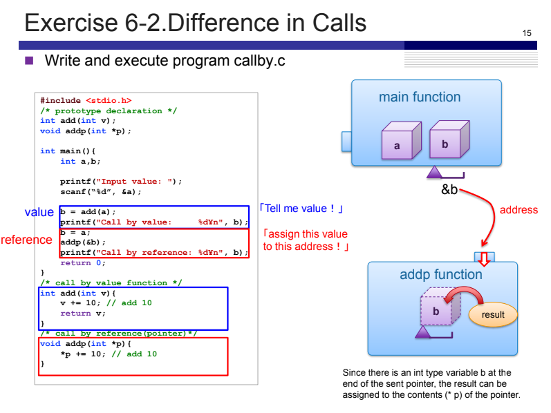

# Exercise 6-2: callby.c
Maximilian Fernaldy - C2TB1702

callby.c highlights two methods to modify a variable declared in the main function. The first method `add()` copies the value of the variable, passes it into the function for modification, then assigns the value that is returned by the function to the variable. The second method `addp()` passes the memory address of the variable, or in other words a pointer to the function, and the function modifies the variable directly by accessing it through its memory address.

Notice how when `add()` is called, the variable `a` is passed into the function, which passes its value as the argument. However, when `addp()` is called, the address `&b` is passed instead, and in the function the address is stored in the pointer `p`, which is then used to access the variable directly by dereferencing it with `*p` then adding 10 to the variable's value.

`add()` works with a copy of `a`, while `addp()` works directly with the variable `b`. This is the main difference between the two. When we pass a copy of the variable's value with `add(a)`, we are allocating additional memory for the copy, because the intended use for this method is to modify it separately of the variable in the main function. As a result, modifications to the copy will not be reflected in the original, except if the modifications are applied by assigning the function's return value to the original variable. Conversely, When we pass the memory address of the variable, although it looks like we're doing the same thing in a different way, this method is fundamentally different. When a variable is created, the memory address will be reserved as well, whether or not we use it in the future. When we use that memory address to pass into a function, we are working directly with the variable, which means the function doesn't allocate any additional memory, and any changes made to the variable will be immediately reflected in the main function.

Running the program shows that the two methods return the same answer:

<figure>
    
  

    <figcaption>The same result is returned for both functions</figcaption>
</figure>

[comment]: <> (Below is CSS code for the output HTML and pdf files. Don't touch them unless you know what you're doing.)
