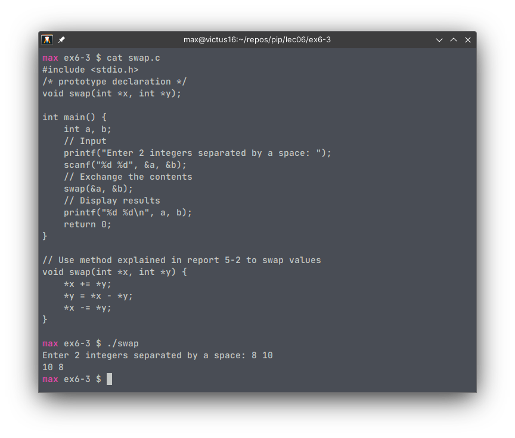

# Exercise 6-3: swap.c

swap.c demonstrates a common useful function that swaps the value of two variables using their pointers. Instead of copying both their values and having to return two variables (which is impossible in C), the function will work directly with the variables and return nothing (which means it will use the `void` return type specifier).

```C
// Use method explained in report 5-2 to swap values
void swap(int *x, int *y) {
    *x += *y;
    *y = *x - *y;
    *x -= *y;
}
```

As previously explained in [report 5-2](https://agb5003.com/coursework/pip/lec05/ex5-2/ex5-2.html#rearranging-arguments), the method above swaps the values of two variables without having to allocate more memory. The difference is that this time, instead of using `a` and `b` explicitly, we use their memory addresses to modify them. Once the function is done, the values in `a` and `b` will have been swapped, without having to return any value from the function itself.

```C
int main() {
    int a, b;
    // Input
    printf("Enter 2 integers separated by a space: ");
    scanf("%d %d", &a, &b);
    // Exchange the contents
    swap(&a, &b);
    // Display results
    printf("%d %d\n", a, b);
    return 0;
}
```

As noted in report 6-2, functions that use pointers to modify variables should have memory addresses (or pointers) passed into them, not the variables themselves. This is to avoid a type error when compiling.

Running the program gives us the following output:

<p align='center'>  </p>


## Self challenge: using the pointer swapper function in a selection sort program

To prove that using pointers has benefits at runtime, we can try doing selection sorts with both conventional swapping and swapping using pointers.


[comment]: <> (Below is CSS code for the output HTML and pdf files. Don't touch them unless you know what you're doing.)
<style>
    figcaption{
    text-align:center;
        font-size:9pt
    }
    img{
        filter: drop-shadow(0px 0px 7px );
    }
    .noshade{
        filter: none
    }
</style>