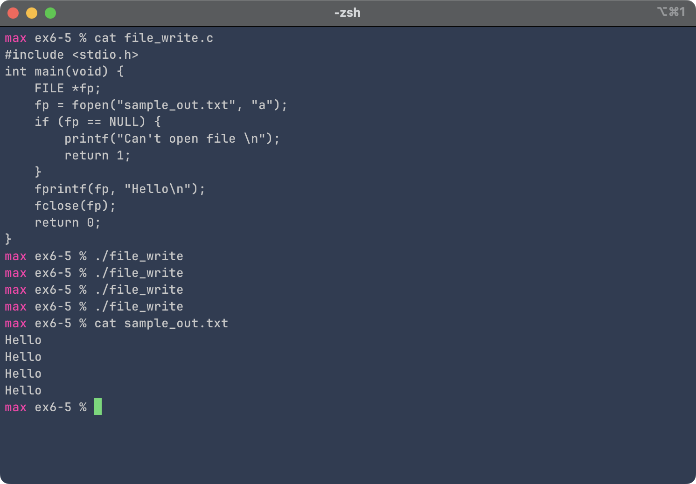
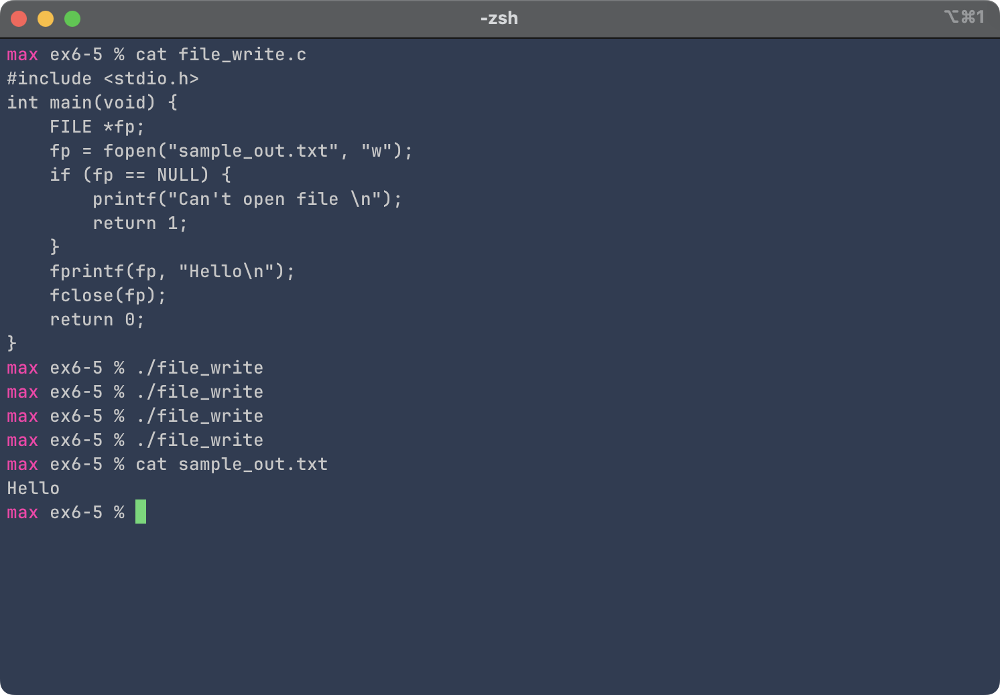

# Exercise 6-5: file_write.c
Maximilian Fernaldy - C2TB1702

<!-- <p class=disclaimer>Note: some links and other HTML-related objects may not work in pdf form. Consider reading the webpage format of the report <a href='https://agb5003.com/coursework/pip/lec06'>here.</a></p> -->

```C
#include <stdio.h>
int main(void) {
    // create file pointer
    FILE *fp;
    fp = fopen("sample_out.txt", "a");

    // handle opening error
    if (fp == NULL) {
        printf("Can't open file \n");
        return 1;
    }

    // print formatted string to file
    fprintf(fp, "Hello\n");
    
    fclose(fp);
    return 0;
}
```

As previously explained in <a href='../ex6-4/ex6-4.html#notice-that'>report 6-4</a>, the file access flags determine how data is written to the file. If we use `"a"` like above, new data will be written to the end of the file.

<figure>
    <p align='center'>  </p>
    <figcaption>Running the program repeatedly appends new data to the text file</figcaption>
</figure>

It needs to be noted that `fprintf()`, just like the behavior of `printf()`, does not print new lines automatically at the end of the string (unlike `printf()` in Python, for instance). We need to append the newline character manually. This is very much intentional, and allows us to write in the same line if we'd like.

In comparison, opening the file in write mode (`"w"`) destroys previous data and rewrites the string from scratch in the file. As a result, however many times we run the program, there will only be one "Hello" followed by a blank line in the text file (the blank line is not visible in the `cat` output because it is used to carriage-return the shell prompt).

<figure>
    <p align='center'>  </p>
    <figcaption>Only one line of "Hello" is retained</figcaption>
</figure>


[comment]: <> (Below is CSS code for the output HTML and pdf files. Don't touch them unless you know what you're doing.)
<style>
    figcaption{
        text-align:center;
        font-size:9pt
    }
    img{
        filter: drop-shadow(0px 0px 7px );
    }
    .noshade{
        filter: none
    }
    .disclaimer{
        font-size:9pt
    }
</style>