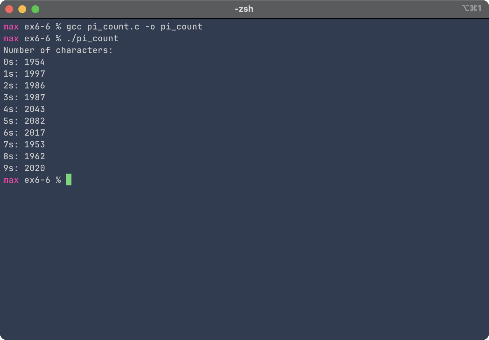

# Exercise 6-6: pi_count.c
Maximilian Fernaldy - C2TB1702

```C
#include <stdio.h>

int main() {
    int c;
    FILE* fp = fopen("pi.txt", "r");
    int count[10]={0,0,0,0,0,0,0,0,0,0};
    
    while ((c=fgetc(fp))!=EOF) {
        // Convert character to integer type by subtracting the ASCII value of
        // 0 from the current character.
        int digit = c - '0';
        count[digit]++;
    }

    printf("Number of characters:\n");
    for (int i = 0; i < 10; i++) {
        printf("%ds: %d\n", i, count[i]);
    }
}
```

As usual, we open the file by defining the pointer using `fopen()`. Then, we initialize an array to store the tally. Finally, to count the digits itself, we use `fgetc()`, passing the pointer `fp`. To convert the character into an integer, recall that assigning a variable with `char` type to an `int` type will automatically assign the character's ASCII value. Well, we can use that mechanism to convert the value of the current character by subtracting its value by the ASCII value of the '0' character. If the current character is '0', it will subtract its value by the value of '0' — effectively canceling out, and will end up assigning the value 0 to the integer variable. If the character is '1', we know that the ASCII value for '1' is just one larger than the ASCII value of '0', so it will assign the value 1 to the integer variable. This applies to all the other digits respectively. At the end of the `for` loop we will have the complete count of all the numbers in the first 20000 digits of pi.

<figure>
    <p align='center'>  </p>
    <figcaption>Output of pi_count</figcaption>
</figure>


## `fgetc()` is interesting

This function reveals something new about file pointers. Notice how we don't need to make any changes to the file pointer `fp` for it to move forward by one character once an arbitrary iteration in the `for` loop ends. It automatically moves on to the next character. This is because when we define `fp` initially, it is in fact **pointing to the start of the file.** It is not dissimilar to how array pointers actually are pointers to the first element of the array, although these two cases are not exactly the same. Each time we call `fgetc()`, the C runtime and the operating system work together to manage the file pointer, changing it to point to the next character, and the next character, and so on, until the end of the file is reached.


[comment]: <> (Below is CSS code for the output HTML and pdf files. Don't touch them unless you know what you're doing.)
<style>
    figcaption{
        text-align:center;
        font-size:9pt
    }
    img{
        filter: drop-shadow(0px 0px 7px );
    }
    .noshade{
        filter: none
    }
    .disclaimer{
        font-size: 9pt
    }
    .linker{
        color: inherit !important
    }
</style>