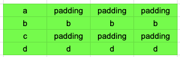
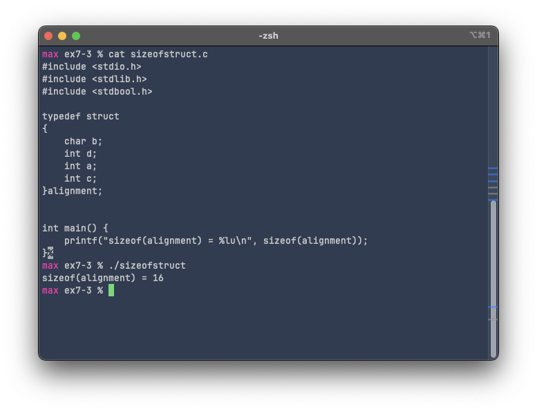
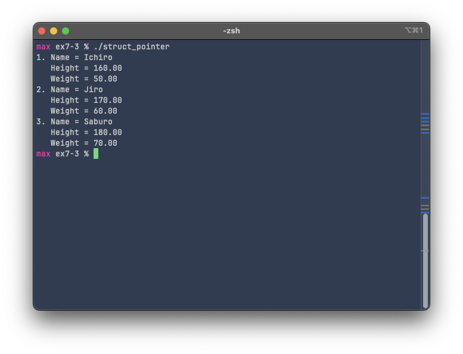

# Exercise 7-3: struct_pointer.c
Maximilian Fernaldy - C2TB1702

<p class=disclaimer> Note: some links and other HTML-related objects may not work in pdf form. Consider reading the webpage format of the report <a href='https://agb5003.com/coursework/pip/lec07'>here</a>. </p>

## Introduction to structure pointers

Structures in C can be thought of as fancier arrays. Structure members are stored in **contiguous** memory locations, meaning they are stored next to each other in memory. This is exactly how arrays work, but since structure members can have different data types, the size of the memory space occupied by each member might be different. To accommodate this, the compiler may insert "padding" between elements to properly align the members. For example, consider the struct definition below:

```C
typedef struct
{
    char a;
    int b;
    bool c;
    float d;
}alignment;
```

the types `char` and `bool` both take up 1 byte of memory space, while `int` and `float` typically take 4 bytes. Imagine if the compiler stores the data of each member right next to each other:

<p align='center'>  </p>

which means theoretically, total memory allocated for a variable of this type/struct should be 10 bytes. However, processors can only access memory with a fixed "parsing step" of 4 bytes. This basically means they can't go through every single "block" in our diagram above, it can only go through every *row*. Reading through the memory in the way it is now, the program will behave unpredictably. Instead, the compiler will insert *padding* to align the different data types properly. This means the actual memory usage will look like this:

<p align='center'>  </p>

which will allow the processor to access data correctly. The actual memory allocation is then 16 bytes instead of 10 - 10 bytes of actual information and 6 padding bytes. We can confirm this by using `sizeof(alignment)`:

<p align='center'>  </p>

All of this is important because structure pointers work in a similar way to array pointers: **they point to the first memory address occupied by the structure**. This is why when using pointers to refer to members, we have to put the dereference operator in parentheses. This will perform the dereference operator *before* searching for its member. Trying to dereference the member directly would not work, because the compiler first needs to access the struct information as a whole to understand what kind of data types are in there, how they are arranged, and of course, where the referenced member is located. Without this information it cannot access the memory correctly. Thus, the correct syntax to access members of a struct with a pointer is:

```C
(*alignment).a = 8
```

However, this isn't very readable. As an alternative, the following syntax is compiled identically as the above:

```C
alignment->a = 8
```

## struct_pointer.c

Following the instructions in slide 15, we pass the memory address of each member inside a `for` loop to a function `print_person()`:

```C
int main() {
    // variable declaration
    st_person member[MEMBER_NUM] =
    {
        {"Ichiro", 160, 50},
        {"Jiro", 170, 60},
        {"Saburo", 180, 70}
    };

    for (int i = 0; i < MEMBER_NUM; i++) {
        print_person(i, &member[i]);
        // alternatively, member+i can be passed instead of &member[i]
    }
}
```

Then, the print_person function takes the pointer, accesses the correct member for each iteration and prints out their details.

```C
void print_person(int i, st_person *pointer_member) {
    printf("%d. Name = %s\n", i+1, pointer_member->name);
    printf("   Height = %.2f\n", pointer_member->height);
    printf("   Weight = %.2f\n", pointer_member->weight);
}
```

I also passed the index `i` to add a number next to each member:

<p align='center'>  </p>


[comment]: <> (Below is CSS code for the output HTML and pdf files. Don't touch them unless you know what you're doing.)
<style>
    figcaption{
        text-align:center;
        font-size:9pt
    }
    img{
        filter: drop-shadow(0px 0px 7px );
    }
    .noshade{
        filter: none
    }
    .disclaimer{
        font-size: 9pt
    }
    .linker{
        color: inherit !important
    }
</style>
