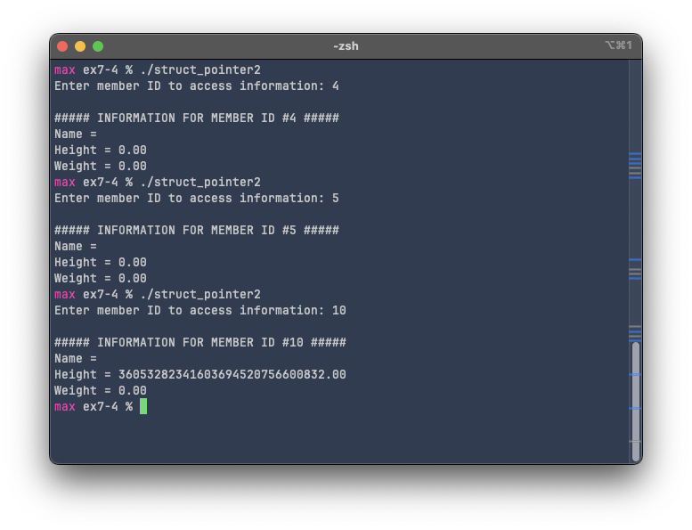
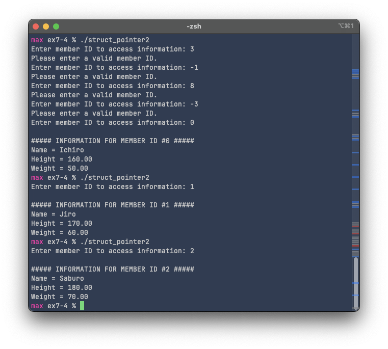

# Exercise 7-4: struct_pointer2.c
Maximilian Fernaldy - C2TB1702

<p class=disclaimer> Note: some links and other HTML-related objects may not work in pdf form. Consider reading the webpage format of the report <a href='https://agb5003.com/coursework/pip/lec07'>here</a>. </p>

Instead of displaying information of all members, struct_pointer2.c will only display the selected member's information, using their "ID".

To do this, we can ask the user for the intended user's ID, then pass the pointer to the struct and the member ID to a function:

```C
int main() {
    // variable declaration
    st_person member[MEMBER_NUM] =
    {
        {"Ichiro", 160, 50},
        {"Jiro", 170, 60},
        {"Saburo", 180, 70}
    };

    int member_ID = -1;  // Initialize member ID as something invalid
    printf("Enter member ID to access information: ");
    scanf("%d", &member_ID);

    print_person(member, member_ID);
    // Pass memory address of the right member to print function

    return 0;
}
```

Then, for the function itself, we can use pointer arithmetic to access the correct element, then the arrow operator to access the members:

```C
void print_person(st_person pointer_member[], int member_ID) {
    printf("\n##### INFORMATION FOR MEMBER ID #%d #####\n", member_ID);
    printf("Name = %s\n", (pointer_member+member_ID)->name);  
    printf("Height = %.2f\n", (pointer_member+member_ID)->height);
    printf("Weight = %.2f\n", (pointer_member+member_ID)->weight);
}
```

This program works, and there is **no error returned** by the compiler. However, there is a glaring mistake in *memory safety*. When we enter numbers lower than 0 or higher than 2, the program still runs, but there's something wrong with the values displayed:

<p align='center'>  </p>

Either the values are "blank" or they are outlandishly big. This is because the program is accessing information that it's not supposed to access. Our array `members` only contains 3 elements with indices 0 to 2, but we're accessing numbers outside that boundary. As a consequence, the program accesses memory locations that are either uninitialized or used by **other programs** on our system. In this case, we encounter some gibberish, because the program may be trying to interpret data stored in another data type. However, if some malicious actor designs a program to correctly interpret this data, and the program is given access to the memory of our system, we can imagine how dangerous that may be. It's even more dangerous when we give the user access to writing and erasing data to and from memory. This program currently contains **unsafe code**, because a **segmentation fault or memory access violation** is possible. To fix this, we need to confine the user to the valid indices:

```C
int main() {
    // variable declaration
    st_person member[MEMBER_NUM] =
    {
        {"Ichiro", 160, 50},
        {"Jiro", 170, 60},
        {"Saburo", 180, 70}
    };

    int member_ID = -1;  // Initialize member ID as something invalid
    while (member_ID < 0 || member_ID >= MEMBER_NUM) {
        printf("Enter member ID to access information: ");
        scanf("%d", &member_ID);
        if (member_ID < 0 || member_ID >= MEMBER_NUM) {
            printf("Please enter a valid member ID.\n");
        }
    }

    print_person(member, member_ID);
    // Pass memory address of the right member to print function

    return 0;
}
```

The while loop will keep asking the user for a member ID while throwing an alert that the entered one is invalid. Then when a valid member ID is entered, the program can proceed to accessing the memory.

<p align='center'>  </p>

[comment]: <> (Below is CSS code for the output HTML and pdf files. Don't touch them unless you know what you're doing.)
<style>
    figcaption{
        text-align:center;
        font-size:9pt
    }
    img{
        filter: drop-shadow(0px 0px 7px );
    }
    .noshade{
        filter: none
    }
    .disclaimer{
        font-size: 9pt
    }
    .linker{
        color: inherit !important
    }
</style>