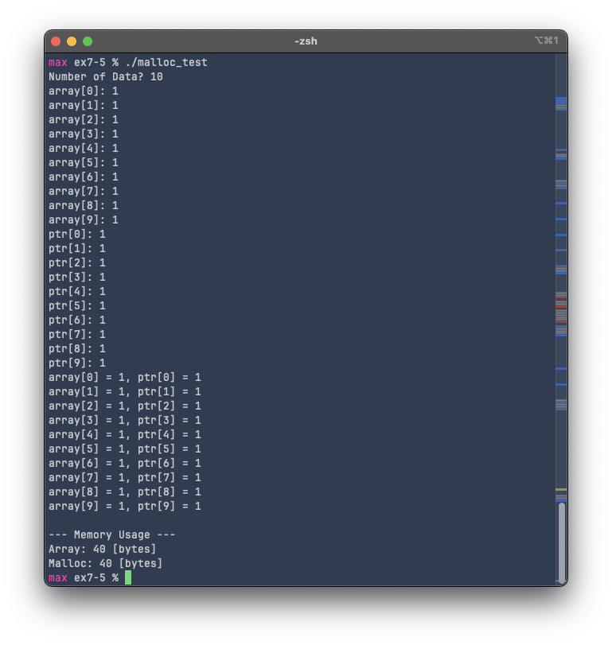
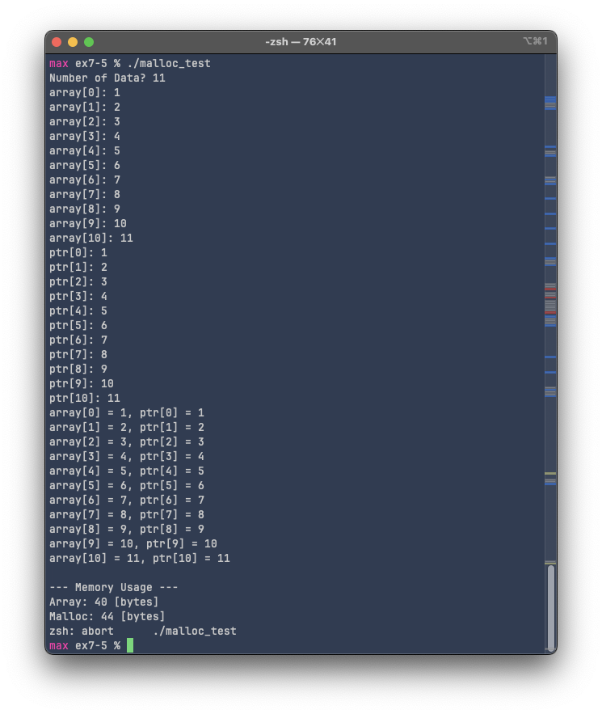

# Exercise 7-5: malloc_test.c
Maximilian Fernaldy - C2TB1702

Exercise 7-5 deals with a very important aspect of the C language and low-level programming as a whole: dynamic memory allocation. Complete control over memory allocation and resource management is what makes C one of the fastest and most efficient programming languages on earth. However, like we've seen in the previous exercise, it can also be a problem when certain problems like memory leaks and segmentation faults go undetected. In exercise 5, we will encounter a similar problem, but instead of reading from invalid memory locations, we will be *writing* into them instead.

## What malloc_test.c does

In malloc.c, there are two arrays initialized.

```C
int array[10];
int *ptr;  // even though it doesn't look like it, ptr can be treated like an array.
// This is because we can treat it as the pointer to the first element of an array.
// After allocating memory, we can then assign values directly with subscripts.
```

Like the comment says, even though we're *syntactically* declaring a pointer instead of an array, in C, we can treat a pointer as the name of an array, because its value without subscripts is just the memory address of an array (i.e., `ptr` is equal to `&ptr[0]`). However, there is a stark difference between the two methods. When we declare an array with the subscript, the square brackets **have** to be filled in with the array size. Alternatively, it can be left blank, but it **has** to be initialized in the same line:

```C
int array[];  // ERROR: incomplete type.
int array[] = {1,2,3,4};  // acceptable.
int array[10];  // acceptable.
```

This is less than ideal, or rather, unusable, if we want to create an array that we don't know the size yet (in other words, array size is only known at *runtime* instead of *compile time*). To *dynamically allocate memory* for an array, we need to use the `malloc()` function, the documentation of which can be found [here](https://www.ibm.com/docs/en/zos/2.2.0?topic=functions-malloc-reserve-storage-block). Essentially, `malloc()` reserves storage blocks, or in other words, allocates memory for our program. It takes the size of the storage block to reserve, in bytes, as its argument. Conveniently, we can use the return value of `sizeof()` as the argument for `malloc()`—the two functions are very frequently seen in conjunction with each other, as different architectures use different sizes for different data types. After reservation, we can then populate the memory address with whatever we see fit. In this example, we are simply going to use it to populate an array, but in more advanced applications, it can also be used to allocate memory for implementing data structures like linked lists, binary trees, or other structures with unknowable size at compile time.

After initializing the arrays, with `array[]`, we can directly start populating it with `scanf()`, but notice that we need to ask for `num` to populate `ptr[]`. This is because `num` is needed to use `malloc()`. We multiply `num` by the size of an integer with `sizeof(int)*num` and pass that as an argument for `malloc()`. This will allocate memory according to how many integers need to be inside the array. Integers typically need 4 bytes, so for 10 integers, for example, we need $4 \times 10 = 40$ bytes. Here, `sizeof(int)` returns 4 and the user inputs 10 for `num`. If the user enters something like `20`, then obviously `malloc()` will allocate 80 bytes instead.

```C
printf("Number of Data? ");
scanf("%d", &num);

for (int i = 0; i < num; i++) {
    printf("array[%d]: ", i);
    scanf("%d", &array[i]);        
}

ptr = malloc(sizeof(int)*num);
if (ptr == NULL) {
    printf("memory allocation error.\n");
    return 1;
}
for (int i = 0; i < num; i++) {
    printf("ptr[%d]: ", i);
    scanf("%d", &ptr[i]);
}
```

As for the `for` loops that populate `array[]` and `ptr[]`, we can see that they're pretty much identical (except for where they store the input, of course). This will prove detrimental for `array[]` later.

Running the program as-is and putting in  10 for `num`, we see that the program seems to work perfectly fine:

<p align='center'>  </p>

Both static and dynamically-allocated arrays are 40 bytes in size and no error is thrown by the shell. However, when we increase the size to be more than 10, an abort error is thrown by the shell:

<p align='center'>  </p>

## Buffer overflow

This error is called a **buffer overflow**. `sizeof()` still returns 40 bytes as the size of `array[]`, because we specified its size explicitly, but in reality we tried to insert 11 elements into it. Technically, "the eleventh element" is not an element of `array[]`, but we can still access it as it's stored next to the tenth element, and `array[i]` is simply the pointer arithmetic `*(array+i)`—meaning, when `i` is equal to 10, it will try to do `*(array+10)` and print whatever is stored in the memory address offset by 10 integers from `array`'s memory address, even though `array[10]` technically does not exist (an array of size 10 will have indices 0 to 9). In our code, we declared `array[]` to have a size of 10 elements:

```C
int array[10];
```

But when we populate it with a `for` loop, we make the loop run `num` times instead of a fixed 10 times:

```C
for (int i = 0; i < num; i++) {
    printf("array[%d]: ", i);
    scanf("%d", &array[i]);        
}
```

This prompts the program to try to insert data into a memory location that's not allocated or initialized for our program. This is called **undefined behavior**. Undefined behavior doesn't *necessarily* result in catastrophic error, but it *does* mean that the program behaves in a way that cannot be predicted by the conventions and specifications of the C language. Therefore, we should avoid it like an error—an unpredictable program is an unusable program. In our instance, the program works fine, "stores" the data in the array anyway and displays it normally, but in a larger array, the program might start changing data on memory locations **still in use by other processes**, which obviously is unwanted behavior.

To make sure we don't run into this problem, if an array is defined to have a fixed size, it should then be populated by a `for` loop that iterates as many times as the size of the array. For example, using a macro definition like `#define ARRAY_SIZE 100`, then `int array[ARRAY_SIZE];` and `for (int i = 0; i < ARRAY_SIZE; i++)`. The `for` loop should iterate a variable number of times *only* if the array size is also defined to be that variable.


[comment]: <> (Below is CSS code for the output HTML and pdf files. Don't touch them unless you know what you're doing.)
<style>
    figcaption{
        text-align:center;
        font-size:9pt
    }
    img{
        filter: drop-shadow(0px 0px 7px );
    }
    .noshade{
        filter: none
    }
    .disclaimer{
        font-size: 9pt
    }
    .linker{
        color: inherit !important
    }
</style>
