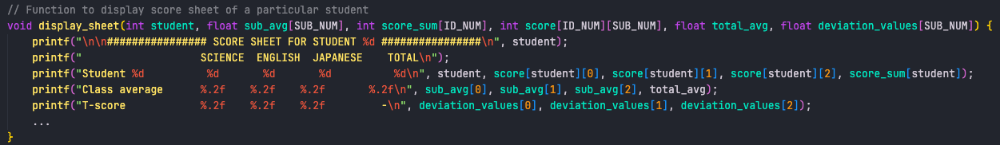

# Midterm Assignment
Maximilian Fernaldy - C2TB1702

## Problem statement
Design a program that displays the score sheet of the corresponding student when the ID number is entered by the user.

### Mandatory items to display:
1. ID Number
2. Names of 3 subjects
3. Score for each subject and total of the scores
4. Class average score for each subject and class average of the total score
5. Grade A~D based on the following criteria:

| Range of total scores | Grade |
|-|-|
| 270 ~ 300 |A|
| 240 ~ 269 |B|
| 210 ~ 239 |C|
| 0 ~ 209 |D|

6. Message, advice to students

### Optional problems:
7. Deviation value / T-score for each subject of the student
8. Ranking based on total points

## Getting the total score for each student, average score for a subject and total score average over the whole class

To getting the total score for each student is easy. To make it scalable, we use a `for` loop that iterates as many times as the number of subjects, and adds up the score from each subject into a total score for the student. Then, we add up the score that a student gets for a specific subject divided by the number of students, which will give us the average score of a certain subject over the whole class. We put this inside another `for` loop, and after the `j`-level `for` loop, we add the total score of a student divided by the number of students to get the averaged total score over the whole class. This way, we have achieved 3 different objectives with 2 nested `for` loops.

```C
// Get total score for each student and class average for each subject
float sub_avg[SUB_NUM];
for (int i = 0; i < SUB_NUM; i++) { // Initialize sub_avg
    sub_avg[i] = 0;
}
int score_sum[ID_NUM];
for (int i = 0; i < ID_NUM; i++) { // Initialize score_sum
    score_sum[i] = 0;
}
float total_avg = 0;
for (int i = 0; i < ID_NUM; i++) {
    for (int j = 0; j < SUB_NUM; j++) {
        score_sum[i] += score[i][j]; // Total score of the student
        sub_avg[j] += (float) score[i][j]/ID_NUM; // Class average for each subject
    }
    total_avg += (float) score_sum[i]/ID_NUM; // Average total score over the whole class
}
```

## Getting user input for the desired student ID

This is relatively simple to implement. We use `scanf()` to ask the user to input a valid student ID. A neat thing about `scanf()` is that it will return `1` if the data input is of the type that is specified (and therefore expected) by the format specifier. Here, we use `%d` as it is the format specifier for integers. If we input, for example, a character or a string, it will return `0`. Since we want an integer input, we put `scanf()` into an `if` statement to check the return value. If a valid integer is detected, `scanf()` returns `1`. We then check if the input is larger than or equal to 0, and if it is smaller than ($<$) the number of students. Remember, arrays are zero-indexed in C, so we don't want to use the smaller than or equal to ($\leq$) symbol. If the input fulfills all these conditions, it is then declared as valid using `isValid = 1`, and the `while` loop ends. If anything else happens (meaning the input isn't valid), we use the `else` statement to tell the user that it's invalid, and the `while` loop continues to look for a valid input from the user.

```C
// Get user input
int isValid = 0, student;
while (!isValid) {
    printf("Enter student ID to begin (0-9): ");
    if (scanf("%d", &student) == 1 && student >= 0 && student < ID_NUM) {
        // Input is a valid student ID
        isValid = 1;
    } else {
        // Input is invalid, ask user to try again
        printf("Invalid input. Please try again.\n");
    }
}
```

## Getting deviation value (T-score)

I will implement this in a function called `get_tscore()` for readability's sake. `get_tscore()` takes 4 arguments: the `student` whose score sheet we want to display (and therefore get the deviation values of), `sub_avg` which is an array containing the average scores of each subject, `score` which is the score data for the whole class, and `deviation_values`, which is an array that we will use to store the t-score data later. Since the variable will be used in the main function and it was declared in the main function, we need to pass it as an argument to the function to be able to modify it. Without passing it, the function does not have access to the variable.

In the main function, we initialize `deviation_values` and call the `get_tscore()` function.
```C
// Process data
float deviation_values[SUB_NUM];
for (int i = 0; i < SUB_NUM; i++) {
    deviation_values[i] = 0; // Initialize deviation_values
}
get_tscore(student, sub_avg, score, deviation_values);
```

Then, outside the main function, we define how `get_tscore()` works. It first calculates the standard deviation for each subject by iterating through all students at the lower level and through all subjects at the higher level. We get the standard deviation through this formula:

$$ \sigma = \sqrt{\frac{1}{N}\displaystyle\sum_{j=1}^{N} (x_j - \mu)^2 } $$

Inside the `j`-level `for` loop, we are adding the square of the difference between a student's score and the class average in a particular subject. We call this the sum of squared differences, or squared difference sum. Once we have that, outside the `j`-level `for` loop, but still inside the `i`-level `for` loop, we divide it by $N$, which is the total number of students, and take the square root of the result. This is the standard deviation for the `i`-th subject. Then we use the following formula to get the T-score:

$$ T_i = \frac{10(x_i - \mu)}{\sigma} $$

where $x_i$ is the score of the student on a subject, $\mu$ is the class average score for that subject , and $\sigma$ is the standard deviation. We can do this right after we get the standard deviation, which is outside the `j`-level `for` loop but inside the `i`-level `for` loop. After the `i`-level `for` loop finishes iterating over the 3 subjects, it will leave us with the student's deviation values (T-score) for each subject inside the `deviation_values` array.

```C
// Get t-score for each subject
void get_tscore(int student, float sub_avg[SUB_NUM], int score[ID_NUM][SUB_NUM], float deviation_values[SUB_NUM]) {
    float std_dev[SUB_NUM];
    for (int i = 0; i < SUB_NUM; i++) {
        std_dev[i] = 0; // Initialize std_dev   
    }
    for (int i = 0; i < SUB_NUM; i++) {
        float squared_difference_sum = 0;
        for (int j = 0; j < ID_NUM; j++) {
            squared_difference_sum += pow(score[j][i] - sub_avg[i], 2);
        }
        // Standard deviation for subject i
        std_dev[i] = sqrt(squared_difference_sum / ID_NUM);
        // Store T-score in the storage array
        deviation_values[i] = 10 * (score[student][i] - sub_avg[i]) / std_dev[i] + 50;
    }
}
```

## Displaying the score sheet

Displaying the score sheet itself is relatively easy to implement. I will do this in the function `display_sheet()`, which takes 6 arguments. It's normal that this function takes a lot of arguments, since it's basically displaying all the information that we've obtained in the previous steps.

### Arguments taken
1. `int student` - the student ID of the selected student
2. `float sub_avg` - array containing the class average score for each subject
3. `int score_sum` - array containing the total score of every student (we need the whole array because we will pass it into another function later to get the rank)
4. `int score` - array containing the score data
5. `float total_avg` - the averaged total score of the whole class
6. `float deviation_values` - the deviation values (T-score) of the selected student's scores on each subject

In the main function, we call the `display_sheet()` function like such:
```C
// Finally, display score sheet with all information
display_sheet(student, sub_avg, score_sum, score, total_avg, deviation_values);
```

Outside the main function, we define `display_sheet()` as such:

<p align='center'>  </p>

First we display the title, specifying which student's score sheet is being displayed. Then on the second line, we print the categories for the scores to be displayed: SUB1, SUB2, SUB3 and the total score. On the third line, we print the student's scores for each subject by using `score[student][i]`, where `i` is the index of the subject which score we want to display. On the fourth line, we print the class average and round it to the second digit behind the decimal point by using the `%.2f` format specifier. We access the different average scores for each subject by using `sub_avg[i]`, again, where `i` is the index of the subject. For the averaged total score over the whole class, we just display the `total_avg` we obtained earlier in the main function. The next line will print the T-score of the student's score for each subject, again rounded to the second decimal point using `%.2f`.

Up until this point, we have completed objectives 1 through 4 and 7. For objective 8, I will do it in a separate function called `get_rank()`. `get_rank()` is a function that returns the rank of the selected student, and takes the total score of all students and the ID of the selected student as input.

To display the rank, we call it in the `display_sheet()` function:
```C
printf("Rank: %d\n", get_rank(student, score_sum));
```

To define `get_rank()`:
```C
// Gets rank of a student
int get_rank(int student, int score_sum[ID_NUM]) {
    int rank = 1; // Initialize as rank 1
    for (int i = 0; i < ID_NUM; i++) {
        if (score_sum[i] > score_sum[student]) {
            rank++; // If there is someone who scores higher, add 1 to rank
        }
    }
    return rank;
}
```

First we initialize the rank as `1`. Then we iterate through the `score_sum` array, and compare the total score of each student to the total score of the selected student. If there is a total score higher than the selected student, we increment `rank` by one with `rank++`. This goes on until there are no more total scores, and the final rank is decided. This works because of the logic that rank is just the number of people who score higher than you, plus one. The person ranked #1 has no one who scored higher than them, which means he has a rank of (0+1) = 1. The person in second place was outscored by the person in rank #1, which means they have one person who outscored them. Their rank is therefore (1+1) = 2. If there are two people with the same exact score, they will obtain the same rank too (tied for the rank), because the amount of people who outscored them is the same. Even though it might seem that we need to sort the students based on their score, we don't actually have to (although sorting is a valid method, too). If we only need to display the rank of a particular student, this method is more than enough.

That's objectives 1 through 4, 7 and 8 done. Now for objectives 5 and 6. Objective 5 is simple - we just need to assign a letter grade based on the total score of a student. We can use an if-else if ladder, but since the score ranges are integers, we can implement it using a switch of different ranges:

```C
// Assigns a grade for a given total score
char grade(int score_sum) {
    switch (score_sum)
    {
    case 0 ... 209:
        return 'D';

    case 210 ... 239:
        return 'C';

    case 240 ... 269:
        return 'B';

    case 270 ... 300:
        return 'A';

    default: // ERROR
        return 'E';
    }
}
```

The documentation for this application of switch can be found <a href='https://www.geeksforgeeks.org/using-range-switch-case-cc/'>here</a>. Since the `grade()` function returns a `char`, we can directly use its return value as the grade to print out in `display_sheet()`:

```C
printf("Grade assigned: %c\n\n", grade(score_sum[student]));
```

### Comment and advice on how to improve

Now for the last objective, objective 6. We want to print a personalized message for each student. To do this, we create a function `judge()` that takes the student's performance and prints out different strings based on how the student performs compared to the class and which subject is the worst for that student.

```C
// Prints comments for student
void judge(int score_sum, int score[], float total_avg) {
    // Print introduction of comments
    printf("Comments: ");
    // Difference between student's sum of scores and the class average
    float total_difference = (float) score_sum - total_avg;
    printf("Overall, ");
    if (total_difference >= -10 && total_difference < 0) {
        printf("you place slightly below the class average. ");
    } else if (total_difference >= -20 && total_difference < -10) {
        printf("you place below the class average. ");
    } else if (total_difference >= -30 && total_difference < -20) {
        printf("you place considerably below the class average. ");
    } else if (total_difference < -30) {
        printf("you place severely below the class average. ");
    } else {
        if (total_difference >= 0 && total_difference <= 10) {
            printf("you place slightly above the class average. ");
        } else if (total_difference > 10 && total_difference <= 20) {
            printf("you place above the class average. ");
        } else if (total_difference > 20 && total_difference <= 30) {
            printf("you place considerably above the class average. ");
        } else if (total_difference > 30) {
            printf("you place much higher than the class average. ");
        }
    }

    char student_grade = grade(score_sum);
    switch(student_grade) {
        case 'A':
            printf("Keep up the good work.\n");
            break;
        case 'B':
            printf("You still have room to improve, ");
            break;
        case 'C':
            printf("You have much room to improve, ");
            break;
        case 'D':
            printf("You need to improve fast in order to pass, ");
            break;
    }

    if (student_grade != 'A') { // No need for additional comments if student has grade A
        // Find subject with lowest grade
        int lowest_index = find_lowest(score);
        // Encourage improvement in the worst subject
        // Define an array of subject names
        char subjects[3][10];
        // Initialize the subject names
        strcpy(subjects[0], "Science");
        strcpy(subjects[1], "English");
        strcpy(subjects[2], "Japanese");
        // Print advice
        printf("especially in %s.\n", subjects[lowest_index]);
    }
}
```

The first portion of the function compares the student's total score to the averaged total score of the class. It prints out different outputs depending on how far the student's total score is from the average. For the second part, it takes the letter grade of the student into account, printing different strings with differing degrees of urgency. If the student has grade A, no further advice is printed, instead opting to encourage the student to keep doing what they're doing (because clearly it's working for them). If it's B, the program tells the student that they still have room to improve. If it's C, the student has "much" room to improve, and if it's D, the student needs to improve fast to be able to pass.

The final portion of the function gives further advice for students below the 'A' letter grade. First, it uses the function `find_lowest()` (explained later) to find the index of the subject that the student performs worst on. Then, it prints the final advice, telling the student to focus on the subject that they're performing the worst on (the name of which is stored in `subjects[lowest_index]`).

To get the subject where the student performs the worst on, we pass the scores of the student into `find_lowest()`. Note that even though the variable used in this function, `score()` has the same name as the large array that stores all the scores of all students, they are in fact *different* items. The `score` here only contains scores of the selected student. While iterating through the scores, the function looks for the smallest score by initializing it as the score obtained for the first subject and iterating through all the subjects. If it finds a smaller score, `smallest_index` will change to `i`, so at the end the index of the score with the smallest value is stored in `smallest_index`.

```C
// Finds subject with lowest score
int find_lowest(int score[]) {
    int smallest_index = 0;
    for (int i = 0; i < SUB_NUM; i++) {
        if (score[i] < score[smallest_index]) {
            smallest_index = i;
        }
    }
    return smallest_index;
}
```

To display the comments, we call `judge()` in the main function:
```C
judge(score_sum[student], score[student], total_avg);

return 0; // End of program
```

With this we have finally completed all objectives. Compiling and running the program gives this output:

<p align='center'>  </p>